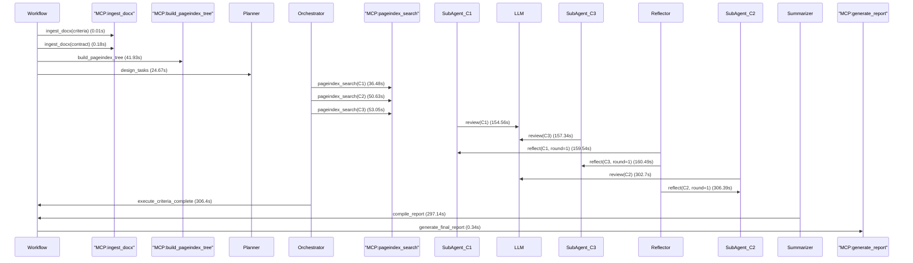

# Workflow Log — 2026-02-21 15:02:11

**Total Steps**: 16 | **Total Time**: 673.41s | **Total Tokens**: 146283

---

## Flow Diagram

---

## Detailed Steps

### Step 1 — ingest_docx(criteria)

- **Time**: 14:51:00
- **Phase**: Ingestion
- **Sender**: Workflow
- **Receiver**: MCP:ingest_docx
- **Action**: ingest_docx(criteria)
- **Input**: 审核要点（初稿）.docx
- **Output**: 764 chars
- **Tokens**: —
- **Duration**: 0.01s

### Step 2 — ingest_docx(contract)

- **Time**: 14:51:00
- **Phase**: Ingestion
- **Sender**: Workflow
- **Receiver**: MCP:ingest_docx
- **Action**: ingest_docx(contract)
- **Input**: 反馈0730-【已审查】（190号）互联网类系统CDN加速服务（三年）采购合同HT-ZRUB-2025-07-01-08-C002.docx
- **Output**: 29898 chars
- **Tokens**: —
- **Duration**: 0.18s

### Step 3 — build_pageindex_tree

- **Time**: 14:51:42
- **Phase**: Tree Building
- **Sender**: Workflow
- **Receiver**: MCP:build_pageindex_tree
- **Action**: build_pageindex_tree
- **Input**: 29800 chars markdown
- **Output**: 36808 chars tree JSON
- **Tokens**: —
- **Duration**: 41.93s

### Step 4 — design_tasks

- **Time**: 14:52:07
- **Phase**: Planning
- **Sender**: Workflow
- **Receiver**: Planner
- **Action**: design_tasks
- **Input**: 723 chars criteria
- **Output**: 3 criteria extracted
- **Tokens**: 1621
- **Duration**: 24.67s

### Step 5 — pageindex_search(C1)

- **Time**: 14:52:44
- **Phase**: Execute
- **Sender**: Orchestrator
- **Receiver**: MCP:pageindex_search
- **Action**: pageindex_search(C1)
- **Input**: 核实签约主体合法性与信息一致性
- **Output**: 1447 chars retrieved
- **Tokens**: —
- **Duration**: 36.48s

### Step 6 — pageindex_search(C2)

- **Time**: 14:52:58
- **Phase**: Execute
- **Sender**: Orchestrator
- **Receiver**: MCP:pageindex_search
- **Action**: pageindex_search(C2)
- **Input**: 确保核心条款无结构性缺失
- **Output**: 23228 chars retrieved
- **Tokens**: —
- **Duration**: 50.63s

### Step 7 — pageindex_search(C3)

- **Time**: 14:53:00
- **Phase**: Execute
- **Sender**: Orchestrator
- **Receiver**: MCP:pageindex_search
- **Action**: pageindex_search(C3)
- **Input**: 保障合同文本严谨性、内部一致性及法律适配性
- **Output**: 15894 chars retrieved
- **Tokens**: —
- **Duration**: 53.05s

### Step 8 — review(C1)

- **Time**: 14:54:42
- **Phase**: Execute
- **Sender**: SubAgent_C1
- **Receiver**: LLM
- **Action**: review(C1)
- **Input**: criterion + 1447 chars context
- **Output**: 我已完成对合同签约主体合法性与信息一致性的全面审查。根据收集到的信息，我将按照审查标准的四个要点逐一进行专业分析和结论。

### 检查要点：通过国家企业信用信息公示系统或司法大数据平台核查该主体是否存在未结重大涉诉、被执行、失信、严重违法等风险信息

- **风险等级**: 低
- **结论**: 根据公开信息查询，浙江农村商业联合银行股份有限公司和腾讯云计算(北京)有限责任公司均处于正常经营状
- **Tokens**: 22974
- **Duration**: 154.56s

### Step 9 — review(C3)

- **Time**: 14:54:44
- **Phase**: Execute
- **Sender**: SubAgent_C3
- **Receiver**: LLM
- **Action**: review(C3)
- **Input**: criterion + 15894 chars context
- **Output**: 我已完成对合同内容的审查，现依据审查标准逐项分析如下：

### 检查要点：通读全文，排查错别字、标点误用、标题层级混乱（如‘二、’下直接接‘（三）’）、语句不通顺、主谓宾残缺等基础文字错误

- **风险等级**: 中
- **结论**: 合同存在多处标点误用、格式不一致和标题层级问题。附件四标题"浙江省农商银行系统"与"信息化建设保密协议"之间缺少连接词，显得突兀；附件六中"购买\使用"使用反
- **Tokens**: 27983
- **Duration**: 157.34s

### Step 10 — reflect(C1, round=1)

- **Time**: 14:54:47
- **Phase**: Reflect
- **Sender**: Reflector
- **Receiver**: SubAgent_C1
- **Action**: reflect(C1, round=1)
- **Input**: 我已完成对合同签约主体合法性与信息一致性的全面审查。根据收集到的信息，我将按照审查标准的四个要点逐一进行专业分析和结论。

### 检查要点：通过国家企业信用信息公示系统或司法大数据平台核查该主体是否
- **Output**: PASS: 
- **Tokens**: 2759
- **Duration**: 159.54s

### Step 11 — reflect(C3, round=1)

- **Time**: 14:54:48
- **Phase**: Reflect
- **Sender**: Reflector
- **Receiver**: SubAgent_C3
- **Action**: reflect(C3, round=1)
- **Input**: 我已完成对合同内容的审查，现依据审查标准逐项分析如下：

### 检查要点：通读全文，排查错别字、标点误用、标题层级混乱（如‘二、’下直接接‘（三）’）、语句不通顺、主谓宾残缺等基础文字错误

- *
- **Output**: PASS: 
- **Tokens**: 3782
- **Duration**: 160.49s

### Step 12 — review(C2)

- **Time**: 14:57:10
- **Phase**: Execute
- **Sender**: SubAgent_C2
- **Receiver**: LLM
- **Action**: review(C2)
- **Input**: criterion + 23228 chars context
- **Output**: 现在我将根据审查标准，对合同中与核心条款结构性缺失相关的部分进行逐项审查。

### 检查要点：采购内容是否具体列明品种、规格、型号、等级、花色等技术参数

- **风险等级**: 中
- **结论**: 采购内容虽有基本描述，但缺乏具体技术参数细节，主要依赖附件，且未明确说明附件为不可分割组成部分
- 原文引用:（必须使用 > 引用块格式，且禁止使用加粗字体）
> 「附件一、合同内容清单」
> 
- **Tokens**: 44043
- **Duration**: 302.7s

### Step 13 — reflect(C2, round=1)

- **Time**: 14:57:13
- **Phase**: Reflect
- **Sender**: Reflector
- **Receiver**: SubAgent_C2
- **Action**: reflect(C2, round=1)
- **Input**: 现在我将根据审查标准，对合同中与核心条款结构性缺失相关的部分进行逐项审查。

### 检查要点：采购内容是否具体列明品种、规格、型号、等级、花色等技术参数

- **风险等级**: 中
- **结论*
- **Output**: PASS: 
- **Tokens**: 10674
- **Duration**: 306.39s

### Step 14 — execute_criteria_complete

- **Time**: 14:57:13
- **Phase**: Execution
- **Sender**: Orchestrator
- **Receiver**: Workflow
- **Action**: execute_criteria_complete
- **Input**: 3 criteria
- **Output**: 3 results
- **Tokens**: —
- **Duration**: 306.4s

### Step 15 — compile_report

- **Time**: 15:02:11
- **Phase**: Summarization
- **Sender**: Summarizer
- **Receiver**: Workflow
- **Action**: compile_report
- **Input**: 3 criterion results
- **Output**: 25494 chars report
- **Tokens**: 32447
- **Duration**: 297.14s

### Step 16 — generate_final_report

- **Time**: 15:02:11
- **Phase**: Report
- **Sender**: Workflow
- **Receiver**: MCP:generate_report
- **Action**: generate_final_report
- **Input**: 27076 chars
- **Output**: Report generated successfully: c:\Users\18014\agent_self_practice\agent_with_mcp\docs\reports\独立审查报告_反馈0730-【已审查】（190号）互联网类系统CDN加速服务（三年）采购合同HT-ZRUB-2025-07-01-08-C002_20260221_150211.docx
- **Tokens**: —
- **Duration**: 0.34s

