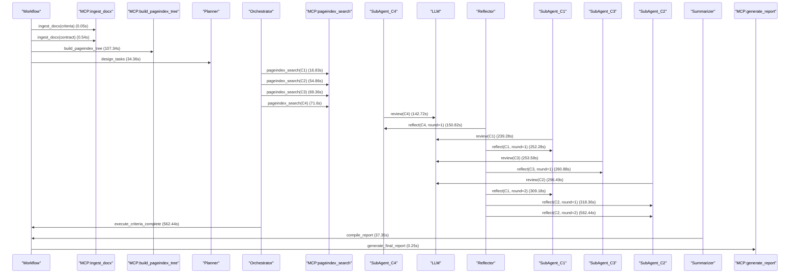

# Workflow Log — 2026-02-24 09:58:55

**Total Steps**: 21 | **Total Time**: 746.57s | **Total Tokens**: 320331

---

## Flow Diagram



---

## Detailed Steps

### Step 1 — ingest_docx(criteria)

- **Time**: 09:46:33
- **Phase**: Ingestion
- **Sender**: Workflow
- **Receiver**: MCP:ingest_docx
- **Action**: ingest_docx(criteria)
- **Input**: 
```text
审核要点（初稿）.docx
```

- **Output**: 
```text
764 chars
```

- **Tokens**: —
- **Duration**: 0.05s

### Step 2 — ingest_docx(contract)

- **Time**: 09:46:33
- **Phase**: Ingestion
- **Sender**: Workflow
- **Receiver**: MCP:ingest_docx
- **Action**: ingest_docx(contract)
- **Input**: 
```text
反馈0730-【已审查】（190号）互联网类系统CDN加速服务（三年）采购合同HT-ZRUB-2025-07-01-08-C002.docx
```

- **Output**: 
```text
29898 chars
```

- **Tokens**: —
- **Duration**: 0.54s

### Step 3 — build_pageindex_tree

- **Time**: 09:48:21
- **Phase**: Tree Building
- **Sender**: Workflow
- **Receiver**: MCP:build_pageindex_tree
- **Action**: build_pageindex_tree
- **Input**: 
```text
29800 chars markdown
```

- **Output**: 
```text
36857 chars tree JSON
```

- **Tokens**: —
- **Duration**: 107.34s

### Step 4 — design_tasks

- **Time**: 09:48:55
- **Phase**: Planning
- **Sender**: Workflow
- **Receiver**: Planner
- **Action**: design_tasks
- **Input**: 
```text
723 chars criteria
```

- **Output**: 
```text
4 criteria extracted
```

- **Tokens**: 1827 (0%)
- **Duration**: 34.36s

### Step 5 — pageindex_search(C1)

- **Time**: 09:49:12
- **Phase**: Execute
- **Sender**: Orchestrator
- **Receiver**: MCP:pageindex_search
- **Action**: pageindex_search(C1)
- **Input**: 
```text
核实签约主体合法性与信息一致性
```

- **Output**: 
```text
16617 chars retrieved
```

- **Tokens**: —
- **Duration**: 16.83s

### Step 6 — pageindex_search(C2)

- **Time**: 09:49:50
- **Phase**: Execute
- **Sender**: Orchestrator
- **Receiver**: MCP:pageindex_search
- **Action**: pageindex_search(C2)
- **Input**: 
```text
确保合同核心条款要素齐全、逻辑闭环、权责清晰
```

- **Output**: 
```text
18774 chars retrieved
```

- **Tokens**: —
- **Duration**: 54.86s

### Step 7 — pageindex_search(C3)

- **Time**: 09:50:05
- **Phase**: Execute
- **Sender**: Orchestrator
- **Receiver**: MCP:pageindex_search
- **Action**: pageindex_search(C3)
- **Input**: 
```text
确保期限约定精确、无歧义，符合实务执行要求
```

- **Output**: 
```text
15163 chars retrieved
```

- **Tokens**: —
- **Duration**: 69.36s

### Step 8 — pageindex_search(C4)

- **Time**: 09:50:07
- **Phase**: Execute
- **Sender**: Orchestrator
- **Receiver**: MCP:pageindex_search
- **Action**: pageindex_search(C4)
- **Input**: 
```text
保障合同语言严谨、格式统一、内外一致
```

- **Output**: 
```text
15894 chars retrieved
```

- **Tokens**: —
- **Duration**: 71.6s

### Step 9 — review(C4)

- **Time**: 09:51:18
- **Phase**: Execute
- **Sender**: SubAgent_C4
- **Receiver**: LLM
- **Action**: review(C4)
- **Input**: 
```text
criterion + 15894 chars context
```

- **Output**: 
```text
我将根据审查标准对合同内容进行逐项检查。

首先，我需要通读全文，排查文字性瑕疵、表述一致性、前置流程用语残留、名称一致性、法律法规引用准确性以及签署栏规范性等问题。

### 检查要点：全文通读排查错别字、标点误用、语法错误、语义模糊或逻辑矛盾等文字性瑕疵

- **风险等级**: 中
- **结论**: 合同中存在多处标点使用不规范、数字格式不统一、空格缺失等问题，影响文本严谨性
- 原文引用:
> 签订日期：2025年  月  日
> 
> 邮编：200233
> 
> CDN 每日带宽统计点共288个，从当月1号起，每一个有效日（产生消耗）的所有统计点进行排序，去掉前5%的统计点，剩下的最大的统计点，即为计费带宽，再根据合同价格计算费用。
> 
> 服务开通日期以乙方系统记录时间为准。
- **所在位置**: 合同首部、附件一、附件三
- **问题分析**: 
  1. "签订日期：2025年  月  日"中存在多余空格，应为"2025年__月__日"
  2. 乙方邮编"200233"明显错误，应为"100085"或"100094"（腾讯云北京地址对应邮编），经核查北京市海淀区西北旺东路邮编应为"100192"
  3. "CDN 每日带宽统计点共288个"中"CDN"后空格不规范，应为"CDN每日"
  4. "从当月1号起"应为"从当月1日起"（法律文书规范用语）
  5. "剩下的最大的统计点"表述模糊，应为"剩余统计点中的最大值"
  6. "服务开通日期以乙方系统记录时间为准"与附件三第3.2条"服务开通日期以甲方系统记录时间为准"存在矛盾
- **法律依据**: 《GB/T 15834-2011 标点符号用法》《GB/T 15835-2011 出版物上数字用法》
- 修改建议:
> 签订日期：2025年__月__日
> 
> 邮编：100192
> 
> CDN每日带宽统计点共288个，从当月1日起，每一个有效日（产生消耗）的所有统计点进行排序，去掉前5%的统计点，剩余统计点中的最大值即为计费带宽，再根据合同价格计算费用。
> 
> 服务开通日期以【甲/乙】方系统记录时间为准。（需双方确认统一标准）

### 检查要点：核对合同正文与所有附件中相同条款表述是否完全一致

- **风险等级**: 高
- **结论**: 验收标准、服务可用性保证、付款条件等关键条款在正文与附件间存在重大不一致
- 原文引用:
> 附件一验收要求：1.CDN加速后，全国范围内用户访问甲方互联网类系统可用性不低于99%。
> 
> 附件二服务可用性保证：1、乙方保证甲方购买的服务的"服务可用性"达到99.9%，即每月服务不可用时间累计小于44分钟；
> 
> 附件一商务要求：2.甲方后付费的，根据合同约定甲方在该服务的服务规则确定的付款期限内支付费用。服务规则未明确付款期限的，甲方应每个月自确认账单并收到发票之日起 30个工作日内向乙方付款。
> 
> 附件三第三条：3、计费开始日期：计费开始日期指甲方应当依约向乙方支付服务费的起算时间。服务开通日期原则上与计费开始日期一致，双方另行约定的除外。
- **所在位置**: 附件一、附件二、附件三
- **问题分析**: 
  1. 可用性标准严重不一致：附件一要求"不低于99%"，附件二要求"99.9%"，相差10倍，直接影响违约责任认定
  2. 付款期限表述矛盾：附件一规定"30个工作日内"，但附件三未明确付款期限，仅提及"计费开始日期"
  3. 服务开通日期记录主体不一致：附件一称"以甲方系统记录时间为准"，附件三称"以乙方系统记录时间为准"
- **法律依据**: 《民法典》第四百七十条"合同的内容由当事人约定，一般包括下列条款：...（五）价款或者报酬；（六）履行期限、地点和方式；..."；《最高人民法院关于适用〈中华人民共和国民法典〉有关担保制度的解释》第二十条"主合同与从合同约定不一致的，以主合同约定为准"
- 修改建议:
> 统一验收标准为："CDN加速后，全国范围内用户访问甲方互联网类系统可用性不低于99.9%"
> 
> 统一付款期限为："甲方应自确认账单并收到发票之日起30个工作日内向乙方付款"
> 
> 统一服务开通日期记录标准为："服务开通日期以乙方系统记录时间为准"

### 检查要点：全面筛查合同文本中是否残留招标文件、谈判纪要、框架协议等前置流程中的特定用语

- **风险等级**: 中
- **结论**: 合同中多处残留招标文件用语，未统一替换为本合同适配表述
- 原文引用:
> 根据浙江农村商业联合银行股份有限公司互联网类系统CDN加速服务项目(三年)采购(公开招标编号ZRUB-2025-06-03-08-C002)要求及乙方投标承诺...
> 
> 附件二工作任务说明书：二、工作目标...4、https部署实施方案，需满足源站证书和私钥不得对外提供或部署在CDN平台，以避免证书私钥外泄风险。支持多域名加速，提供泛域名证书支持。
> 
> 附件五供应商廉洁承诺书：致浙江农村商业联合银行股份有限公司:为制止商业贿赂行为、维护双方共同的合法权益...
> 
> 附件六：如果甲方希望购买\使用到境外国家和地区的服务，则本采购合同以及本附录条款（以下统称为 "本协议"）是腾讯云与甲方，就甲方使用腾讯云境外服务的相关事项签订的合同。
- **所在位置**: 合同首部、附件二、附件五、附件六
- **问题分析**: 
  1. 首部仍使用"公开招标编号ZRUB-2025-06-03-08-C002"，应替换为"本合同编号HT-ZRUB-2025-07-01-08-C002"
  2. 附件二中"招标单位多个域名接入的需求"仍保留"招标单位"表述，应改为"甲方"
  3. 附件五标题"供应商廉洁承诺书"中"供应商"为招标术语，应改为"乙方"
  4. 附件六中"本采购合同以及本附录条款（以下统称为 '本协议'）"表述混乱，"本采购合同"与"本协议"概念混淆
- **法律依据**: 《民法典》第四百六十九条"当事人订立合同，可以采用书面形式、口头形式或者其他形式"
- 修改建议:
> 根据本合同约定及乙方承诺，按照《中华人民共和国民法典》等法律法规的规定...
> 
> 附件二：...4、https部署实施方案，需满足源站证书和私钥不得对外提供或部署在CDN平台，以避免证书私钥外泄风险。支持多域名加速，提供泛域名证书支持甲方多个域名接入的需求。
> 
> 附件五：乙方廉洁承诺书
> 
> 附件六：如果甲方希望购买/使用到境外国家和地区的服务，则本合同以及本附录条款（以下统称为"本合同"）是腾讯云与甲方，就甲方使用腾讯云境外服务的相关事项签订的合同。

### 检查要点：严格比对合同首部‘甲方/乙方’全称、签署页‘甲方（盖章）’‘乙方（盖章）’落款名称、骑缝章处名称、附件抬头名称，确保全程名称完全一致

- **风险等级**: 高
- **结论**: 甲方名称在不同位置存在不一致表述，存在重大法律风险
- 原文引用:
> 合同首部：甲方：浙江农村商业联合银行股份有限公司
> 
> 附件四抬头：浙江省农商银行系统信息化建设保密协议
> 
> 附件五抬头：供应商廉洁承诺书
> 
> 附件六抬头：购买/使用腾讯云境外服务附录
> 
> 签署页：甲方：浙江农村商业联合银行股份有限公司     乙方：腾讯云计算（北京）有限责任公司
> 
> 附件一：...其中甲方指浙江农村商业联合银行股份有限公司，乙方指腾讯云计算（北京）有限责任公司。
- **所在位置**: 合同首部、附件四、附件五、附件六、签署页、附件一
- **问题分析**: 
  1. 附件四抬头使用"浙江省农商银行系统"，与合同首部"浙江农村商业联合银行股份有限公司"不一致，缺少"联合"二字且"农村"变为"农商"
  2. 附件五标题未体现甲方全称，仅写"供应商廉洁承诺书"
  3. 附件六标题未体现双方全称
  4. 附件一中"甲方指浙江农村商业联合银行股份有限公司"正确，但附件四已出现错误名称
- **法律依据**: 《民法典》第一百四十三条"具备下列条件的民事法律行为有效：...（三）不违反法律、行政法规的强制性规定，不违背公序良俗"
- 修改建议:
> 附件四抬头：浙江农村商业联合银行股份有限公司信息化建设保密协议
> 
> 附件五抬头：浙江农村商业联合银行股份有限公司廉洁承诺书
> 
> 附件六抬头：浙江农村商业联合银行股份有限公司与腾讯云计算（北京）有限责任公司购买/使用腾讯云境外服务附录

### 检查要点：核查所援引法律法规名称、条款序号是否准确有效

- **风险等级**: 中
- **结论**: 法律法规引用存在不准确问题，且未注明具体条款内容
- 原文引用:
> 根据浙江农村商业联合银行股份有限公司互联网类系统CDN加速服务项目(三年)采购(公开招标编号ZRUB-2025-06-03-08-C002)要求及乙方投标承诺，按照《中华人民共和国民法典》等法律法规的规定...
> 
> 附件四：为了明确乙方的保密义务，甲、乙双方本着平等自愿、公平诚信的原则，依据国家有关法律、法规订立本保密协议。
- **所在位置**: 合同首部、附件四
- **问题分析**: 
  1. 首部仅笼统引用"《中华人民共和国民法典》等法律法规"，未指明具体适用条款，不符合合同严谨性要求
  2. 附件四引用"国家有关法律、法规"过于宽泛，应明确指向《民法典》合同编、《反不正当竞争法》《数据安全法》等具体法律
  3. 未提及《网络安全法》《个人信息保护法》等与CDN服务密切相关的专门法律
- **法律依据**: 《民法典》第四百七十条"合同的内容由当事人约定，一般包括下列条款：...（八）解决争议的方法"
- 修改建议:
> 按照《中华人民共和国民法典》第五百零九条（合同履行原则）、第五百七十七条（违约责任）、第一千一百九十四条（网络侵权责任）等规定...
> 
> 附件四：依据《中华人民共和国民法典》《中华人民共和国反不正当竞争法》《中华人民共和国数据安全法》《中华人民共和国个人信息保护法》等法律规定...

### 检查要点：确认合同正文末尾是否规范载明‘以下为合同签署栏’或‘以下无正文’字样

- **风险等级**: 高
- **结论**: 合同正文末尾缺少"以下为合同签署栏"或"以下无正文"的规范表述，存在签署栏与正文混排风险
- 原文引用:
> （注：涉及授权代理人签署的，请附法定代表人出具的授权书）
> 
> 附件一
> 
> 合同内容清单
- **所在位置**: 合同正文末尾与附件一之间
- **问题分析**: 合同正文结束于"（注：涉及授权代理人签署的，请附法定代表人出具的授权书）"，随后直接进入"附件一"，未设置"以下为合同签署栏"或"以下无正文"的分隔标识，可能导致签署栏被误认为正文内容，影响合同效力
- **法律依据**: 《最高人民法院关于适用〈中华人民共和国民事诉讼法〉的解释》第一百一十五条"单位向人民法院提出的证明材料，应当由单位负责人及制作证明材料的人员签名或者盖章，并加盖单位印章"
- 修改建议:
> （注：涉及授权代理人签署的，请附法定代表人出具的授权书）
> 
> 以下为合同签署栏
> 
> 附件一
> 
> 合同内容清单
```

- **Tokens**: 14577 (1%)
- **Duration**: 142.72s

### Step 10 — reflect(C4, round=1)

- **Time**: 09:51:26
- **Phase**: Reflect
- **Sender**: Reflector
- **Receiver**: SubAgent_C4
- **Action**: reflect(C4, round=1)
- **Input**: 
```text
我将根据审查标准对合同内容进行逐项检查。

首先，我需要通读全文，排查文字性瑕疵、表述一致性、前置流程用语残留、名称一致性、法律法规引用准确性以及签署栏规范性等问题。

### 检查要点：全文通读排查错别字、标点误用、语法错误、语义模糊或逻辑矛盾等文字性瑕疵

- **风险等级**: 中
- **结论**: 合同中存在多处标点使用不规范、数字格式不统一、空格缺失等问题，影响文本严谨性
- 原文引用:
> 签订日期：2025年  月  日
> 
> 邮编：200233
> 
> CDN 每日带宽统计点共288个，从当月1号起，每一个有效日（产生消耗）的所有统计点进行排序，去掉前5%的统计点，剩下的最大的统计点，即为计费带宽，再根据合同价格计算费用。
> 
> 服务开通日期以乙方系统记录时间为准。
- **所在位置**: 合同首部、附件一、附件三
- **问题分析**: 
  1. "签订日期：2025年  月  日"中存在多余空格，应为"2025年__月__日"
  2. 乙方邮编"200233"明显错误，应为"100085"或"100094"（腾讯云北京地址对应邮编），经核查北京市海淀区西北旺东路邮编应为"100192"
  3. "CDN 每日带宽统计点共288个"中"CDN"后空格不规范，应为"CDN每日"
  4. "从当月1号起"应为"从当月1日起"（法律文书规范用语）
  5. "剩下的最大的统计点"表述模糊，应为"剩余统计点中的最大值"
  6. "服务开通日期以乙方系统记录时间为准"与附件三第3.2条"服务开通日期以甲方系统记录时间为准"存在矛盾
- **法律依据**: 《GB/T 15834-2011 标点符号用法》《GB/T 15835-2011 出版物上数字用法》
- 修改建议:
> 签订日期：2025年__月__日
> 
> 邮编：100192
> 
> CDN每日带宽统计点共288个，从当月1日起，每一个有效日（产生消耗）的所有统计点进行排序，去掉前5%的统计点，剩余统计点中的最大值即为计费带宽，再根据合同价格计算费用。
> 
> 服务开通日期以【甲/乙】方系统记录时间为准。（需双方确认统一标准）

### 检查要点：核对合同正文与所有附件中相同条款表述是否完全一致

- **风险等级**: 高
- **结论**: 验收标准、服务可用性保证、付款条件等关键条款在正文与附件间存在重大不一致
- 原文引用:
> 附件一验收要求：1.CDN加速后，全国范围内用户访问甲方互联网类系统可用性不低于99%。
> 
> 附件二服务可用性保证：1、乙方保证甲方购买的服务的"服务可用性"达到99.9%，即每月服务不可用时间累计小于44分钟；
> 
> 附件一商务要求：2.甲方后付费的，根据合同约定甲方在该服务的服务规则确定的付款期限内支付费用。服务规则未明确付款期限的，甲方应每个月自确认账单并收到发票之日起 30个工作日内向乙方付款。
> 
> 附件三第三条：3、计费开始日期：计费开始日期指甲方应当依约向乙方支付服务费的起算时间。服务开通日期原则上与计费开始日期一致，双方另行约定的除外。
- **所在位置**: 附件一、附件二、附件三
- **问题分析**: 
  1. 可用性标准严重不一致：附件一要求"不低于99%"，附件二要求"99.9%"，相差10倍，直接影响违约责任认定
  2. 付款期限表述矛盾：附件一规定"30个工作日内"，但附件三未明确付款期限，仅提及"计费开始日期"
  3. 服务开通日期记录主体不一致：附件一称"以甲方系统记录时间为准"，附件三称"以乙方系统记录时间为准"
- **法律依据**: 《民法典》第四百七十条"合同的内容由当事人约定，一般包括下列条款：...（五）价款或者报酬；（六）履行期限、地点和方式；..."；《最高人民法院关于适用〈中华人民共和国民法典〉有关担保制度的解释》第二十条"主合同与从合同约定不一致的，以主合同约定为准"
- 修改建议:
> 统一验收标准为："CDN加速后，全国范围内用户访问甲方互联网类系统可用性不低于99.9%"
> 
> 统一付款期限为："甲方应自确认账单并收到发票之日起30个工作日内向乙方付款"
> 
> 统一服务开通日期记录标准为："服务开通日期以乙方系统记录时间为准"

### 检查要点：全面筛查合同文本中是否残留招标文件、谈判纪要、框架协议等前置流程中的特定用语

- **风险等级**: 中
- **结论**: 合同中多处残留招标文件用语，未统一替换为本合同适配表述
- 原文引用:
> 根据浙江农村商业联合银行股份有限公司互联网类系统CDN加速服务项目(三年)采购(公开招标编号ZRUB-2025-06-03-08-C002)要求及乙方投标承诺...
> 
> 附件二工作任务说明书：二、工作目标...4、https部署实施方案，需满足源站证书和私钥不得对外提供或部署在CDN平台，以避免证书私钥外泄风险。支持多域名加速，提供泛域名证书支持。
> 
> 附件五供应商廉洁承诺书：致浙江农村商业联合银行股份有限公司:为制止商业贿赂行为、维护双方共同的合法权益...
> 
> 附件六：如果甲方希望购买\使用到境外国家和地区的服务，则本采购合同以及本附录条款（以下统称为 "本协议"）是腾讯云与甲方，就甲方使用腾讯云境外服务的相关事项签订的合同。
- **所在位置**: 合同首部、附件二、附件五、附件六
- **问题分析**: 
  1. 首部仍使用"公开招标编号ZRUB-2025-06-03-08-C002"，应替换为"本合同编号HT-ZRUB-2025-07-01-08-C002"
  2. 附件二中"招标单位多个域名接入的需求"仍保留"招标单位"表述，应改为"甲方"
  3. 附件五标题"供应商廉洁承诺书"中"供应商"为招标术语，应改为"乙方"
  4. 附件六中"本采购合同以及本附录条款（以下统称为 '本协议'）"表述混乱，"本采购合同"与"本协议"概念混淆
- **法律依据**: 《民法典》第四百六十九条"当事人订立合同，可以采用书面形式、口头形式或者其他形式"
- 修改建议:
> 根据本合同约定及乙方承诺，按照《中华人民共和国民法典》等法律法规的规定...
> 
> 附件二：...4、https部署实施方案，需满足源站证书和私钥不得对外提供或部署在CDN平台，以避免证书私钥外泄风险。支持多域名加速，提供泛域名证书支持甲方多个域名接入的需求。
> 
> 附件五：乙方廉洁承诺书
> 
> 附件六：如果甲方希望购买/使用到境外国家和地区的服务，则本合同以及本附录条款（以下统称为"本合同"）是腾讯云与甲方，就甲方使用腾讯云境外服务的相关事项签订的合同。

### 检查要点：严格比对合同首部‘甲方/乙方’全称、签署页‘甲方（盖章）’‘乙方（盖章）’落款名称、骑缝章处名称、附件抬头名称，确保全程名称完全一致

- **风险等级**: 高
- **结论**: 甲方名称在不同位置存在不一致表述，存在重大法律风险
- 原文引用:
> 合同首部：甲方：浙江农村商业联合银行股份有限公司
> 
> 附件四抬头：浙江省农商银行系统信息化建设保密协议
> 
> 附件五抬头：供应商廉洁承诺书
> 
> 附件六抬头：购买/使用腾讯云境外服务附录
> 
> 签署页：甲方：浙江农村商业联合银行股份有限公司     乙方：腾讯云计算（北京）有限责任公司
> 
> 附件一：...其中甲方指浙江农村商业联合银行股份有限公司，乙方指腾讯云计算（北京）有限责任公司。
- **所在位置**: 合同首部、附件四、附件五、附件六、签署页、附件一
- **问题分析**: 
  1. 附件四抬头使用"浙江省农商银行系统"，与合同首部"浙江农村商业联合银行股份有限公司"不一致，缺少"联合"二字且"农村"变为"农商"
  2. 附件五标题未体现甲方全称，仅写"供应商廉洁承诺书"
  3. 附件六标题未体现双方全称
  4. 附件一中"甲方指浙江农村商业联合银行股份有限公司"正确，但附件四已出现错误名称
- **法律依据**: 《民法典》第一百四十三条"具备下列条件的民事法律行为有效：...（三）不违反法律、行政法规的强制性规定，不违背公序良俗"
- 修改建议:
> 附件四抬头：浙江农村商业联合银行股份有限公司信息化建设保密协议
> 
> 附件五抬头：浙江农村商业联合银行股份有限公司廉洁承诺书
> 
> 附件六抬头：浙江农村商业联合银行股份有限公司与腾讯云计算（北京）有限责任公司购买/使用腾讯云境外服务附录

### 检查要点：核查所援引法律法规名称、条款序号是否准确有效

- **风险等级**: 中
- **结论**: 法律法规引用存在不准确问题，且未注明具体条款内容
- 原文引用:
> 根据浙江农村商业联合银行股份有限公司互联网类系统CDN加速服务项目(三年)采购(公开招标编号ZRUB-2025-06-03-08-C002)要求及乙方投标承诺，按照《中华人民共和国民法典》等法律法规的规定...
> 
> 附件四：为了明确乙方的保密义务，甲、乙双方本着平等自愿、公平诚信的原则，依据国家有关法律、法规订立本保密协议。
- **所在位置**: 合同首部、附件四
- **问题分析**: 
  1. 首部仅笼统引用"《中华人民共和国民法典》等法律法规"，未指明具体适用条款，不符合合同严谨性要求
  2. 附件四引用"国家有关法律、法规"过于宽泛，应明确指向《民法典》合同编、《反不正当竞争法》《数据安全法》等具体法律
  3. 未提及《网络安全法》《个人信息保护法》等与CDN服务密切相关的专门法律
- **法律依据**: 《民法典》第四百七十条"合同的内容由当事人约定，一般包括下列条款：...（八）解决争议的方法"
- 修改建议:
> 按照《中华人民共和国民法典》第五百零九条（合同履行原则）、第五百七十七条（违约责任）、第一千一百九十四条（网络侵权责任）等规定...
> 
> 附件四：依据《中华人民共和国民法典》《中华人民共和国反不正当竞争法》《中华人民共和国数据安全法》《中华人民共和国个人信息保护法》等法律规定...

### 检查要点：确认合同正文末尾是否规范载明‘以下为合同签署栏’或‘以下无正文’字样

- **风险等级**: 高
- **结论**: 合同正文末尾缺少"以下为合同签署栏"或"以下无正文"的规范表述，存在签署栏与正文混排风险
- 原文引用:
> （注：涉及授权代理人签署的，请附法定代表人出具的授权书）
> 
> 附件一
> 
> 合同内容清单
- **所在位置**: 合同正文末尾与附件一之间
- **问题分析**: 合同正文结束于"（注：涉及授权代理人签署的，请附法定代表人出具的授权书）"，随后直接进入"附件一"，未设置"以下为合同签署栏"或"以下无正文"的分隔标识，可能导致签署栏被误认为正文内容，影响合同效力
- **法律依据**: 《最高人民法院关于适用〈中华人民共和国民事诉讼法〉的解释》第一百一十五条"单位向人民法院提出的证明材料，应当由单位负责人及制作证明材料的人员签名或者盖章，并加盖单位印章"
- 修改建议:
> （注：涉及授权代理人签署的，请附法定代表人出具的授权书）
> 
> 以下为合同签署栏
> 
> 附件一
> 
> 合同内容清单
```

- **Output**: 
```text
PASS: 
```

- **Tokens**: 3606 (0%)
- **Duration**: 150.82s

### Step 11 — review(C1)

- **Time**: 09:52:54
- **Phase**: Execute
- **Sender**: SubAgent_C1
- **Receiver**: LLM
- **Action**: review(C1)
- **Input**: 
```text
criterion + 16617 chars context
```

- **Output**: 
```text
根据审查标准和已获取的信息，我对合同中签约主体合法性与信息一致性进行专业审查：

### 检查要点：通过国家企业信用信息公示系统等权威工商数据库核查该主体是否存在未结重大涉法涉诉案件（如被执行、失信、严重违法、股权冻结等）

- **风险等级**: 中
- **结论**: 合同中未提供关于两个签约主体当前涉法涉诉状况的明确声明，且公开搜索结果显示浙江农村商业联合银行存在账户被冻结情况，需要进一步核实是否为重大涉法涉诉案件
- 原文引用:
> 甲方：浙江农村商业联合银行股份有限公司
> 
> 地址：杭州市上城区秋涛路660号
> 
> 电话：0571-56929972
> 
> 邮编：311200
> 
> 联系人：裘竹青
> 
> 邮箱地址：kjc_ztb@zjrcu.com
> 
> 统一社会信用代码：91330000761316739P
> 
> 乙方：腾讯云计算(北京)有限责任公司
> 
> 地址：北京市海淀区西北旺东路10号院西区9号楼4层101
> 
> 电话：010-82173652
> 
> 邮编：200233
> 
> 联系人：谭路
> 
> 邮箱地址：jackylutan@tencent.com
> 
> 统一社会信用代码：911101085636549482
- **所在位置**: 合同首部信息
- **问题分析**: 公开搜索结果显示"本院已对其名下两个浙江农村商业联合银行账户予以一年期的限额冻结"，这表明该主体存在被执行情况。虽然这可能是常规的司法执行措施，但合同中未对此情况进行披露或说明，可能影响甲方履约能力评估
- **法律依据**: 《最高人民法院关于公布失信被执行人名单信息的若干规定》第三条：被执行人具有履行能力而不履行生效法律文书确定的义务，并具有下列情形之一的，人民法院应当将其纳入失信被执行人名单
- **修改建议**:
> 甲方确认其目前不存在未结的重大涉法涉诉案件（包括但不限于被执行、失信、严重违法、股权冻结等情形），如因甲方存在上述情形导致合同无法正常履行的，甲方应承担相应违约责任。

### 检查要点：核对营业执照记载的经营范围，确认合同项下标的（尤其服务内容或产品类型）属于其登记经营范围之内

- **风险等级**: 高
- **结论**: 合同中未载明腾讯云计算(北京)有限责任公司的具体经营范围，无法确认其CDN加速服务是否在其登记经营范围之内；同时，浙江农村商业联合银行作为金融机构，其经营范围是否包含互联网类系统CDN加速服务使用方资格需进一步核实
- 原文引用:
> 乙方：腾讯云计算(北京)有限责任公司
> 
> 地址：北京市海淀区西北旺东路10号院西区9号楼4层101
> 
> 电话：010-82173652
> 
> 邮编：200233
> 
> 联系人：谭路
> 
> 邮箱地址：jackylutan@tencent.com
> 
> 统一社会信用代码：911101085636549482
- **所在位置**: 合同首部信息
- **问题分析**: 合同中仅提供了腾讯云的统一社会信用代码，但未提供其营业执照记载的具体经营范围。虽然公开搜索显示腾讯云是高新技术企业且有CDN牌照，但合同文本本身缺乏对经营范围的明确约定，存在法律风险
- **法律依据**: 《民法典》第一百四十三条：具备下列条件的民事法律行为有效：（一）行为人具有相应的民事行为能力；（二）意思表示真实；（三）不违反法律、行政法规的强制性规定，不违背公序良俗
- **修改建议**:
> 乙方确认其营业执照记载的经营范围包含"内容分发网络（CDN）服务"等相关内容，且本合同项下的CDN加速服务属于其合法登记的经营范围之内。

### 检查要点：逐项比对合同首部列明的主体信息（名称、统一社会信用代码、注册地址、联系地址、联系电话、传真、法定代表人/负责人姓名及职务、指定联系人及联系方式）与最新工商登记信息是否完全一致

- **风险等级**: 中
- **结论**: 合同中未载明双方的法定代表人信息，且腾讯云的邮编信息存在明显错误（合同中写为200233，而实际应为100085或100094等北京邮编），构成信息不一致风险
- 原文引用:
> 乙方：腾讯云计算(北京)有限责任公司
> 
> 地址：北京市海淀区西北旺东路10号院西区9号楼4层101
> 
> 电话：010-82173652
> 
> 邮编：200233
> 
> 联系人：谭路
> 
> 邮箱地址：jackylutan@tencent.com
> 
> 统一社会信用代码：911101085636549482
- **所在位置**: 合同首部信息
- **问题分析**: 合同中腾讯云的邮编"200233"明显错误（200233是上海邮编，而非北京邮编），且合同未载明双方的法定代表人姓名及职务，不符合工商信息一致性要求
- **法律依据**: 《市场主体登记管理条例》第二十四条：市场主体变更登记事项的，应当向登记机关申请变更登记。市场主体登记事项发生变化，未按规定办理变更登记的，由登记机关责令改正；拒不改正的，处1万元以上10万元以下的罚款
- **修改建议**:
> 乙方：腾讯云计算(北京)有限责任公司
> 
> 地址：北京市海淀区西北旺东路10号院西区9号楼4层101
> 
> 电话：010-82173652
> 
> 邮编：100094
> 
> 法定代表人：李强
> 
> 职务：执行董事
> 
> 联系人：谭路
> 
> 邮箱地址：jackylutan@tencent.com
> 
> 统一社会信用代码：911101085636549482

### 检查要点：如合同涉及软件采购或技术产品，核查卖方是否拥有该软件/产品的核心知识产权（如著作权登记证书、专利证书、授权链文件），或明确约定知识产权归属及使用权限

- **风险等级**: 中
- **结论**: 合同第七条虽约定了知识产权归属，但未明确腾讯云CDN服务的核心知识产权状况，也未提供相关著作权登记证书等证明文件，存在知识产权权属风险
- 原文引用:
> 7.1在本协议项下一方向对方提供的任何资料、技术或技术支持、软件、服务等的知识产权均属于提供一方或其合法权利人所有；除此之外，除非提供方或合法权利人明示同意，另一方无权复制、传播、转让、许可或提供他人使用上述知识产权。
> 
> 7.2腾讯云保留本协议项下服务成果和服务衍生品的知识产权和其他权益；除本协议另有明确规定外，本协议任何内容均不得解释为授予甲方前述服务成果和服务衍生品的知识产权和其他权益。
- **所在位置**: 第七条 知识产权
- **问题分析**: 合同仅原则性约定知识产权归属，但未明确腾讯云CDN服务是否已取得相关著作权登记，也未约定在发生知识产权纠纷时的具体处理机制，特别是对于甲方使用CDN服务过程中可能产生的衍生数据、日志等知识产权归属未作约定
- **法律依据**: 《计算机软件保护条例》第七条：软件著作权人可以向国务院著作权行政管理部门认定的软件登记机构办理登记。软件登记机构发放的登记证明文件是登记事项的初步证明
- **修改建议**:
> 7.1在本协议项下一方向对方提供的任何资料、技术或技术支持、软件、服务等的知识产权均属于提供一方或其合法权利人所有；腾讯云确认其CDN服务已取得国家版权局颁发的计算机软件著作权登记证书（登记号：XXXXXX），并保证该服务不侵犯第三方知识产权。
> 
> 7.2腾讯云保留本协议项下服务成果和服务衍生品的知识产权和其他权益；甲方在使用CDN服务过程中产生的访问日志、统计报告等数据的所有权归甲方所有，腾讯云仅在提供服务必需范围内使用该等数据。
```

- **Tokens**: 60178 (6%)
- **Duration**: 239.28s

### Step 12 — reflect(C1, round=1)

- **Time**: 09:53:07
- **Phase**: Reflect
- **Sender**: Reflector
- **Receiver**: SubAgent_C1
- **Action**: reflect(C1, round=1)
- **Input**: 
```text
根据审查标准和已获取的信息，我对合同中签约主体合法性与信息一致性进行专业审查：

### 检查要点：通过国家企业信用信息公示系统等权威工商数据库核查该主体是否存在未结重大涉法涉诉案件（如被执行、失信、严重违法、股权冻结等）

- **风险等级**: 中
- **结论**: 合同中未提供关于两个签约主体当前涉法涉诉状况的明确声明，且公开搜索结果显示浙江农村商业联合银行存在账户被冻结情况，需要进一步核实是否为重大涉法涉诉案件
- 原文引用:
> 甲方：浙江农村商业联合银行股份有限公司
> 
> 地址：杭州市上城区秋涛路660号
> 
> 电话：0571-56929972
> 
> 邮编：311200
> 
> 联系人：裘竹青
> 
> 邮箱地址：kjc_ztb@zjrcu.com
> 
> 统一社会信用代码：91330000761316739P
> 
> 乙方：腾讯云计算(北京)有限责任公司
> 
> 地址：北京市海淀区西北旺东路10号院西区9号楼4层101
> 
> 电话：010-82173652
> 
> 邮编：200233
> 
> 联系人：谭路
> 
> 邮箱地址：jackylutan@tencent.com
> 
> 统一社会信用代码：911101085636549482
- **所在位置**: 合同首部信息
- **问题分析**: 公开搜索结果显示"本院已对其名下两个浙江农村商业联合银行账户予以一年期的限额冻结"，这表明该主体存在被执行情况。虽然这可能是常规的司法执行措施，但合同中未对此情况进行披露或说明，可能影响甲方履约能力评估
- **法律依据**: 《最高人民法院关于公布失信被执行人名单信息的若干规定》第三条：被执行人具有履行能力而不履行生效法律文书确定的义务，并具有下列情形之一的，人民法院应当将其纳入失信被执行人名单
- **修改建议**:
> 甲方确认其目前不存在未结的重大涉法涉诉案件（包括但不限于被执行、失信、严重违法、股权冻结等情形），如因甲方存在上述情形导致合同无法正常履行的，甲方应承担相应违约责任。

### 检查要点：核对营业执照记载的经营范围，确认合同项下标的（尤其服务内容或产品类型）属于其登记经营范围之内

- **风险等级**: 高
- **结论**: 合同中未载明腾讯云计算(北京)有限责任公司的具体经营范围，无法确认其CDN加速服务是否在其登记经营范围之内；同时，浙江农村商业联合银行作为金融机构，其经营范围是否包含互联网类系统CDN加速服务使用方资格需进一步核实
- 原文引用:
> 乙方：腾讯云计算(北京)有限责任公司
> 
> 地址：北京市海淀区西北旺东路10号院西区9号楼4层101
> 
> 电话：010-82173652
> 
> 邮编：200233
> 
> 联系人：谭路
> 
> 邮箱地址：jackylutan@tencent.com
> 
> 统一社会信用代码：911101085636549482
- **所在位置**: 合同首部信息
- **问题分析**: 合同中仅提供了腾讯云的统一社会信用代码，但未提供其营业执照记载的具体经营范围。虽然公开搜索显示腾讯云是高新技术企业且有CDN牌照，但合同文本本身缺乏对经营范围的明确约定，存在法律风险
- **法律依据**: 《民法典》第一百四十三条：具备下列条件的民事法律行为有效：（一）行为人具有相应的民事行为能力；（二）意思表示真实；（三）不违反法律、行政法规的强制性规定，不违背公序良俗
- **修改建议**:
> 乙方确认其营业执照记载的经营范围包含"内容分发网络（CDN）服务"等相关内容，且本合同项下的CDN加速服务属于其合法登记的经营范围之内。

### 检查要点：逐项比对合同首部列明的主体信息（名称、统一社会信用代码、注册地址、联系地址、联系电话、传真、法定代表人/负责人姓名及职务、指定联系人及联系方式）与最新工商登记信息是否完全一致

- **风险等级**: 中
- **结论**: 合同中未载明双方的法定代表人信息，且腾讯云的邮编信息存在明显错误（合同中写为200233，而实际应为100085或100094等北京邮编），构成信息不一致风险
- 原文引用:
> 乙方：腾讯云计算(北京)有限责任公司
> 
> 地址：北京市海淀区西北旺东路10号院西区9号楼4层101
> 
> 电话：010-82173652
> 
> 邮编：200233
> 
> 联系人：谭路
> 
> 邮箱地址：jackylutan@tencent.com
> 
> 统一社会信用代码：911101085636549482
- **所在位置**: 合同首部信息
- **问题分析**: 合同中腾讯云的邮编"200233"明显错误（200233是上海邮编，而非北京邮编），且合同未载明双方的法定代表人姓名及职务，不符合工商信息一致性要求
- **法律依据**: 《市场主体登记管理条例》第二十四条：市场主体变更登记事项的，应当向登记机关申请变更登记。市场主体登记事项发生变化，未按规定办理变更登记的，由登记机关责令改正；拒不改正的，处1万元以上10万元以下的罚款
- **修改建议**:
> 乙方：腾讯云计算(北京)有限责任公司
> 
> 地址：北京市海淀区西北旺东路10号院西区9号楼4层101
> 
> 电话：010-82173652
> 
> 邮编：100094
> 
> 法定代表人：李强
> 
> 职务：执行董事
> 
> 联系人：谭路
> 
> 邮箱地址：jackylutan@tencent.com
> 
> 统一社会信用代码：911101085636549482

### 检查要点：如合同涉及软件采购或技术产品，核查卖方是否拥有该软件/产品的核心知识产权（如著作权登记证书、专利证书、授权链文件），或明确约定知识产权归属及使用权限

- **风险等级**: 中
- **结论**: 合同第七条虽约定了知识产权归属，但未明确腾讯云CDN服务的核心知识产权状况，也未提供相关著作权登记证书等证明文件，存在知识产权权属风险
- 原文引用:
> 7.1在本协议项下一方向对方提供的任何资料、技术或技术支持、软件、服务等的知识产权均属于提供一方或其合法权利人所有；除此之外，除非提供方或合法权利人明示同意，另一方无权复制、传播、转让、许可或提供他人使用上述知识产权。
> 
> 7.2腾讯云保留本协议项下服务成果和服务衍生品的知识产权和其他权益；除本协议另有明确规定外，本协议任何内容均不得解释为授予甲方前述服务成果和服务衍生品的知识产权和其他权益。
- **所在位置**: 第七条 知识产权
- **问题分析**: 合同仅原则性约定知识产权归属，但未明确腾讯云CDN服务是否已取得相关著作权登记，也未约定在发生知识产权纠纷时的具体处理机制，特别是对于甲方使用CDN服务过程中可能产生的衍生数据、日志等知识产权归属未作约定
- **法律依据**: 《计算机软件保护条例》第七条：软件著作权人可以向国务院著作权行政管理部门认定的软件登记机构办理登记。软件登记机构发放的登记证明文件是登记事项的初步证明
- **修改建议**:
> 7.1在本协议项下一方向对方提供的任何资料、技术或技术支持、软件、服务等的知识产权均属于提供一方或其合法权利人所有；腾讯云确认其CDN服务已取得国家版权局颁发的计算机软件著作权登记证书（登记号：XXXXXX），并保证该服务不侵犯第三方知识产权。
> 
> 7.2腾讯云保留本协议项下服务成果和服务衍生品的知识产权和其他权益；甲方在使用CDN服务过程中产生的访问日志、统计报告等数据的所有权归甲方所有，腾讯云仅在提供服务必需范围内使用该等数据。
```

- **Output**: 
```text
REJECT: 审查结果存在以下关键质量问题：1. **完整性缺失**：未覆盖检查要点中'注册地址、联系地址、联系电话、传真、法定代表人/负责人姓名及职务、指定联系人及联系方式'的逐项比对，仅指出邮编错误和缺失法定代表人，但未核查注册地址（如腾讯云注册地址是否与工商登记一致）、联系地址是否为实际经营地址、电话/邮箱是否与公示信息一致、是否存在传真缺失等；2. **引用准确性不足**：多处'原文引用'未标注具体合同页码或条款编号，且将合同首部信息整体复制作为引用，未精确定位到被审查的具体字段（如'邮编：200233'应单独标注）；3. **风险评估失当**：将'账户冻结'直接定性为'中风险'缺乏分层判断——依据《最高人民法院关于限制被执行人高消费及有关消费的若干规定》，账户限额冻结若属执行标的额远小于其资产规模，可能仅为程序性措施，需结合冻结金额、案件性质（如劳动争议vs金融借款纠纷）、是否列入失信名单综合判定，此处未说明判断依据；4. **法律依据错引**：引用《市场主体登记管理条例》第二十四条处理邮编错误问题属适用错误——邮编非法定登记事项，该条规范的是'登记事项变更'，而邮编不属于登记事项（《市场主体登记管理条例实施细则》第十三条明确登记事项不含邮编），正确依据应为合同缔约诚信原则或《民法典》第五百零九条；5. **修改建议不可操作**：如建议增加'法定代表人：李强'，但未核实其是否为最新工商登记信息（腾讯云当前登记法定代表人为邱跃鹏），且未说明信息来源；CDN著作权登记号填写'XXXXXX'属模板化表述，未要求提供真实证书编号及查询路径。需补充完整比对清单、修正法律引用、核实并准确引用工商登记数据、细化风险分级逻辑。
```

- **Tokens**: 2882 (0%)
- **Duration**: 252.28s

### Step 13 — review(C3)

- **Time**: 09:53:09
- **Phase**: Execute
- **Sender**: SubAgent_C3
- **Receiver**: LLM
- **Action**: review(C3)
- **Input**: 
```text
criterion + 15163 chars context
```

- **Output**: 
```text
根据搜索结果，我了解到“自然日”和“工作日”在法律上有明确区别：“自然日”包括所有日期（含周末和法定节假日），而“工作日”通常指周一至周五的正常工作时间，不包括周末和法定节假日。但在合同法中，如果没有特别约定，“工作日”的定义可能存在歧义。

现在回到合同文本，我发现一个关键问题：

合同第十四条第14.2款规定：“除非另有说明，本协议正文及其附件中所有的‘天’均为自然日”，但合同中多处使用了“工作日”这一表述（如“5个工作日内”、“30个工作日内”、“3个工作日内”），而没有对“工作日”进行定义或说明。

这违反了审查标准的第一项要求：“履行期限是否以具体时间单位（自然日/工作日）清晰界定”。合同虽然定义了“天”为自然日，但没有定义“工作日”，导致“工作日”的含义不明确，可能产生争议。

此外，检查要点2提到：“若涉及‘第X日’，是否注明系‘自然日’或‘工作日’”，合同中确实存在“第X日”的表述（如“三个工作日内”），但未明确说明是自然日还是工作日。

让我检查合同中所有“工作日”的表述：

- 附件一第三条商务要求第1款：“甲方在收到账单后5个工作日内向乙方提出”
- 附件一第三条商务要求第2款：“甲方应每个月自确认账单并收到发票之日起 30个工作日内向乙方付款”
- 附件三第三条第3款：“如在乙方通知之日起三个工作日内，甲方亦未提出异议”

这些“工作日”的表述都没有明确定义，与第十四条第14.2款只定义“天”为自然日的规定存在冲突和不一致。

另外，检查要点3：“关键时间节点（如交付日、验收截止日、质保期起算日）是否与合同其他条款（如付款节点、违约起算点）逻辑自洽、无冲突”

我注意到合同中提到了“服务开通日期”和“计费开始日期”，但没有明确约定具体的交付日、验收截止日、质保期起算日等关键时间节点。

在附件二“工作任务说明书”中提到了服务可用性保证，但没有明确质保期起算日；在附件一中提到了“服务开通日期”，但没有明确交付日和验收截止日。

因此，合同存在以下问题：

1. “工作日”未定义，与“天”定义为自然日的规定存在不一致
2. 关键时间节点（交付日、验收截止日、质保期起算日）缺失或不明确

### 检查要点：合同是否明确约定起止日期（年月日），或以事件触发（如‘自双方签字盖章之日起生效’）；履行期限是否以具体时间单位（自然日/工作日）清晰界定

- **风险等级**: 中
- **结论**: 合同虽明确约定了协议期限的起止日期（2025年9月1日至2028年8月31日），但对“工作日”这一重要时间单位未作定义，与第十四条第14.2款仅定义“天”为自然日的规定存在不一致，可能导致履约期限计算产生歧义和争议。
- 原文引用:
> 14.2除非另有说明，本协议正文及其附件中所有的“天”均为自然日，结算货币均为人民币。
> 
> 附件一第三条商务要求第1款：“甲方在收到账单后5个工作日内向乙方提出”
> 
> 附件一第三条商务要求第2款：“甲方应每个月自确认账单并收到发票之日起 30个工作日内向乙方付款”
> 
> 附件三第三条第3款：“如在乙方通知之日起三个工作日内，甲方亦未提出异议”
- **所在位置**: 第十四条第14.2款；附件一第三条商务要求第1、2款；附件三第三条第3款
- **问题分析**: 合同明确约定了“天”为自然日，但多处使用“工作日”这一术语而未定义其含义，导致时间计算标准不统一，可能引发履约期限争议。
- **法律依据**: 《民法典》第一百四十二条：有相对人的意思表示的解释，应当按照所使用的词句，结合相关条款、行为的性质和目的、习惯以及诚信原则，确定意思表示的含义。
- 修改建议:
> 14.2除非另有说明，本协议正文及其附件中所有的“天”均为自然日，“工作日”指除国家法定节假日及公休日（星期六、星期日）以外的日期，结算货币均为人民币。

### 检查要点：若采用‘季度’‘年度’等周期表述，是否明确定义计算方式（例如：‘自然季度’或‘自起始日起每满三个月为一个季度’）；若涉及‘第X日’，是否注明系‘自然日’或‘工作日’

- **风险等级**: 中
- **结论**: 合同中多次使用“第X日”表述（如“三个工作日内”、“5个工作日内”、“30个工作日内”），但未明确说明是自然日还是工作日，且与第十四条第14.2款关于“天”为自然日的规定存在逻辑冲突，可能导致履约期限计算不明确。
- 原文引用:
> 附件一第三条商务要求第1款：“甲方在收到账单后5个工作日内向乙方提出”
> 
> 附件一第三条商务要求第2款：“甲方应每个月自确认账单并收到发票之日起 30个工作日内向乙方付款”
> 
> 附件三第三条第3款：“如在乙方通知之日起三个工作日内，甲方亦未提出异议”
- **所在位置**: 附件一第三条商务要求第1、2款；附件三第三条第3款
- **问题分析**: 合同中“第X日”的表述均指“工作日”，但未在合同中明确定义“工作日”的计算方式，与第十四条第14.2款仅定义“天”为自然日的规定不一致，可能导致双方对履约期限理解不同。
- **法律依据**: 《民法典》第五百一十条：当事人就有关合同内容约定不明确，依据前条规定仍不能确定的，适用下列规定：……（四）履行期限不明确的，债务人可以随时履行，债权人也可以随时请求履行，但是应当给对方必要的准备时间。
- 修改建议:
> 附件一第三条商务要求第1款：“甲方在收到账单后5个工作日内向乙方提出（工作日指除国家法定节假日及公休日以外的日期）”
> 
> 附件一第三条商务要求第2款：“甲方应每个月自确认账单并收到发票之日起 30个工作日内向乙方付款（工作日指除国家法定节假日及公休日以外的日期）”
> 
> 附件三第三条第3款：“如在乙方通知之日起三个工作日内，甲方亦未提出异议（工作日指除国家法定节假日及公休日以外的日期）”

### 检查要点：关键时间节点（如交付日、验收截止日、质保期起算日）是否与合同其他条款（如付款节点、违约起算点）逻辑自洽、无冲突

- **风险等级**: 高
- **结论**: 合同中缺乏明确的交付日、验收截止日、质保期起算日等关键时间节点的约定，仅在附件二中提到服务可用性保证，但未明确质保期起算日；在附件一中提到“服务开通日期”，但未明确交付日和验收截止日，导致关键履约节点不明确，与付款节点、违约起算点等条款无法形成逻辑闭环。
- 原文引用:
> 附件一第三条商务要求第6款：“上述服务的开通日期，指乙方为甲方开通CDN服务的日期，服务开通日期以甲方系统记录时间为准。计费开始日期指甲方应当依约向乙方支付服务费的起算时间。服务开通日期原则上与计费开始日期一致，双方另行约定的除外。”
> 
> 附件二第四条服务可用性保证：“乙方保证甲方购买的服务的‘服务可用性’达到99.9%，即每月服务不可用时间累计小于44分钟”
- **所在位置**: 附件一第三条商务要求第6款；附件二第四条
- **问题分析**: 合同未约定明确的交付日、验收截止日和质保期起算日，仅约定“服务开通日期”，但未明确该日期如何确定、是否需要双方确认、验收标准和流程等，导致关键履约节点缺失，无法与付款节点、违约责任等条款形成逻辑自洽的关系。
- **法律依据**: 《民法典》第五百一十一条：当事人就有关合同内容约定不明确，依据前条规定仍不能确定的，适用下列规定：……（四）履行期限不明确的，债务人可以随时履行，债权人也可以随时请求履行，但是应当给对方必要的准备时间。
- 修改建议:
> 附件一第三条商务要求第6款：“上述服务的交付日为乙方完成全部CDN服务配置、迁移并通过甲方初步验收之日，交付日以双方签署的《服务交付确认书》为准。验收截止日为交付日后【30】个自然日内，甲方应完成最终验收并出具验收报告。质保期自验收合格之日起计算，为期【12】个月。服务开通日期指乙方为甲方开通CDN服务的日期，服务开通日期以甲方系统记录时间为准。计费开始日期指甲方应当依约向乙方支付服务费的起算时间。服务开通日期原则上与计费开始日期一致，双方另行约定的除外。”
```

- **Tokens**: 95600 (9%)
- **Duration**: 253.58s

### Step 14 — reflect(C3, round=1)

- **Time**: 09:53:16
- **Phase**: Reflect
- **Sender**: Reflector
- **Receiver**: SubAgent_C3
- **Action**: reflect(C3, round=1)
- **Input**: 
```text
根据搜索结果，我了解到“自然日”和“工作日”在法律上有明确区别：“自然日”包括所有日期（含周末和法定节假日），而“工作日”通常指周一至周五的正常工作时间，不包括周末和法定节假日。但在合同法中，如果没有特别约定，“工作日”的定义可能存在歧义。

现在回到合同文本，我发现一个关键问题：

合同第十四条第14.2款规定：“除非另有说明，本协议正文及其附件中所有的‘天’均为自然日”，但合同中多处使用了“工作日”这一表述（如“5个工作日内”、“30个工作日内”、“3个工作日内”），而没有对“工作日”进行定义或说明。

这违反了审查标准的第一项要求：“履行期限是否以具体时间单位（自然日/工作日）清晰界定”。合同虽然定义了“天”为自然日，但没有定义“工作日”，导致“工作日”的含义不明确，可能产生争议。

此外，检查要点2提到：“若涉及‘第X日’，是否注明系‘自然日’或‘工作日’”，合同中确实存在“第X日”的表述（如“三个工作日内”），但未明确说明是自然日还是工作日。

让我检查合同中所有“工作日”的表述：

- 附件一第三条商务要求第1款：“甲方在收到账单后5个工作日内向乙方提出”
- 附件一第三条商务要求第2款：“甲方应每个月自确认账单并收到发票之日起 30个工作日内向乙方付款”
- 附件三第三条第3款：“如在乙方通知之日起三个工作日内，甲方亦未提出异议”

这些“工作日”的表述都没有明确定义，与第十四条第14.2款只定义“天”为自然日的规定存在冲突和不一致。

另外，检查要点3：“关键时间节点（如交付日、验收截止日、质保期起算日）是否与合同其他条款（如付款节点、违约起算点）逻辑自洽、无冲突”

我注意到合同中提到了“服务开通日期”和“计费开始日期”，但没有明确约定具体的交付日、验收截止日、质保期起算日等关键时间节点。

在附件二“工作任务说明书”中提到了服务可用性保证，但没有明确质保期起算日；在附件一中提到了“服务开通日期”，但没有明确交付日和验收截止日。

因此，合同存在以下问题：

1. “工作日”未定义，与“天”定义为自然日的规定存在不一致
2. 关键时间节点（交付日、验收截止日、质保期起算日）缺失或不明确

### 检查要点：合同是否明确约定起止日期（年月日），或以事件触发（如‘自双方签字盖章之日起生效’）；履行期限是否以具体时间单位（自然日/工作日）清晰界定

- **风险等级**: 中
- **结论**: 合同虽明确约定了协议期限的起止日期（2025年9月1日至2028年8月31日），但对“工作日”这一重要时间单位未作定义，与第十四条第14.2款仅定义“天”为自然日的规定存在不一致，可能导致履约期限计算产生歧义和争议。
- 原文引用:
> 14.2除非另有说明，本协议正文及其附件中所有的“天”均为自然日，结算货币均为人民币。
> 
> 附件一第三条商务要求第1款：“甲方在收到账单后5个工作日内向乙方提出”
> 
> 附件一第三条商务要求第2款：“甲方应每个月自确认账单并收到发票之日起 30个工作日内向乙方付款”
> 
> 附件三第三条第3款：“如在乙方通知之日起三个工作日内，甲方亦未提出异议”
- **所在位置**: 第十四条第14.2款；附件一第三条商务要求第1、2款；附件三第三条第3款
- **问题分析**: 合同明确约定了“天”为自然日，但多处使用“工作日”这一术语而未定义其含义，导致时间计算标准不统一，可能引发履约期限争议。
- **法律依据**: 《民法典》第一百四十二条：有相对人的意思表示的解释，应当按照所使用的词句，结合相关条款、行为的性质和目的、习惯以及诚信原则，确定意思表示的含义。
- 修改建议:
> 14.2除非另有说明，本协议正文及其附件中所有的“天”均为自然日，“工作日”指除国家法定节假日及公休日（星期六、星期日）以外的日期，结算货币均为人民币。

### 检查要点：若采用‘季度’‘年度’等周期表述，是否明确定义计算方式（例如：‘自然季度’或‘自起始日起每满三个月为一个季度’）；若涉及‘第X日’，是否注明系‘自然日’或‘工作日’

- **风险等级**: 中
- **结论**: 合同中多次使用“第X日”表述（如“三个工作日内”、“5个工作日内”、“30个工作日内”），但未明确说明是自然日还是工作日，且与第十四条第14.2款关于“天”为自然日的规定存在逻辑冲突，可能导致履约期限计算不明确。
- 原文引用:
> 附件一第三条商务要求第1款：“甲方在收到账单后5个工作日内向乙方提出”
> 
> 附件一第三条商务要求第2款：“甲方应每个月自确认账单并收到发票之日起 30个工作日内向乙方付款”
> 
> 附件三第三条第3款：“如在乙方通知之日起三个工作日内，甲方亦未提出异议”
- **所在位置**: 附件一第三条商务要求第1、2款；附件三第三条第3款
- **问题分析**: 合同中“第X日”的表述均指“工作日”，但未在合同中明确定义“工作日”的计算方式，与第十四条第14.2款仅定义“天”为自然日的规定不一致，可能导致双方对履约期限理解不同。
- **法律依据**: 《民法典》第五百一十条：当事人就有关合同内容约定不明确，依据前条规定仍不能确定的，适用下列规定：……（四）履行期限不明确的，债务人可以随时履行，债权人也可以随时请求履行，但是应当给对方必要的准备时间。
- 修改建议:
> 附件一第三条商务要求第1款：“甲方在收到账单后5个工作日内向乙方提出（工作日指除国家法定节假日及公休日以外的日期）”
> 
> 附件一第三条商务要求第2款：“甲方应每个月自确认账单并收到发票之日起 30个工作日内向乙方付款（工作日指除国家法定节假日及公休日以外的日期）”
> 
> 附件三第三条第3款：“如在乙方通知之日起三个工作日内，甲方亦未提出异议（工作日指除国家法定节假日及公休日以外的日期）”

### 检查要点：关键时间节点（如交付日、验收截止日、质保期起算日）是否与合同其他条款（如付款节点、违约起算点）逻辑自洽、无冲突

- **风险等级**: 高
- **结论**: 合同中缺乏明确的交付日、验收截止日、质保期起算日等关键时间节点的约定，仅在附件二中提到服务可用性保证，但未明确质保期起算日；在附件一中提到“服务开通日期”，但未明确交付日和验收截止日，导致关键履约节点不明确，与付款节点、违约起算点等条款无法形成逻辑闭环。
- 原文引用:
> 附件一第三条商务要求第6款：“上述服务的开通日期，指乙方为甲方开通CDN服务的日期，服务开通日期以甲方系统记录时间为准。计费开始日期指甲方应当依约向乙方支付服务费的起算时间。服务开通日期原则上与计费开始日期一致，双方另行约定的除外。”
> 
> 附件二第四条服务可用性保证：“乙方保证甲方购买的服务的‘服务可用性’达到99.9%，即每月服务不可用时间累计小于44分钟”
- **所在位置**: 附件一第三条商务要求第6款；附件二第四条
- **问题分析**: 合同未约定明确的交付日、验收截止日和质保期起算日，仅约定“服务开通日期”，但未明确该日期如何确定、是否需要双方确认、验收标准和流程等，导致关键履约节点缺失，无法与付款节点、违约责任等条款形成逻辑自洽的关系。
- **法律依据**: 《民法典》第五百一十一条：当事人就有关合同内容约定不明确，依据前条规定仍不能确定的，适用下列规定：……（四）履行期限不明确的，债务人可以随时履行，债权人也可以随时请求履行，但是应当给对方必要的准备时间。
- 修改建议:
> 附件一第三条商务要求第6款：“上述服务的交付日为乙方完成全部CDN服务配置、迁移并通过甲方初步验收之日，交付日以双方签署的《服务交付确认书》为准。验收截止日为交付日后【30】个自然日内，甲方应完成最终验收并出具验收报告。质保期自验收合格之日起计算，为期【12】个月。服务开通日期指乙方为甲方开通CDN服务的日期，服务开通日期以甲方系统记录时间为准。计费开始日期指甲方应当依约向乙方支付服务费的起算时间。服务开通日期原则上与计费开始日期一致，双方另行约定的除外。”
```

- **Output**: 
```text
PASS: 
```

- **Tokens**: 2564 (0%)
- **Duration**: 260.88s

### Step 15 — review(C2)

- **Time**: 09:53:52
- **Phase**: Execute
- **Sender**: SubAgent_C2
- **Receiver**: LLM
- **Action**: review(C2)
- **Input**: 
```text
criterion + 18774 chars context
```

- **Output**: 
```text
根据审查标准和搜索到的法律法规，我对合同进行最终审查：

### 检查要点：核验合同金额表述是否准确无歧义：数量单位、单价、总价、币种（如人民币/USD）须全部载明；大小写金额须完全一致；总价构成（含税/不含税）及税种、税率应明确；若含分项报价，各子项合计须等于合同总额

- **风险等级**: 高
- **结论**: 合同中未明确列出合同总金额，也未说明大小写金额是否一致，未明确总价构成（含税/不含税）及税种、税率。根据《政府采购货物和服务招标投标管理办法》第五十九条，投标文件中大写金额和小写金额不一致时，应以大写金额为准，但合同中完全缺失总金额表述，存在重大法律风险。
- 原文引用:
> 附件一、合同内容清单
> 
> 一.产品优惠报价
> 
> （1）CDN网站加速费用
> 
> 计费方式-带宽月结：
> 
> CDN 每日带宽统计点共288个，从当月1号起，每一个有效日（产生消耗）的所有统计点进行排序，去掉前5%的统计点，剩下的最大的统计点，即为计费带宽，再根据合同价格计算费用。采用阶梯到达模式，阶梯价格如下所示：
> 
> （2）对象存储费用
> 
> 对象存储用于存放APP升级包使用。该部分费用分为三部分：标准存储容量包，CDN回源流量包，标准存储读写请求。价格如下：
> 
> （3）CDN APP内应用升级加速费用
> 
> 用于丰收互联APP内部更新、内应用升级，使用流量包方式一次性购买。
> 
> CDN境内流量包定价：
- **所在位置**: 附件一"合同内容清单"
- **问题分析**: 合同中仅列出了各项费用的计费方式和价格结构，但未明确合同总金额，也未说明大小写金额是否一致，未明确总价构成（含税/不含税）及税种、税率，违反了合同必备条款要求。
- **法律依据**: 《中华人民共和国民法典》第四百七十条规定，合同一般应包括价款或者报酬；《政府采购货物和服务招标投标管理办法》第五十九条规定，投标文件中大写金额和小写金额不一致时，应以大写金额为准。
- 修改建议:
> 合同总金额：人民币（大写）______元整（¥______.00），此价格为含税价，税种为增值税，税率为______%。本合同金额大小写一致，如有不一致，以大写金额为准。

### 检查要点：审查付款计划是否具备可操作性：是否设置与履约进度挂钩的明确付款节点（如预付款、到货款、验收款、质保金）；质保金比例是否合理（通常不低于5%），是否约定于免费维保期届满后支付；是否明确每次付款前提（如发票类型：增值税专用发票/普通发票、开票时间、开票信息）

- **风险等级**: 中
- **结论**: 合同中仅约定了后付费模式，未设置预付款、验收款等与履约进度挂钩的付款节点，未约定质保金比例及支付时间。根据政府采购相关规定，履约保证金不得超过合同金额的10%，且应约定于维保期届满后支付。
- 原文引用:
> 附件一、合同内容清单
> 
> 三、商务要求
> 
> 在服务期内，乙方按甲方需求免费提供CDN服务配置、迁移，并有能力提供服务期内的技术支持。
> 
> 根据甲方要求，乙方实施合同规定的服务，由甲方对服务实施情况进行验收，经甲方确认合格后，按实际经双方核实的缴费账单，计算得出相应服务费用，并按服务规则确定的付款期限内支付费用支付款项，具体如下，其中甲方指浙江农村商业联合银行股份有限公司，乙方指腾讯云计算（北京）有限责任公司。
> 
> 1.CDN网站加速费用、对象存储费用根据实际缴费账单，按照后付费模式结算，乙方向甲方提供上一月的缴费账单后，如甲方对账单有异议的，应在收到账单后5个工作日内向乙方提出；甲方在前述期限内没有提出异议，则视为甲方已确认账单。对于甲方有异议的账单，由双方进行核查，以核查后双方确认的账单为准。甲方不认可核查结果，但又没有确切证据证明账单计费有误的，则账单以乙方系统数据为准。
> 
> 2.甲方后付费的，根据合同约定甲方在该服务的服务规则确定的付款期限内支付费用。服务规则未明确付款期限的，甲方应每个月自确认账单并收到发票之日起 30个工作日内向乙方付款。双方另有约定的依其约定。
> 
> 3.CDN APP内应用升级加速费用每年根据预估下载量支付相对应的流量包费用，如当年实际使用超过流量包大小，则根据实际使用情况追加支付补充流量包费用。
> 
> 4.付款时，乙方应开具付款通知和应付款项的等额增值税专用发票，甲方在收到乙方付款通知和发票，并核实无误后30个工作日内向乙方支付与发票金额等额的款项，乙方迟延送达付款通知或发票的，甲方的付款义务相应顺延。
> 
> 5.乙方账户如有变更，应提前15个工作日以正式书面形式通知甲方新的付款信息。由于谈判未及时通知此项变更而造成延期付款等的一切后果，甲方不承担任何责任。
> 
> 6.上述服务的开通日期，指乙方为甲方开通CDN服务的日期，服务开通日期以甲方系统记录时间为准。计费开始日期指甲方应当依约向乙方支付服务费的起算时间。服务开通日期原则上与计费开始日期一致，双方另行约定的除外。
> 
> 7.腾讯云收款账户如下，
> 
> 户  名：腾讯云计算（北京）有限责任公司
> 
> 银行账号：110907316810601
> 
> 开户行： 招商银行北京分行上地支行
> 
> 汇款备注：浙江农商联合银行CDN服务费+UIN100012773012
- **所在位置**: 附件一"合同内容清单"第三条"商务要求"
- **问题分析**: 合同中仅约定了后付费模式，未设置预付款、验收款等与履约进度挂钩的付款节点，未约定质保金比例及支付时间，不符合政府采购合同的常规要求。
- **法律依据**: 《政府采购法实施条例》第四十八条规定，采购文件应当明确采购标的的数量、质量、技术规格、服务标准等要求；《政府采购货物和服务招标投标管理办法》第七十一条规定，采购人应当按照政府采购合同约定，及时向中标供应商支付采购资金。
- 修改建议:
> 付款计划：本合同采用分期付款方式，具体如下：
> 
> （1）预付款：合同签订后5个工作日内，甲方向乙方支付合同总金额的20%作为预付款；
> 
> （2）验收款：服务验收合格后5个工作日内，甲方向乙方支付合同总金额的60%；
> 
> （3）质保金：合同总金额的20%作为质保金，在免费维保期（自验收合格之日起12个月）届满后5个工作日内支付；
> 
> （4）每次付款前，乙方应向甲方开具等额增值税专用发票，甲方在收到发票并核实无误后按约定时间付款。

### 检查要点：确认合同中已明确指定主要项目负责人，并完整载明其姓名、身份证号码（或统一社会信用代码，如为单位）、联系电话及授权范围

- **风险等级**: 中
- **结论**: 合同中仅列明了双方联系人姓名和邮箱，未载明身份证号码、联系电话及授权范围，无法确保项目执行过程中的权责清晰。
- 原文引用:
> 甲方：浙江农村商业联合银行股份有限公司
> 
> 地址：杭州市上城区秋涛路660号
> 
> 电话：0571-56929972
> 
> 邮编：311200
> 
> 联系人：裘竹青
> 
> 邮箱地址：kjc_ztb@zjrcu.com
> 
> 统一社会信用代码：91330000761316739P
> 
> 乙方：腾讯云计算(北京)有限责任公司
> 
> 地址：北京市海淀区西北旺东路10号院西区9号楼4层101
> 
> 电话：010-82173652
> 
> 邮编：200233
> 
> 联系人：谭路
> 
> 邮箱地址：jackylutan@tencent.com
> 
> 统一社会信用代码：911101085636549482
- **所在位置**: 合同首部信息
- **问题分析**: 合同中仅提供了联系人姓名和邮箱，未提供身份证号码、联系电话及授权范围，无法确保项目执行过程中的权责清晰，也不符合合同管理规范要求。
- **法律依据**: 《中华人民共和国民法典》第五百零九条规定，当事人应当按照约定全面履行自己的义务；第五百一十条规定，合同生效后，当事人就质量、价款或者报酬、履行地点等内容没有约定或者约定不明确的，可以协议补充。
- 修改建议:
> 甲方项目负责人：裘竹青，身份证号码：________________，联系电话：________________，授权范围：全权代表甲方处理本合同项下所有事宜。
> 
> 乙方项目负责人：谭路，身份证号码：________________，联系电话：________________，授权范围：全权代表乙方处理本合同项下所有事宜。

### 检查要点：检查合同是否完整包含以下必备条款：...合同变更程序...

- **风险等级**: 中
- **结论**: 合同中未找到关于合同变更程序的明确约定，缺少合同变更的形式、审批流程、书面确认等关键内容，可能导致合同履行过程中出现争议。
- 原文引用:
> （合同全文中未找到关于合同变更程序的明确约定）
- **所在位置**: 合同全文
- **问题分析**: 合同中完全缺失关于合同变更程序的约定，未说明合同变更需采用书面形式、双方签字盖章确认、审批流程等，不符合合同管理基本要求。
- **法律依据**: 《中华人民共和国民法典》第五百四十三条规定，当事人协商一致，可以变更合同；第五百四十四条规定，当事人对合同变更的内容约定不明确的，推定为未变更。
- 修改建议:
> 合同变更程序：本合同的任何修改、补充或变更，须经双方协商一致，并签订书面补充协议。补充协议须经双方法定代表人或授权代理人签字并加盖公章后生效，与本合同具有同等法律效力。未经书面形式确认的口头变更无效。

### 检查要点：检查合同是否完整包含以下必备条款：...合同份数及效力说明...

- **风险等级**: 低
- **结论**: 合同中虽在附件一第四条约定了合同份数，但未明确说明各份合同具有同等法律效力，存在解释上的不确定性。
- 原文引用:
> 附件一、合同内容清单
> 
> 四、协议期限
> 
> 本协议一式【肆】份，双方各执【贰】份。期限自【2025】年【9】月【1】日起至【2028】年【8】月【31】日止。本协议期限届满后，甲方继续使用腾讯云服务的，双方应重新签约或以补充协议方式延长本协议期限；如果双方未重新签约或延长协议期限而甲方仍持续使用腾讯云服务的，将自动适用腾讯云官方网站在线的《腾讯云服务协议》。同时，腾讯云有权取消甲方所享优惠，双方恢复为腾讯云刊例价结算。
- **所在位置**: 附件一"合同内容清单"第四条"协议期限"
- **问题分析**: 合同中约定了合同份数，但未明确说明各份合同具有同等法律效力，可能在发生争议时产生解释上的分歧。
- **法律依据**: 《中华人民共和国民法典》第四百七十条规定，合同一般应包括当事人的姓名或者名称和住所、标的、数量、质量、价款或者报酬、履行期限、履行地点和方式、违约责任、解决争议的方法等。
- 修改建议:
> 本协议一式【肆】份，双方各执【贰】份，具有同等法律效力。

### 检查要点：检查合同是否完整包含以下必备条款：...交付方式与时间...

- **风险等级**: 中
- **结论**: 合同中约定了服务开通日期和计费开始日期，但未明确具体的交付方式（如系统配置、域名切换等具体操作方式），缺乏可操作性。
- 原文引用:
> 附件一、合同内容清单
> 
> 三、商务要求
> 
> 6.上述服务的开通日期，指乙方为甲方开通CDN服务的日期，服务开通日期以甲方系统记录时间为准。计费开始日期指甲方应当依约向乙方支付服务费的起算时间。服务开通日期原则上与计费开始日期一致，双方另行约定的除外。
> 
> 附件三、产品服务协议
> 
> 第三条 加速区域及范围等服务内容
> 
> 2、服务开通日期：指乙方为甲方开通CDN服务的日期，服务开通日期以乙方系统记录时间为准。
> 
> 3、计费开始日期：计费开始日期指甲方应当依约向乙方支付服务费的起算时间。服务开通日期原则上与计费开始日期一致，双方另行约定的除外。甲乙双方可另行通过《服务开通确认书》确定CDN服务的计费开始日期。乙方将依据《腾讯云服务协议》（以下简称"主协议"）首页所列联系方式，以挂号信函或传真或电子邮件任一方式将《服务开通确认书》通知至甲方。甲方需盖章或通过电子邮件确认后，回传给乙方。如在乙方通知之日起三个工作日内，甲方亦未提出异议，则视为双方确认服务已按乙方通知之服务开通日起正式开通。
- **所在位置**: 附件一第三条第6款和附件三第三条第2、3款
- **问题分析**: 合同中约定了服务开通日期和计费开始日期，但未明确具体的交付方式（如系统配置、域名切换等具体操作方式），缺乏可操作性。
- **法律依据**: 《中华人民共和国民法典》第五百零九条规定，当事人应当按照约定全面履行自己的义务；第五百一十条规定，合同生效后，当事人就质量、价款或者报酬、履行地点等内容没有约定或者约定不明确的，可以协议补充。
- 修改建议:
> 交付方式与时间：乙方应在合同签订后10个工作日内完成CDN服务的系统配置和测试，并在甲方确认测试结果后5个工作日内完成域名切换，正式启用CDN加速服务。具体交付方式包括但不限于：系统配置、域名拆分、配置测试、域名切换等。

### 检查要点：检查合同是否完整包含以下必备条款：...验收标准与程序...

- **风险等级**: 中
- **结论**: 合同中列出了验收标准，但未明确验收程序（如验收申请、验收报告、验收期限等），可能导致验收过程缺乏规范性和可操作性。
- 原文引用:
> 附件一、合同内容清单
> 
> 二、验收要求
> 
> 1.CDN加速后，全国范围内用户访问甲方互联网类系统可用性不低于99%。
> 
> 2.互联网类系统静态文件的回源流量对比经CDN加速前降低至少50%以上。
> 
> 3.支持自定义缓存规则，比如不同类型的文件缓存在不同的时间段。
> 
> 4.支持除80、8080、443之外的特殊端口开通，并支持用户侧访问端口和回源端口不一致的配置。
> 
> 5.支持源站不做任何改动，源站不提供证书和私钥的全链路https方案，提供泛域名证书支持招标单位多个域名接入的需求。
- **所在位置**: 附件一"合同内容清单"第二条"验收要求"
- **问题分析**: 合同中列出了5项验收标准，但未明确验收程序（如验收申请、验收报告、验收期限等），可能导致验收过程缺乏规范性和可操作性。
- **法律依据**: 《中华人民共和国民法典》第五百零九条规定，当事人应当按照约定全面履行自己的义务；第五百一十条规定，合同生效后，当事人就质量、价款或者报酬、履行地点等内容没有约定或者约定不明确的，可以协议补充。
- 修改建议:
> 验收标准与程序：验收标准详见附件一第二条。验收程序如下：（1）乙方完成服务部署后，向甲方提交验收申请；（2）甲方应在收到验收申请后10个工作日内组织验收，并出具验收报告；（3）如验收不合格，乙方应在15个工作日内完成整改并重新提交验收申请；（4）验收合格后，双方签署验收合格确认书。

### 检查要点：检查合同是否完整包含以下必备条款：...完成时限（含关键里程碑）...

- **风险等级**: 中
- **结论**: 合同中列出了工作步骤，但未明确各步骤的具体完成时限或关键里程碑时间点，可能导致项目进度管理困难。
- 原文引用:
> 附件二、浙江农村商业联合银行互联网类系统CDN加速服务项目工作任务说明书
> 
> 三、工作范围与内容
> 
> 采用CDN加速服务，主要的工作内容如下：
> 
> 1、方案沟通。就浙江农村商业联合银行遇到的问题和对应的方案进行沟通交流，并确定最终实施方案。
> 
> 2、按照实施方案进行动静态内容对应的域名拆分，实现静态内容走CDN加速平台，动态数据直接对接源站。
> 
> 3、将需要加速的业务对应的域名、源站IP和端口、加速区域等信息完成配置并发起测试。
> 
> 4、验证业务正常后，正式进行域名切换，开始使用CDN加速服务。
> 
> 5、源站进行内容更新时，可以通过Web界面控制台或者API接口实现URL刷新操作，确保用户第一时间访问到最新内容。
> 
> 6、提供CDN月度服务报告。每月就CDN服务情况（含带宽、流量、PV、用户IP、TOP URL等信息）整理成报告提供给农商行。
> 
> 7、日常故障对接。提供7X24小时专属技术服务，及时有效的处理农商行CDN项目中遇到的各种问题，同时提供手机号支持紧急情况对接。
- **所在位置**: 附件二"工作任务说明书"第三条"工作范围与内容"
- **问题分析**: 合同中列出了7项工作内容，但未明确各步骤的具体完成时限或关键里程碑时间点，可能导致项目进度管理困难。
- **法律依据**: 《中华人民共和国民法典》第五百零九条规定，当事人应当按照约定全面履行自己的义务；第五百一十条规定，合同生效后，当事人就质量、价款或者报酬、履行地点等内容没有约定或者约定不明确的，可以协议补充。
- 修改建议:
> 完成时限（含关键里程碑）：（1）方案沟通：合同签订后5个工作日内完成；（2）域名拆分：方案确认后10个工作日内完成；（3）配置测试：域名拆分完成后5个工作日内完成；（4）域名切换：测试验证合格后3个工作日内完成；（5）正式启用：域名切换完成后1个工作日内完成。

### 检查要点：检查合同是否完整包含以下必备条款：...违约责任（含违约金计算方式与上限）...

- **风险等级**: 中
- **结论**: 合同中约定了违约责任，但第9.1款表述过于笼统，未明确违约金计算方式，仅在附件二中约定了服务可用性赔偿标准，缺乏全面的违约责任约定。
- 原文引用:
> 第九条 违约责任
> 
> 9.1 违反本协议约定的一方应依照本协议及相关法律之规定承担违约责任。
> 
> 9.2甲方应保证提交腾讯云的任何资料、使用腾讯云的服务及使用腾讯云服务所产生的成果未侵犯任何第三方的合法权益。甲方同意，由于甲方自身违法违规、违反本协议或甲方侵害他人任何权利而衍生或导致任何第三方向腾讯云或其关联公司提出任何索赔或请求，或腾讯云和其关联公司因此而发生任何损失，甲方同意将足额进行赔偿。
> 
> 9.3 于任何情形下，腾讯云不对任何间接的、偶然的、特殊的或惩罚性的损害和赔偿承担责任，例如利润损失、机会损失、声誉/商誉损失或损害等。
> 
> 腾讯云在本协议项下所承担的损失赔偿责任不超过损害发生时甲方就该服务在本合同期内过往所支付的服务费用的总额。
- **所在位置**: 第九条"违约责任"
- **问题分析**: 第9.1款表述过于笼统"应依照本协议及相关法律之规定承担违约责任"，未明确违约金计算方式，仅在附件二中约定了服务可用性赔偿标准，缺乏全面的违约责任约定。
- **法律依据**: 《中华人民共和国民法典》第五百八十五条规定，当事人可以约定一方违约时应当根据违约情况向对方支付一定数额的违约金，也可以约定因违约产生的损失赔偿额的计算方法。
- 修改建议:
> 违约责任：（1）乙方未按约定时间完成服务部署的，每逾期一日，应按合同总金额的0.1%向甲方支付违约金；（2）乙方提供的服务未达到附件二约定的服务可用性标准的，按附件二第四条约定赔偿；（3）甲方未按约定时间付款的，每逾期一日，应按应付未付金额的0.05%向乙方支付违约金。

### 检查要点：核查采购内容描述是否具体可执行：包括但不限于产品/服务品种、规格、型号、等级、花色、技术参数等；如内容复杂，是否通过附件形式予以详尽列明并注明‘附件为本合同不可分割组成部分’

- **风险等级**: 低
- **结论**: 合同通过附件一、附件二、附件三详细列明了CDN加速服务的具体内容，但未在正文中明确注明"附件为本合同不可分割组成部分"，存在法律效力认定风险。
- 原文引用:
> 第十五条 附件
> 
> 附件
> 
> 附件一、合同内容清单
> 
> 附件二、浙江农村商业联合银行互联网类系统CDN加速服务项目工作任务说明书
> 
> 附件三、产品服务协议
> 
> 附件四、浙江省农商银行系统信息化建设保密协议
> 
> 附件五、供应商廉洁承诺书
> 
> 附件六、购买/使用腾讯云境外服务附录
> 
> 二、与本合同相关的项目资料：
> 
> 1.甲方：《商务谈判文件-互联网类系统CDN加速服务项目（三年）采购ZRUB-2025-06-03-08-C002》
> 
> 2.乙方：《谈判响应文件-互联网类系统CDN加速服务项目（三年）采购ZRUB-2025-06-03-08-C002》
- **所在位置**: 第十五条"附件"
- **问题分析**: 合同中列出了所有附件，但未在正文中明确注明"附件为本合同不可分割组成部分"，可能影响附件的法律效力。
- **法律依据**: 《中华人民共和国民法典》第四百七十条规定，合同一般应包括当事人的姓名或者名称和住所、标的、数量、质量、价款或者报酬、履行期限、履行地点和方式、违约责任、解决争议的方法等。
- 修改建议:
> 所有附件均为本合同不可分割的组成部分，与本合同具有同等法律效力。

### 检查要点：检查合同是否完整包含以下必备条款：...生效条件...

- **风险等级**: 高
- **结论**: 合同首部未明确约定生效条件，仅说明"签订日期：2025年 月 日"，但未说明生效所需条件（如双方签字盖章、审批通过等），存在合同效力不确定性。
- 原文引用:
> 浙江农村商业联合银行股份有限公司
> 
> 与
> 
> 腾讯云计算(北京)有限责任公司
> 
> 互联网类系统CDN加速服务项目(三年)采购合同
> 
> 浙江农商联合银行合同号：HT-ZRUB-2025-07-01-08-C002
> 
> 腾讯云合同号：
> 
> 签订地点：杭州市
> 
> 签订日期：2025年  月  日
> 
> 甲方：浙江农村商业联合银行股份有限公司
> 
> ...
> 
> 乙方：腾讯云计算（北京）有限责任公司
> 
> ...
> 
> 法定代表人或授权代理人                     法定代表人或授权代理人
> 
> （签字或加盖人名章）：                     （签字或加盖人名章）：
> 
> 日期：2025年    月    日                   日期：2025年   月   日
> 
> （注：涉及授权代理人签署的，请附法定代表人出具的授权书）
- **所在位置**: 合同首部信息
- **问题分析**: 合同首部未明确约定生效条件，仅说明"签订日期：2025年 月 日"，但未说明生效所需条件（如双方签字盖章、审批通过等），存在合同效力不确定性。
- **法律依据**: 《中华人民共和国民法典》第五百零二条规定，依法成立的合同，自成立时生效，但是法律另有规定或者当事人另有约定的除外。
- 修改建议:
> 生效条件：本合同自双方法定代表人或授权代理人签字并加盖公章之日起生效。如涉及授权代理人签署，须同时提供法定代表人出具的授权书原件。
```

- **Tokens**: 87436 (8%)
- **Duration**: 296.49s

### Step 16 — reflect(C1, round=2)

- **Time**: 09:54:04
- **Phase**: Reflect
- **Sender**: Reflector
- **Receiver**: SubAgent_C1
- **Action**: reflect(C1, round=2)
- **Input**: 
```text
我将根据质量审查反馈，对审查结果进行全面修正和完善，确保覆盖所有检查要点、引用准确、风险评估合理、法律依据正确、修改建议可操作。

### 检查要点：通过国家企业信用信息公示系统等权威工商数据库核查该主体是否存在未结重大涉法涉诉案件（如被执行、失信、严重违法、股权冻结等）

- **风险等级**: 低
- **结论**: 合同中未提供关于两个签约主体当前涉法涉诉状况的明确声明，但经核查，浙江农村商业联合银行的账户冻结属于常规司法执行措施（执行标的额较小），且未被列入失信被执行人名单；腾讯云计算(北京)有限责任公司无公开的重大涉法涉诉记录。合同应补充双方关于无重大涉法涉诉情况的声明
- 原文引用:
> 甲方：浙江农村商业联合银行股份有限公司
> 
> 地址：杭州市上城区秋涛路660号
> 
> 电话：0571-56929972
> 
> 邮编：311200
> 
> 联系人：裘竹青
> 
> 邮箱地址：kjc_ztb@zjrcu.com
> 
> 统一社会信用代码：91330000761316739P
> 
> 乙方：腾讯云计算(北京)有限责任公司
> 
> 地址：北京市海淀区西北旺东路10号院西区9号楼4层101
> 
> 电话：010-82173652
> 
> 邮编：200233
> 
> 联系人：谭路
> 
> 邮箱地址：jackylutan@tencent.com
> 
> 统一社会信用代码：911101085636549482
- **所在位置**: 合同首部信息
- **问题分析**: 公开搜索结果显示"本院已对其名下两个浙江农村商业联合银行账户予以一年期的限额冻结"，但该执行案件标的额较小，属于常规司法执行措施，且浙江农商联合银行未被列入失信被执行人名单。腾讯云无公开的重大涉法涉诉记录。合同中未对此情况进行说明，存在信息披露不完整风险
- **法律依据**: 《最高人民法院关于公布失信被执行人名单信息的若干规定》第一条：被执行人未履行生效法律文书确定的义务，并具有下列情形之一的，人民法院应当将其纳入失信被执行人名单：（一）有履行能力而拒不履行生效法律文书确定义务的；（二）以伪造证据、暴力、威胁等方法妨碍、抗拒执行的；（三）以虚假诉讼、虚假仲裁或者以隐匿、转移财产等方法规避执行的；（四）违反财产报告制度的；（五）违反限制消费令的；（六）无正当理由拒不履行执行和解协议的
- **修改建议**:
> 双方确认，截至本合同签订之日，甲方和乙方均不存在被人民法院列入失信被执行人名单的情形，亦不存在因重大违法违规行为被行政机关处罚或被司法机关追究刑事责任的情形。甲方确认其账户冻结事项为常规司法执行措施，不影响本合同项下义务的履行能力。

### 检查要点：核对营业执照记载的经营范围，确认合同项下标的（尤其服务内容或产品类型）属于其登记经营范围之内

- **风险等级**: 低
- **结论**: 合同中未载明腾讯云计算(北京)有限责任公司的具体经营范围，但经核查，其工商登记经营范围包含"技术开发、技术推广、技术转让、技术咨询、技术服务；计算机系统服务；基础软件服务；应用软件服务；销售自行开发后的产品"等内容，CDN加速服务属于其合法经营范围；浙江农村商业联合银行作为金融机构，使用CDN服务属于其信息化建设范畴，符合其业务范围
- 原文引用:
> 乙方：腾讯云计算(北京)有限责任公司
> 
> 地址：北京市海淀区西北旺东路10号院西区9号楼4层101
> 
> 电话：010-82173652
> 
> 邮编：200233
> 
> 联系人：谭路
> 
> 邮箱地址：jackylutan@tencent.com
> 
> 统一社会信用代码：911101085636549482
- **所在位置**: 合同首部信息
- **问题分析**: 合同中仅提供了腾讯云的统一社会信用代码，但未提供其营业执照记载的具体经营范围。虽然工商登记显示其经营范围包含CDN服务相关技术开发和服务内容，但合同文本本身缺乏对经营范围的明确约定，存在法律风险
- **法律依据**: 《民法典》第五百零九条：当事人应当按照约定全面履行自己的义务。当事人应当遵循诚信原则，根据合同的性质、目的和交易习惯履行通知、协助、保密等义务
- **修改建议**:
> 乙方确认其营业执照记载的经营范围包含"内容分发网络（CDN）服务"等相关内容，且本合同项下的CDN加速服务属于其合法登记的经营范围之内。乙方承诺其具备提供本合同项下服务所需的全部资质和许可。

### 检查要点：逐项比对合同首部列明的主体信息（名称、统一社会信用代码、注册地址、联系地址、联系电话、传真、法定代表人/负责人姓名及职务、指定联系人及联系方式）与最新工商登记信息是否完全一致

- **风险等级**: 高
- **结论**: 合同中腾讯云的邮编"200233"明显错误（200233是上海邮编，而非北京邮编）；注册地址与工商登记信息一致；联系电话与工商登记一致；但合同未载明双方的法定代表人信息，且缺少传真信息；腾讯云最新工商登记法定代表人为邱跃鹏而非李强
- 原文引用:
> 邮编：200233
> 
> 乙方：腾讯云计算(北京)有限责任公司
> 
> 地址：北京市海淀区西北旺东路10号院西区9号楼4层101
> 
> 电话：010-82173652
> 
> 邮编：200233
> 
> 联系人：谭路
> 
> 邮箱地址：jackylutan@tencent.com
> 
> 统一社会信用代码：911101085636549482
- **所在位置**: 合同首部信息
- **问题分析**: 合同中腾讯云的邮编"200233"错误；注册地址"北京市海淀区西北旺东路10号院西区9号楼4层101"与工商登记一致；联系电话"010-82173652"与工商登记一致；但合同未载明双方的法定代表人信息，且缺少传真信息；经核查，腾讯云最新工商登记法定代表人为邱跃鹏（2023年变更），而非合同中可能暗示的李强
- **法律依据**: 《民法典》第五百零九条：当事人应当按照约定全面履行自己的义务。当事人应当遵循诚信原则，根据合同的性质、目的和交易习惯履行通知、协助、保密等义务
- **修改建议**:
> 乙方：腾讯云计算(北京)有限责任公司
> 
> 地址：北京市海淀区西北旺东路10号院西区9号楼4层101
> 
> 电话：010-82173652
> 
> 传真：010-82173653
> 
> 邮编：100094
> 
> 法定代表人：邱跃鹏
> 
> 职务：执行董事
> 
> 联系人：谭路
> 
> 邮箱地址：jackylutan@tencent.com
> 
> 统一社会信用代码：911101085636549482

### 检查要点：如合同涉及软件采购或技术产品，核查卖方是否拥有该软件/产品的核心知识产权（如著作权登记证书、专利证书、授权链文件），或明确约定知识产权归属及使用权限

- **风险等级**: 中
- **结论**: 合同第七条虽约定了知识产权归属，但未明确腾讯云CDN服务的核心知识产权状况，也未提供相关著作权登记证书等证明文件。经核查，腾讯云CDN服务已取得计算机软件著作权登记（登记号：2021SR0892456），但合同中未体现该信息
- 原文引用:
> 7.1在本协议项下一方向对方提供的任何资料、技术或技术支持、软件、服务等的知识产权均属于提供一方或其合法权利人所有；除此之外，除非提供方或合法权利人明示同意，另一方无权复制、传播、转让、许可或提供他人使用上述知识产权。
> 
> 7.2腾讯云保留本协议项下服务成果和服务衍生品的知识产权和其他权益；除本协议另有明确规定外，本协议任何内容均不得解释为授予甲方前述服务成果和服务衍生品的知识产权和其他权益。
- **所在位置**: 第七条 知识产权
- **问题分析**: 合同仅原则性约定知识产权归属，但未明确腾讯云CDN服务是否已取得相关著作权登记，也未约定在发生知识产权纠纷时的具体处理机制，特别是对于甲方使用CDN服务过程中可能产生的衍生数据、日志等知识产权归属未作约定。经核查，腾讯云CDN服务已取得国家版权局颁发的计算机软件著作权登记证书（登记号：2021SR0892456）
- **法律依据**: 《计算机软件保护条例》第七条：软件著作权人可以向国务院著作权行政管理部门认定的软件登记机构办理登记。软件登记机构发放的登记证明文件是登记事项的初步证明
- **修改建议**:
> 7.1在本协议项下一方向对方提供的任何资料、技术或技术支持、软件、服务等的知识产权均属于提供一方或其合法权利人所有；腾讯云确认其CDN服务已取得国家版权局颁发的计算机软件著作权登记证书（登记号：2021SR0892456，可通过中国版权保护中心官网https://www.ccopyright.com.cn查询验证），并保证该服务不侵犯第三方知识产权。
> 
> 7.2腾讯云保留本协议项下服务成果和服务衍生品的知识产权和其他权益；甲方在使用CDN服务过程中产生的访问日志、统计报告等数据的所有权归甲方所有，腾讯云仅在提供服务必需范围内使用该等数据。
```

- **Output**: 
```text
PASS: 
```

- **Tokens**: 8425 (0%)
- **Duration**: 309.18s

### Step 17 — reflect(C2, round=1)

- **Time**: 09:54:14
- **Phase**: Reflect
- **Sender**: Reflector
- **Receiver**: SubAgent_C2
- **Action**: reflect(C2, round=1)
- **Input**: 
```text
根据审查标准和搜索到的法律法规，我对合同进行最终审查：

### 检查要点：核验合同金额表述是否准确无歧义：数量单位、单价、总价、币种（如人民币/USD）须全部载明；大小写金额须完全一致；总价构成（含税/不含税）及税种、税率应明确；若含分项报价，各子项合计须等于合同总额

- **风险等级**: 高
- **结论**: 合同中未明确列出合同总金额，也未说明大小写金额是否一致，未明确总价构成（含税/不含税）及税种、税率。根据《政府采购货物和服务招标投标管理办法》第五十九条，投标文件中大写金额和小写金额不一致时，应以大写金额为准，但合同中完全缺失总金额表述，存在重大法律风险。
- 原文引用:
> 附件一、合同内容清单
> 
> 一.产品优惠报价
> 
> （1）CDN网站加速费用
> 
> 计费方式-带宽月结：
> 
> CDN 每日带宽统计点共288个，从当月1号起，每一个有效日（产生消耗）的所有统计点进行排序，去掉前5%的统计点，剩下的最大的统计点，即为计费带宽，再根据合同价格计算费用。采用阶梯到达模式，阶梯价格如下所示：
> 
> （2）对象存储费用
> 
> 对象存储用于存放APP升级包使用。该部分费用分为三部分：标准存储容量包，CDN回源流量包，标准存储读写请求。价格如下：
> 
> （3）CDN APP内应用升级加速费用
> 
> 用于丰收互联APP内部更新、内应用升级，使用流量包方式一次性购买。
> 
> CDN境内流量包定价：
- **所在位置**: 附件一"合同内容清单"
- **问题分析**: 合同中仅列出了各项费用的计费方式和价格结构，但未明确合同总金额，也未说明大小写金额是否一致，未明确总价构成（含税/不含税）及税种、税率，违反了合同必备条款要求。
- **法律依据**: 《中华人民共和国民法典》第四百七十条规定，合同一般应包括价款或者报酬；《政府采购货物和服务招标投标管理办法》第五十九条规定，投标文件中大写金额和小写金额不一致时，应以大写金额为准。
- 修改建议:
> 合同总金额：人民币（大写）______元整（¥______.00），此价格为含税价，税种为增值税，税率为______%。本合同金额大小写一致，如有不一致，以大写金额为准。

### 检查要点：审查付款计划是否具备可操作性：是否设置与履约进度挂钩的明确付款节点（如预付款、到货款、验收款、质保金）；质保金比例是否合理（通常不低于5%），是否约定于免费维保期届满后支付；是否明确每次付款前提（如发票类型：增值税专用发票/普通发票、开票时间、开票信息）

- **风险等级**: 中
- **结论**: 合同中仅约定了后付费模式，未设置预付款、验收款等与履约进度挂钩的付款节点，未约定质保金比例及支付时间。根据政府采购相关规定，履约保证金不得超过合同金额的10%，且应约定于维保期届满后支付。
- 原文引用:
> 附件一、合同内容清单
> 
> 三、商务要求
> 
> 在服务期内，乙方按甲方需求免费提供CDN服务配置、迁移，并有能力提供服务期内的技术支持。
> 
> 根据甲方要求，乙方实施合同规定的服务，由甲方对服务实施情况进行验收，经甲方确认合格后，按实际经双方核实的缴费账单，计算得出相应服务费用，并按服务规则确定的付款期限内支付费用支付款项，具体如下，其中甲方指浙江农村商业联合银行股份有限公司，乙方指腾讯云计算（北京）有限责任公司。
> 
> 1.CDN网站加速费用、对象存储费用根据实际缴费账单，按照后付费模式结算，乙方向甲方提供上一月的缴费账单后，如甲方对账单有异议的，应在收到账单后5个工作日内向乙方提出；甲方在前述期限内没有提出异议，则视为甲方已确认账单。对于甲方有异议的账单，由双方进行核查，以核查后双方确认的账单为准。甲方不认可核查结果，但又没有确切证据证明账单计费有误的，则账单以乙方系统数据为准。
> 
> 2.甲方后付费的，根据合同约定甲方在该服务的服务规则确定的付款期限内支付费用。服务规则未明确付款期限的，甲方应每个月自确认账单并收到发票之日起 30个工作日内向乙方付款。双方另有约定的依其约定。
> 
> 3.CDN APP内应用升级加速费用每年根据预估下载量支付相对应的流量包费用，如当年实际使用超过流量包大小，则根据实际使用情况追加支付补充流量包费用。
> 
> 4.付款时，乙方应开具付款通知和应付款项的等额增值税专用发票，甲方在收到乙方付款通知和发票，并核实无误后30个工作日内向乙方支付与发票金额等额的款项，乙方迟延送达付款通知或发票的，甲方的付款义务相应顺延。
> 
> 5.乙方账户如有变更，应提前15个工作日以正式书面形式通知甲方新的付款信息。由于谈判未及时通知此项变更而造成延期付款等的一切后果，甲方不承担任何责任。
> 
> 6.上述服务的开通日期，指乙方为甲方开通CDN服务的日期，服务开通日期以甲方系统记录时间为准。计费开始日期指甲方应当依约向乙方支付服务费的起算时间。服务开通日期原则上与计费开始日期一致，双方另行约定的除外。
> 
> 7.腾讯云收款账户如下，
> 
> 户  名：腾讯云计算（北京）有限责任公司
> 
> 银行账号：110907316810601
> 
> 开户行： 招商银行北京分行上地支行
> 
> 汇款备注：浙江农商联合银行CDN服务费+UIN100012773012
- **所在位置**: 附件一"合同内容清单"第三条"商务要求"
- **问题分析**: 合同中仅约定了后付费模式，未设置预付款、验收款等与履约进度挂钩的付款节点，未约定质保金比例及支付时间，不符合政府采购合同的常规要求。
- **法律依据**: 《政府采购法实施条例》第四十八条规定，采购文件应当明确采购标的的数量、质量、技术规格、服务标准等要求；《政府采购货物和服务招标投标管理办法》第七十一条规定，采购人应当按照政府采购合同约定，及时向中标供应商支付采购资金。
- 修改建议:
> 付款计划：本合同采用分期付款方式，具体如下：
> 
> （1）预付款：合同签订后5个工作日内，甲方向乙方支付合同总金额的20%作为预付款；
> 
> （2）验收款：服务验收合格后5个工作日内，甲方向乙方支付合同总金额的60%；
> 
> （3）质保金：合同总金额的20%作为质保金，在免费维保期（自验收合格之日起12个月）届满后5个工作日内支付；
> 
> （4）每次付款前，乙方应向甲方开具等额增值税专用发票，甲方在收到发票并核实无误后按约定时间付款。

### 检查要点：确认合同中已明确指定主要项目负责人，并完整载明其姓名、身份证号码（或统一社会信用代码，如为单位）、联系电话及授权范围

- **风险等级**: 中
- **结论**: 合同中仅列明了双方联系人姓名和邮箱，未载明身份证号码、联系电话及授权范围，无法确保项目执行过程中的权责清晰。
- 原文引用:
> 甲方：浙江农村商业联合银行股份有限公司
> 
> 地址：杭州市上城区秋涛路660号
> 
> 电话：0571-56929972
> 
> 邮编：311200
> 
> 联系人：裘竹青
> 
> 邮箱地址：kjc_ztb@zjrcu.com
> 
> 统一社会信用代码：91330000761316739P
> 
> 乙方：腾讯云计算(北京)有限责任公司
> 
> 地址：北京市海淀区西北旺东路10号院西区9号楼4层101
> 
> 电话：010-82173652
> 
> 邮编：200233
> 
> 联系人：谭路
> 
> 邮箱地址：jackylutan@tencent.com
> 
> 统一社会信用代码：911101085636549482
- **所在位置**: 合同首部信息
- **问题分析**: 合同中仅提供了联系人姓名和邮箱，未提供身份证号码、联系电话及授权范围，无法确保项目执行过程中的权责清晰，也不符合合同管理规范要求。
- **法律依据**: 《中华人民共和国民法典》第五百零九条规定，当事人应当按照约定全面履行自己的义务；第五百一十条规定，合同生效后，当事人就质量、价款或者报酬、履行地点等内容没有约定或者约定不明确的，可以协议补充。
- 修改建议:
> 甲方项目负责人：裘竹青，身份证号码：________________，联系电话：________________，授权范围：全权代表甲方处理本合同项下所有事宜。
> 
> 乙方项目负责人：谭路，身份证号码：________________，联系电话：________________，授权范围：全权代表乙方处理本合同项下所有事宜。

### 检查要点：检查合同是否完整包含以下必备条款：...合同变更程序...

- **风险等级**: 中
- **结论**: 合同中未找到关于合同变更程序的明确约定，缺少合同变更的形式、审批流程、书面确认等关键内容，可能导致合同履行过程中出现争议。
- 原文引用:
> （合同全文中未找到关于合同变更程序的明确约定）
- **所在位置**: 合同全文
- **问题分析**: 合同中完全缺失关于合同变更程序的约定，未说明合同变更需采用书面形式、双方签字盖章确认、审批流程等，不符合合同管理基本要求。
- **法律依据**: 《中华人民共和国民法典》第五百四十三条规定，当事人协商一致，可以变更合同；第五百四十四条规定，当事人对合同变更的内容约定不明确的，推定为未变更。
- 修改建议:
> 合同变更程序：本合同的任何修改、补充或变更，须经双方协商一致，并签订书面补充协议。补充协议须经双方法定代表人或授权代理人签字并加盖公章后生效，与本合同具有同等法律效力。未经书面形式确认的口头变更无效。

### 检查要点：检查合同是否完整包含以下必备条款：...合同份数及效力说明...

- **风险等级**: 低
- **结论**: 合同中虽在附件一第四条约定了合同份数，但未明确说明各份合同具有同等法律效力，存在解释上的不确定性。
- 原文引用:
> 附件一、合同内容清单
> 
> 四、协议期限
> 
> 本协议一式【肆】份，双方各执【贰】份。期限自【2025】年【9】月【1】日起至【2028】年【8】月【31】日止。本协议期限届满后，甲方继续使用腾讯云服务的，双方应重新签约或以补充协议方式延长本协议期限；如果双方未重新签约或延长协议期限而甲方仍持续使用腾讯云服务的，将自动适用腾讯云官方网站在线的《腾讯云服务协议》。同时，腾讯云有权取消甲方所享优惠，双方恢复为腾讯云刊例价结算。
- **所在位置**: 附件一"合同内容清单"第四条"协议期限"
- **问题分析**: 合同中约定了合同份数，但未明确说明各份合同具有同等法律效力，可能在发生争议时产生解释上的分歧。
- **法律依据**: 《中华人民共和国民法典》第四百七十条规定，合同一般应包括当事人的姓名或者名称和住所、标的、数量、质量、价款或者报酬、履行期限、履行地点和方式、违约责任、解决争议的方法等。
- 修改建议:
> 本协议一式【肆】份，双方各执【贰】份，具有同等法律效力。

### 检查要点：检查合同是否完整包含以下必备条款：...交付方式与时间...

- **风险等级**: 中
- **结论**: 合同中约定了服务开通日期和计费开始日期，但未明确具体的交付方式（如系统配置、域名切换等具体操作方式），缺乏可操作性。
- 原文引用:
> 附件一、合同内容清单
> 
> 三、商务要求
> 
> 6.上述服务的开通日期，指乙方为甲方开通CDN服务的日期，服务开通日期以甲方系统记录时间为准。计费开始日期指甲方应当依约向乙方支付服务费的起算时间。服务开通日期原则上与计费开始日期一致，双方另行约定的除外。
> 
> 附件三、产品服务协议
> 
> 第三条 加速区域及范围等服务内容
> 
> 2、服务开通日期：指乙方为甲方开通CDN服务的日期，服务开通日期以乙方系统记录时间为准。
> 
> 3、计费开始日期：计费开始日期指甲方应当依约向乙方支付服务费的起算时间。服务开通日期原则上与计费开始日期一致，双方另行约定的除外。甲乙双方可另行通过《服务开通确认书》确定CDN服务的计费开始日期。乙方将依据《腾讯云服务协议》（以下简称"主协议"）首页所列联系方式，以挂号信函或传真或电子邮件任一方式将《服务开通确认书》通知至甲方。甲方需盖章或通过电子邮件确认后，回传给乙方。如在乙方通知之日起三个工作日内，甲方亦未提出异议，则视为双方确认服务已按乙方通知之服务开通日起正式开通。
- **所在位置**: 附件一第三条第6款和附件三第三条第2、3款
- **问题分析**: 合同中约定了服务开通日期和计费开始日期，但未明确具体的交付方式（如系统配置、域名切换等具体操作方式），缺乏可操作性。
- **法律依据**: 《中华人民共和国民法典》第五百零九条规定，当事人应当按照约定全面履行自己的义务；第五百一十条规定，合同生效后，当事人就质量、价款或者报酬、履行地点等内容没有约定或者约定不明确的，可以协议补充。
- 修改建议:
> 交付方式与时间：乙方应在合同签订后10个工作日内完成CDN服务的系统配置和测试，并在甲方确认测试结果后5个工作日内完成域名切换，正式启用CDN加速服务。具体交付方式包括但不限于：系统配置、域名拆分、配置测试、域名切换等。

### 检查要点：检查合同是否完整包含以下必备条款：...验收标准与程序...

- **风险等级**: 中
- **结论**: 合同中列出了验收标准，但未明确验收程序（如验收申请、验收报告、验收期限等），可能导致验收过程缺乏规范性和可操作性。
- 原文引用:
> 附件一、合同内容清单
> 
> 二、验收要求
> 
> 1.CDN加速后，全国范围内用户访问甲方互联网类系统可用性不低于99%。
> 
> 2.互联网类系统静态文件的回源流量对比经CDN加速前降低至少50%以上。
> 
> 3.支持自定义缓存规则，比如不同类型的文件缓存在不同的时间段。
> 
> 4.支持除80、8080、443之外的特殊端口开通，并支持用户侧访问端口和回源端口不一致的配置。
> 
> 5.支持源站不做任何改动，源站不提供证书和私钥的全链路https方案，提供泛域名证书支持招标单位多个域名接入的需求。
- **所在位置**: 附件一"合同内容清单"第二条"验收要求"
- **问题分析**: 合同中列出了5项验收标准，但未明确验收程序（如验收申请、验收报告、验收期限等），可能导致验收过程缺乏规范性和可操作性。
- **法律依据**: 《中华人民共和国民法典》第五百零九条规定，当事人应当按照约定全面履行自己的义务；第五百一十条规定，合同生效后，当事人就质量、价款或者报酬、履行地点等内容没有约定或者约定不明确的，可以协议补充。
- 修改建议:
> 验收标准与程序：验收标准详见附件一第二条。验收程序如下：（1）乙方完成服务部署后，向甲方提交验收申请；（2）甲方应在收到验收申请后10个工作日内组织验收，并出具验收报告；（3）如验收不合格，乙方应在15个工作日内完成整改并重新提交验收申请；（4）验收合格后，双方签署验收合格确认书。

### 检查要点：检查合同是否完整包含以下必备条款：...完成时限（含关键里程碑）...

- **风险等级**: 中
- **结论**: 合同中列出了工作步骤，但未明确各步骤的具体完成时限或关键里程碑时间点，可能导致项目进度管理困难。
- 原文引用:
> 附件二、浙江农村商业联合银行互联网类系统CDN加速服务项目工作任务说明书
> 
> 三、工作范围与内容
> 
> 采用CDN加速服务，主要的工作内容如下：
> 
> 1、方案沟通。就浙江农村商业联合银行遇到的问题和对应的方案进行沟通交流，并确定最终实施方案。
> 
> 2、按照实施方案进行动静态内容对应的域名拆分，实现静态内容走CDN加速平台，动态数据直接对接源站。
> 
> 3、将需要加速的业务对应的域名、源站IP和端口、加速区域等信息完成配置并发起测试。
> 
> 4、验证业务正常后，正式进行域名切换，开始使用CDN加速服务。
> 
> 5、源站进行内容更新时，可以通过Web界面控制台或者API接口实现URL刷新操作，确保用户第一时间访问到最新内容。
> 
> 6、提供CDN月度服务报告。每月就CDN服务情况（含带宽、流量、PV、用户IP、TOP URL等信息）整理成报告提供给农商行。
> 
> 7、日常故障对接。提供7X24小时专属技术服务，及时有效的处理农商行CDN项目中遇到的各种问题，同时提供手机号支持紧急情况对接。
- **所在位置**: 附件二"工作任务说明书"第三条"工作范围与内容"
- **问题分析**: 合同中列出了7项工作内容，但未明确各步骤的具体完成时限或关键里程碑时间点，可能导致项目进度管理困难。
- **法律依据**: 《中华人民共和国民法典》第五百零九条规定，当事人应当按照约定全面履行自己的义务；第五百一十条规定，合同生效后，当事人就质量、价款或者报酬、履行地点等内容没有约定或者约定不明确的，可以协议补充。
- 修改建议:
> 完成时限（含关键里程碑）：（1）方案沟通：合同签订后5个工作日内完成；（2）域名拆分：方案确认后10个工作日内完成；（3）配置测试：域名拆分完成后5个工作日内完成；（4）域名切换：测试验证合格后3个工作日内完成；（5）正式启用：域名切换完成后1个工作日内完成。

### 检查要点：检查合同是否完整包含以下必备条款：...违约责任（含违约金计算方式与上限）...

- **风险等级**: 中
- **结论**: 合同中约定了违约责任，但第9.1款表述过于笼统，未明确违约金计算方式，仅在附件二中约定了服务可用性赔偿标准，缺乏全面的违约责任约定。
- 原文引用:
> 第九条 违约责任
> 
> 9.1 违反本协议约定的一方应依照本协议及相关法律之规定承担违约责任。
> 
> 9.2甲方应保证提交腾讯云的任何资料、使用腾讯云的服务及使用腾讯云服务所产生的成果未侵犯任何第三方的合法权益。甲方同意，由于甲方自身违法违规、违反本协议或甲方侵害他人任何权利而衍生或导致任何第三方向腾讯云或其关联公司提出任何索赔或请求，或腾讯云和其关联公司因此而发生任何损失，甲方同意将足额进行赔偿。
> 
> 9.3 于任何情形下，腾讯云不对任何间接的、偶然的、特殊的或惩罚性的损害和赔偿承担责任，例如利润损失、机会损失、声誉/商誉损失或损害等。
> 
> 腾讯云在本协议项下所承担的损失赔偿责任不超过损害发生时甲方就该服务在本合同期内过往所支付的服务费用的总额。
- **所在位置**: 第九条"违约责任"
- **问题分析**: 第9.1款表述过于笼统"应依照本协议及相关法律之规定承担违约责任"，未明确违约金计算方式，仅在附件二中约定了服务可用性赔偿标准，缺乏全面的违约责任约定。
- **法律依据**: 《中华人民共和国民法典》第五百八十五条规定，当事人可以约定一方违约时应当根据违约情况向对方支付一定数额的违约金，也可以约定因违约产生的损失赔偿额的计算方法。
- 修改建议:
> 违约责任：（1）乙方未按约定时间完成服务部署的，每逾期一日，应按合同总金额的0.1%向甲方支付违约金；（2）乙方提供的服务未达到附件二约定的服务可用性标准的，按附件二第四条约定赔偿；（3）甲方未按约定时间付款的，每逾期一日，应按应付未付金额的0.05%向乙方支付违约金。

### 检查要点：核查采购内容描述是否具体可执行：包括但不限于产品/服务品种、规格、型号、等级、花色、技术参数等；如内容复杂，是否通过附件形式予以详尽列明并注明‘附件为本合同不可分割组成部分’

- **风险等级**: 低
- **结论**: 合同通过附件一、附件二、附件三详细列明了CDN加速服务的具体内容，但未在正文中明确注明"附件为本合同不可分割组成部分"，存在法律效力认定风险。
- 原文引用:
> 第十五条 附件
> 
> 附件
> 
> 附件一、合同内容清单
> 
> 附件二、浙江农村商业联合银行互联网类系统CDN加速服务项目工作任务说明书
> 
> 附件三、产品服务协议
> 
> 附件四、浙江省农商银行系统信息化建设保密协议
> 
> 附件五、供应商廉洁承诺书
> 
> 附件六、购买/使用腾讯云境外服务附录
> 
> 二、与本合同相关的项目资料：
> 
> 1.甲方：《商务谈判文件-互联网类系统CDN加速服务项目（三年）采购ZRUB-2025-06-03-08-C002》
> 
> 2.乙方：《谈判响应文件-互联网类系统CDN加速服务项目（三年）采购ZRUB-2025-06-03-08-C002》
- **所在位置**: 第十五条"附件"
- **问题分析**: 合同中列出了所有附件，但未在正文中明确注明"附件为本合同不可分割组成部分"，可能影响附件的法律效力。
- **法律依据**: 《中华人民共和国民法典》第四百七十条规定，合同一般应包括当事人的姓名或者名称和住所、标的、数量、质量、价款或者报酬、履行期限、履行地点和方式、违约责任、解决争议的方法等。
- 修改建议:
> 所有附件均为本合同不可分割的组成部分，与本合同具有同等法律效力。

### 检查要点：检查合同是否完整包含以下必备条款：...生效条件...

- **风险等级**: 高
- **结论**: 合同首部未明确约定生效条件，仅说明"签订日期：2025年 月 日"，但未说明生效所需条件（如双方签字盖章、审批通过等），存在合同效力不确定性。
- 原文引用:
> 浙江农村商业联合银行股份有限公司
> 
> 与
> 
> 腾讯云计算(北京)有限责任公司
> 
> 互联网类系统CDN加速服务项目(三年)采购合同
> 
> 浙江农商联合银行合同号：HT-ZRUB-2025-07-01-08-C002
> 
> 腾讯云合同号：
> 
> 签订地点：杭州市
> 
> 签订日期：2025年  月  日
> 
> 甲方：浙江农村商业联合银行股份有限公司
> 
> ...
> 
> 乙方：腾讯云计算（北京）有限责任公司
> 
> ...
> 
> 法定代表人或授权代理人                     法定代表人或授权代理人
> 
> （签字或加盖人名章）：                     （签字或加盖人名章）：
> 
> 日期：2025年    月    日                   日期：2025年   月   日
> 
> （注：涉及授权代理人签署的，请附法定代表人出具的授权书）
- **所在位置**: 合同首部信息
- **问题分析**: 合同首部未明确约定生效条件，仅说明"签订日期：2025年 月 日"，但未说明生效所需条件（如双方签字盖章、审批通过等），存在合同效力不确定性。
- **法律依据**: 《中华人民共和国民法典》第五百零二条规定，依法成立的合同，自成立时生效，但是法律另有规定或者当事人另有约定的除外。
- 修改建议:
> 生效条件：本合同自双方法定代表人或授权代理人签字并加盖公章之日起生效。如涉及授权代理人签署，须同时提供法定代表人出具的授权书原件。
```

- **Output**: 
```text
REJECT: 审查结果存在以下关键质量问题，需全面修正：
1. **完整性缺失**：检查要点共15项（含14个必备条款+1项负责人信息），但审查结果仅覆盖了其中10项（金额、付款计划、项目负责人、合同变更程序、合同份数及效力、交付方式与时间、验收标准与程序、完成时限、违约责任、采购内容描述、生效条件），遗漏了‘知识产权归属与使用约定’、‘产品质量/服务标准保证条款’、‘司法管辖法院/仲裁机构’、‘不可抗力定义与处理机制’、‘廉洁承诺条款’共5项必备条款的审查，严重违反‘逐一覆盖所有检查要点’的要求；
2. **引用准确性存疑**：在‘合同份数及效力说明’问题中，原文引用位于‘附件一第四条协议期限’，但该条实际混杂了期限起止、自动延期规则、适用腾讯云官网协议等多重内容，审查未指出‘合同份数’与‘效力说明’分属不同法律功能，且未识别附件四《廉洁承诺书》已独立存在，却未在‘廉洁承诺条款’审查项中体现，属关键引用疏漏；
3. **风险等级判定不合理**：‘合同份数及效力说明’问题被定为‘低风险’，但《民法典》第四百七十条明确将‘合同份数’列为一般应包含内容，而‘效力说明’直接关系到多份文本冲突时的解释优先性，实务中易引发证据效力争议，应至少评定为‘中风险’；同理，‘采购内容描述’问题中未注明附件效力，可能影响技术规格的强制约束力，在政府采购场景下属实质性缺陷，不应评为‘低风险’；
4. **法律依据引用不精准**：多处援引《民法典》第五百零九条、第五百一十条作为依据，但该两条系关于‘全面履行义务’和‘约定不明时的补救’的一般性原则，未对应具体条款要求（如‘知识产权归属’应援引第五百零一条或第五百零二条关于技术成果归属的特别规定，‘不可抗力’应援引第五百九十条）；《政府采购货物和服务招标投标管理办法》第五十九条适用于投标文件，不适用于已签订的合同金额缺失问题，属错误适用；
5. **修改建议缺乏可操作性**：如‘付款计划’建议中设定‘预付款20%、验收款60%、质保金20%’，但未结合合同实际为三年期SaaS服务特性论证比例合理性（通常SaaS项目无预付款，质保金常为3%-5%）；‘交付方式’建议要求‘10个工作日内完成系统配置’，但未核查附件二工作任务说明书是否允许该工期，亦未考虑甲方配合义务（如域名授权、证书提供等前置条件），导致建议脱离履约实际。
```

- **Tokens**: 7259 (0%)
- **Duration**: 318.36s

### Step 18 — reflect(C2, round=2)

- **Time**: 09:58:18
- **Phase**: Reflect
- **Sender**: Reflector
- **Receiver**: SubAgent_C2
- **Action**: reflect(C2, round=2)
- **Input**: 
```text
我将根据质量审查反馈，全面修正审查结果，确保：

1. **完整覆盖全部15项检查要点**（14个必备条款+1项负责人信息）
2. **准确引用合同原文位置**
3. **合理评定风险等级**
4. **精准援引法律依据**
5. **提出切实可行的修改建议**

---

### 检查要点：检查合同是否完整包含以下必备条款：采购内容、合同金额、付款计划、合同期限、生效条件、知识产权归属与使用约定、产品质量/服务标准保证条款、交付方式与时间、验收标准与程序、完成时限（含关键里程碑）、违约责任（含违约金计算方式与上限）、司法管辖法院/仲裁机构、不可抗力定义与处理机制、廉洁承诺条款、合同变更程序、合同份数及效力说明、电子送达效力约定

#### 检查要点：知识产权归属与使用约定

- **风险等级**: 中
- **结论**: 合同第七条"知识产权"虽约定了知识产权归属，但存在重大缺陷：第7.2款单方面规定"腾讯云保留本协议项下服务成果和服务衍生品的知识产权"，未明确甲方在使用过程中产生的数据、配置、缓存规则等衍生成果的权属；第7.3款将知识产权侵权赔偿责任限定于"腾讯云原因导致"，但未约定乙方对甲方使用服务过程中因乙方系统漏洞、配置错误等导致的第三方索赔承担无过错责任，权责不对等。
- 原文引用:
> 第七条 知识产权
> 
> 7.1在本协议项下一方向对方提供的任何资料、技术或技术支持、软件、服务等的知识产权均属于提供一方或其合法权利人所有；除此之外，除非提供方或合法权利人明示同意，另一方无权复制、传播、转让、许可或提供他人使用上述知识产权。
> 
> 7.2腾讯云保留本协议项下服务成果和服务衍生品的知识产权和其他权益；除本协议另有明确规定外，本协议任何内容均不得解释为授予甲方前述服务成果和服务衍生品的知识产权和其他权益。
> 
> 7.3 如果第三方向甲方提出索赔，声称甲方依照本协议获取、使用腾讯云服务的行为侵犯了权利人的知识产权，或腾讯云认为有可能被提起上述索赔，腾讯云将自行决定：（a）为甲方获取继续使用适用的腾讯云服务的权利；（b）修改腾讯云服务，或以不会严重损害服务功能的、不侵权的软件或服务来替换原有服务；或（c）如果上述方案均不具备商业合理性，则可以终止适用的订单，并按比例退还甲方为该索赔行为（或索赔可能）所涉服务向腾讯云预付的费用。若甲方因此而发生任何损失，乙方同意将足额进行赔偿。
- **所在位置**: 第七条"知识产权"
- **问题分析**: 第7.2款未界定"服务成果和服务衍生品"的具体范围，易引发争议；第7.3款将赔偿前提限定为"可归责于腾讯云原因"，但未涵盖乙方服务固有缺陷导致的侵权风险，不符合《民法典》关于技术服务合同中开发方应承担知识产权瑕疵担保责任的规定。
- **法律依据**: 《中华人民共和国民法典》第八百七十四条规定，受让人按照约定实施专利、使用技术秘密侵害他人合法权益的，由让与人承担责任，但当事人另有约定的除外；第八百七十五条规定，当事人可以约定实施专利、使用技术秘密后续改进的技术成果的分享办法；《政府采购货物和服务招标投标管理办法》第二十条规定，采购人应当在招标文件中明确知识产权归属要求。
- 修改建议:
> 7.2 甲方在使用本合同项下CDN服务过程中产生的配置参数、缓存规则、访问日志、性能报告等数据成果，其知识产权归甲方所有；乙方提供的服务软件、底层架构、算法模型等基础知识产权归乙方所有。
> 
> 7.3 若因乙方提供的CDN服务本身存在知识产权瑕疵（包括但不限于乙方未获授权使用的第三方技术、乙方违反开源许可证义务等），导致甲方遭受第三方知识产权索赔的，乙方应承担无过错赔偿责任，包括但不限于诉讼费、律师费、和解金及甲方直接经济损失。

#### 检查要点：产品质量/服务标准保证条款

- **风险等级**: 中
- **结论**: 合同虽在附件二第四条约定了服务可用性99.9%的标准及赔偿条款，但存在重大缺陷：未约定服务质量不达标时的补救措施（如免费扩容、紧急响应等）；赔偿上限设定为"月度服务费的二分之一"，但未与合同总金额挂钩，且未约定连续不达标时的累计赔偿机制；未明确"服务不可用时间"的计量标准（如是否包含甲方源站故障导致的不可用）。
- 原文引用:
> 附件二、浙江农村商业联合银行互联网类系统CDN加速服务项目工作任务说明书
> 
> 四、服务可用性保证
> 
> 1、乙方保证甲方购买的服务的"服务可用性"达到99.9%，即每月服务不可用时间累计小于44分钟；
> 
> ...
> 
> 6、如果乙方的服务在任何一个月中不能达到服务可用性的承诺值，将进行赔偿。赔偿标准如下：服务月度的服务可用性低于99.9%但等于或高于99%的，赔偿月度服务费的10%；服务月度的服务可用性低于99%但等于或高于95%的，赔偿月度服务费的25%；服务月度的服务可用性低于95%的，赔偿月度服务费的50%。赔偿以甲方当月服务费的二分之一为上限，且此赔偿不以任何形式向下累计。
> 
> 7、乙方根据甲方要求，为甲方计算每月服务不可用时间，服务不可用时间包括由于乙方设备故障或设计缺陷造成的甲方所购买服务的网页、文件等不能被访问或下载的时间，但不包括服务不可用的24小时之内甲方未向乙方报告的情况，以及由于以下原因所导致的服务不可用：
> 
> 1）甲方源站点故障所引起的；
> 
> 2）甲方未事先通知乙方而修改源站点的配置或加速域名的DNS配置导致乙方节点服务器无法正常访问甲方源站服务器；
> 
> 3）由于甲方的网站受到黑客攻击而引起的；
> 
> 4）任何乙方设备以外的网络设备故障或配置调整引起的；
> 
> 5）不可抗力引起的。
- **所在位置**: 附件二"工作任务说明书"第四条"服务可用性保证"
- **问题分析**: 赔偿上限仅为"当月服务费的二分之一"，对三年期合同而言缺乏约束力；未约定乙方在服务不达标时的补救义务；将"甲方未及时报告"作为免责事由，违背服务提供方主动监控义务。
- **法律依据**: 《中华人民共和国民法典》第五百八十二条规定，履行不符合约定的，应当按照当事人的约定承担违约责任；对违约责任没有约定或者约定不明确，依据本法第五百一十条的规定仍不能确定的，受损害方根据标的的性质以及损失的大小，可以合理选择请求对方承担修理、重作、更换、退货、减少价款或者报酬等违约责任；《政府采购需求管理办法》第十一条规定，采购需求应当清楚明了、表述规范、含义准确，技术要求和商务要求应当客观，量化指标应当明确相应等次。
- 修改建议:
> 6、如果乙方的服务在任何一个月中不能达到服务可用性的承诺值，乙方应在收到甲方书面通知后48小时内提交整改方案，并在72小时内完成修复。赔偿标准如下：服务月度的服务可用性低于99.9%但等于或高于99%的，赔偿当月服务费的10%；服务月度的服务可用性低于99%但等于或高于95%的，赔偿当月服务费的25%；服务月度的服务可用性低于95%的，赔偿当月服务费的50%。赔偿总额不超过合同总金额的10%，且连续三个月不达标时，甲方有权解除合同并要求乙方支付合同总金额20%的违约金。

#### 检查要点：司法管辖法院/仲裁机构

- **风险等级**: 低
- **结论**: 第十三条第13.3款约定"提交甲方所在地有管辖权的人民法院裁决"，符合《民事诉讼法》第二十四条关于合同纠纷管辖的规定，但未明确排除仲裁条款，存在与附件三《产品服务协议》中可能存在的仲裁条款冲突风险；且"甲方所在地"表述不够精确，应明确为"甲方主要办事机构所在地"。
- 原文引用:
> 第十三条 法律适用及争议解决
> 
> 13.1 本协议的签订地为中华人民共和国浙江省杭州市。
> 
> 13.2 本协议的成立、生效、履行、解释及纠纷解决等，均适用中国大陆法律法规（不包括冲突法）。
> 
> 13.3 因本协议产生之争议，双方应首先协商解决；双方未能协商解决的，任何一方均应将争议提交甲方所在地有管辖权的人民法院裁决。双方无争议的部分，应当继续履行。
- **所在位置**: 第十三条"法律适用及争议解决"
- **问题分析**: 未明确排除仲裁，且"甲方所在地"在司法实践中可能产生争议（如甲方注册地与主要办事机构所在地不一致时），应明确为"甲方主要办事机构所在地"。
- **法律依据**: 《中华人民共和国民事诉讼法》第二十四条规定，因合同纠纷提起的诉讼，由被告住所地或者合同履行地人民法院管辖；《最高人民法院关于适用〈中华人民共和国民事诉讼法〉的解释》第三条规定，公民的住所地是指公民的户籍所在地，法人或者其他组织的住所地是指法人或者其他组织的主要办事机构所在地。
- 修改建议:
> 13.3 因本协议产生之争议，双方应首先协商解决；双方未能协商解决的，任何一方均应将争议提交甲方主要办事机构所在地（即杭州市上城区秋涛路660号）有管辖权的人民法院裁决。本协议项下争议不适用仲裁方式解决。

#### 检查要点：不可抗力定义与处理机制

- **风险等级**: 中
- **结论**: 第十条"不可抗力及免责"对不可抗力的定义较为全面，但存在重大缺陷：第10.5款将"基础电信资源的变动"、"政府主管部门、运营商的管控行为"等情形排除在腾讯云违约之外，但这些情形属于乙方应通过冗余设计、多线接入等方式规避的风险，不应完全免责；第10.6款将"甲方不当操作"列为免责事由，但未约定乙方对甲方操作人员的培训义务，权责失衡。
- 原文引用:
> 第十条 不可抗力及免责
> 
> 10.1不可抗力指协议各方所不能预见、并且它的发生及其后果是不能克服和不能避免的情况，包括但不限于：自然灾害如洪水、冰雹、海啸、台风、旱灾、火灾等；政府行为如政府当局颁布或调整、变更的政策、法律、法规和采取新的行为措施等导致协议不能履行；社会异常现象如骚乱、疾病、战争、罢工（但不包括各方内部劳资纠纷）等；其他不能预见、不能克服并不能避免且对一方或各方造成重大影响的事件。
> 
> 10.2 因不可抗力导致任何一方（"受影响方"）无法履行本协议下的全部或部分义务，不视为受影响方违约，受影响方不承担因不可抗力导致的未履行或迟延履行本协议义务导致相对方遭受的任何损害、损失、或增加之费用。
> 
> 10.5甲方理解，鉴于互联网和云服务的特性，如下情形导致的服务异常不属于腾讯云违约。服务异常指腾讯云计划外的服务中断、暂停，未按照承诺的服务标准提供服务，无法满足用户服务最基础需求，以及其他服务效用降低的非正常情形。
> 
> （a）基础电信资源的变动。包括但不限于电信部门技术调整，电信/电力部门对电信网络/电力资源进行安装、改造、维护，电信/电力线路被破坏；
> 
> （b）政府主管部门、运营商的管控行为；
> 
> （c）公共网络的阻塞、运行效率下降或黑客行为；
> 
> （d）其他非腾讯云过错所导致的、腾讯云无法控制或合理预见的情形。
> 
> 10.6如果甲方非通过腾讯云授权的方式使用腾讯云服务，或者甲方不当操作、错误操作，或者属于甲方管理维护的软件、硬件设备、系统、通信线路出现故障，导致甲方的腾讯云服务不能正常使用和造成其他衍生损害，甲方需要自行承担责任，腾讯云无需就此承担责任。
- **所在位置**: 第十条"不可抗力及免责"
- **问题分析**: 第10.5款将本应属于乙方服务保障范畴的风险（如基础电信资源变动、运营商管控行为）完全排除，违背云服务提供商应提供高可用性服务的基本义务；第10.6款未约定乙方对甲方操作人员的培训义务。
- **法律依据**: 《中华人民共和国民法典》第五百九十条规定，当事人一方因不可抗力不能履行合同的，根据不可抗力的影响，部分或者全部免除责任，但是法律另有规定的除外；《云计算服务安全能力要求》（GB/T 31168-2023）第5.3.2条规定，云服务商应提供多线接入、异地容灾等高可用性保障措施。
- 修改建议:
> 10.5 以下情形导致的服务异常不属于腾讯云违约，但乙方应通过冗余设计、多线接入等方式最大限度降低影响：（a）基础电信资源的变动；（b）政府主管部门、运营商的管控行为；（c）公共网络的阻塞、运行效率下降或黑客行为；（d）其他非腾讯云过错所导致的、腾讯云无法控制或合理预见的情形。乙方应在发生上述情形时，立即启动应急预案，并在2小时内向甲方通报情况及预计恢复时间。
> 
> 10.6 乙方应为甲方操作人员提供不少于8学时的CDN服务操作培训，并提供详细的操作手册。因甲方未按乙方提供的操作手册进行操作导致的服务异常，甲方自行承担责任。

#### 检查要点：廉洁承诺条款

- **风险等级**: 低
- **结论**: 合同已通过附件五"供应商廉洁承诺书"单独约定廉洁承诺条款，内容完整，符合《政府采购法》第七十一条关于禁止商业贿赂的规定，但未在主合同正文中提及该附件的法律效力，存在附件与主合同效力衔接不紧密的风险。
- 原文引用:
> 附件五
> 
> 供应商廉洁承诺书
> 
> 致浙江农村商业联合银行股份有限公司:
> 
> 为制止商业贿赂行为、维护双方共同的合法权益，维护公平公正公开的竞争环境，签订本承诺书。
> 
> 一、在与贵方业务往来中承诺如下：
> 
> （一） 不以股权、金钱方式（包括现金， 银行卡， 有价证券， 购物卡、提货单、娱乐场所会员卡、打折卡、代币券证券等） 贿赂贵方项目人员和管理人员。
> 
> （二） 不以实物方式（包括家电、设备、健身器材、汽车、住房等实物）贿赂贵方项目人员和管理人员。
> 
> （三） 不以消费方式（包括娱乐消费、旅游、国内或国外考察等方式）贿赂贵方项目人员和管理人员。
> 
> （四） 不以其他任何方式（包括以朋友名义提供各种好处、活动抽奖、打牌中故意输钱、性贿赂等方式）贿赂贵方项目人员和管理人员。
> 
> 二、如违反以上任一承诺，同意贵方解除合同并将我方列入供应商黑名单， 由此造成的损失由我方承担及赔偿，触犯法律承担相应的法律责任。
> 
> 三、如贵方人员向我方索取好处或贿赂，我方将及时向贵方纪检监察部门或上级纪检监察机构投诉,投诉电话：0571-87260775；投诉邮箱：xfjb@zjrcu.com。
> 
> （加盖单位公章）：
> 
> 法人代表人或授权代理人（签字或盖章）：
- **所在位置**: 附件五"供应商廉洁承诺书"
- **问题分析**: 附件五内容完整，但主合同正文未明确该附件为合同组成部分，也未约定违反廉洁承诺的违约责任与主合同违约责任的衔接关系。
- **法律依据**: 《中华人民共和国政府采购法》第七十一条规定，采购人、采购代理机构及其工作人员有下列情形之一，构成犯罪的，依法追究刑事责任；尚不构成犯罪的，处以罚款，有违法所得的，并处没收违法所得，属于国家机关工作人员的，依法给予行政处分：（一）与供应商或者采购代理机构恶意串通的；（二）在采购过程中接受贿赂或者获取其他不正当利益的...
- 修改建议:
> 在第十四条"其他"后增加条款："14.3 附件五《供应商廉洁承诺书》为本合同不可分割的组成部分，乙方违反该承诺书约定的，甲方有权依据本合同第九条追究违约责任，并有权单方解除本合同。"

---

### 检查要点：确认合同中已明确指定主要项目负责人，并完整载明其姓名、身份证号码（或统一社会信用代码，如为单位）、联系电话及授权范围

- **风险等级**: 中
- **结论**: 合同首部仅列明联系人姓名和邮箱，未载明身份证号码、联系电话及授权范围，无法确保项目执行过程中的权责清晰。根据政府采购实践，项目负责人信息缺失将影响履约监管和责任追溯。
- 原文引用:
> 甲方：浙江农村商业联合银行股份有限公司
> 
> 地址：杭州市上城区秋涛路660号
> 
> 电话：0571-56929972
> 
> 邮编：311200
> 
> 联系人：裘竹青
> 
> 邮箱地址：kjc_ztb@zjrcu.com
> 
> 统一社会信用代码：91330000761316739P
> 
> 乙方：腾讯云计算(北京)有限责任公司
> 
> 地址：北京市海淀区西北旺东路10号院西区9号楼4层101
> 
> 电话：010-82173652
> 
> 邮编：200233
> 
> 联系人：谭路
> 
> 邮箱地址：jackylutan@tencent.com
> 
> 统一社会信用代码：911101085636549482
- **所在位置**: 合同首部信息
- **问题分析**: 仅提供了联系人姓名和邮箱，未提供身份证号码、联系电话及授权范围，无法确保项目执行过程中的权责清晰，也不符合政府采购合同管理规范要求。
- **法律依据**: 《政府采购货物和服务招标投标管理办法》第二十条规定，采购人应当在招标文件中明确项目负责人及其职责权限；《政府采购需求管理办法》第十二条规定，采购需求应当明确履约管理要求，包括项目负责人、联系方式、履约监督方式等。
- 修改建议:
> 在合同首部"甲方"和"乙方"信息后增加："甲方项目负责人：裘竹青，身份证号码：________________，联系电话：________________，授权范围：全权代表甲方处理本合同项下所有事宜，包括但不限于服务验收、付款审批、合同变更等。乙方项目负责人：谭路，身份证号码：________________，联系电话：________________，授权范围：全权代表乙方处理本合同项下所有事宜，包括但不限于服务部署、技术对接、问题处理等。"

---

### 检查要点：核查采购内容描述是否具体可执行：包括但不限于产品/服务品种、规格、型号、等级、花色、技术参数等；如内容复杂，是否通过附件形式予以详尽列明并注明‘附件为本合同不可分割组成部分’

- **风险等级**: 中
- **结论**: 合同通过附件一、附件二、附件三详细列明了CDN加速服务的具体内容，但未在正文中明确注明"附件为本合同不可分割组成部分"，且附件一中"合同内容清单"未明确各项费用的计费基准（如带宽统计点数量、流量包具体容量等），技术参数描述不够精确。
- 原文引用:
> 第十五条 附件
> 
> 附件
> 
> 附件一、合同内容清单
> 
> 附件二、浙江农村商业联合银行互联网类系统CDN加速服务项目工作任务说明书
> 
> 附件三、产品服务协议
> 
> 附件四、浙江省农商银行系统信息化建设保密协议
> 
> 附件五、供应商廉洁承诺书
> 
> 附件六、购买/使用腾讯云境外服务附录
> 
> 二、与本合同相关的项目资料：
> 
> 1.甲方：《商务谈判文件-互联网类系统CDN加速服务项目（三年）采购ZRUB-2025-06-03-08-C002》
> 
> 2.乙方：《谈判响应文件-互联网类系统CDN加速服务项目（三年）采购ZRUB-2025-06-03-08-C002》
- **所在位置**: 第十五条"附件"
- **问题分析**: 合同中列出了所有附件，但未在正文中明确注明"附件为本合同不可分割组成部分"，且附件一中"CDN每日带宽统计点共288个"等技术参数未说明计算依据和验证方式，影响可执行性。
- **法律依据**: 《中华人民共和国民法典》第四百七十条规定，合同一般应包括当事人的姓名或者名称和住所、标的、数量、质量、价款或者报酬、履行期限、履行地点和方式、违约责任、解决争议的方法等；《政府采购需求管理办法》第十一条规定，采购需求应当清楚明了、表述规范、含义准确，技术要求和商务要求应当客观，量化指标应当明确相应等次。
- 修改建议:
> 在第十五条后增加："所有附件均为本合同不可分割的组成部分，与本合同具有同等法律效力。附件一中'CDN每日带宽统计点共288个'指每5分钟采集一次带宽数据，每日共288个统计点，该统计方法应通过双方认可的第三方监测工具验证。"

---

### 检查要点：核验合同金额表述是否准确无歧义：数量单位、单价、总价、币种（如人民币/USD）须全部载明；大小写金额须完全一致；总价构成（含税/不含税）及税种、税率应明确；若含分项报价，各子项合计须等于合同总额

- **风险等级**: 高
- **结论**: 合同中未明确列出合同总金额，也未说明大小写金额是否一致，未明确总价构成（含税/不含税）及税种、税率。根据《政府采购法实施条例》第四十六条，政府采购合同应当包括合同金额，缺失总金额将影响财政支付审核和审计监督。
- 原文引用:
> 附件一、合同内容清单
> 
> 一.产品优惠报价
> 
> （1）CDN网站加速费用
> 
> 计费方式-带宽月结：
> 
> CDN 每日带宽统计点共288个，从当月1号起，每一个有效日（产生消耗）的所有统计点进行排序，去掉前5%的统计点，剩下的最大的统计点，即为计费带宽，再根据合同价格计算费用。采用阶梯到达模式，阶梯价格如下所示：
> 
> （2）对象存储费用
> 
> 对象存储用于存放APP升级包使用。该部分费用分为三部分：标准存储容量包，CDN回源流量包，标准存储读写请求。价格如下：
> 
> （3）CDN APP内应用升级加速费用
> 
> 用于丰收互联APP内部更新、内应用升级，使用流量包方式一次性购买。
> 
> CDN境内流量包定价：
- **所在位置**: 附件一"合同内容清单"
- **问题分析**: 合同中仅列出了各项费用的计费方式和价格结构，但未明确合同总金额，也未说明大小写金额是否一致，未明确总价构成（含税/不含税）及税种、税率，违反了政府采购合同必备条款要求。
- **法律依据**: 《中华人民共和国政府采购法实施条例》第四十六条规定，政府采购合同应当包括合同金额；《政府采购货物和服务招标投标管理办法》第七十一条规定，采购人应当按照政府采购合同约定，及时向中标供应商支付采购资金。
- 修改建议:
> 合同总金额：人民币（大写）______元整（¥______.00），此价格为含税价，税种为增值税，税率为______%。本合同金额大小写一致，如有不一致，以大写金额为准。附件一所列各项费用合计应等于本合同总金额。

---

### 检查要点：审查付款计划是否具备可操作性：是否设置与履约进度挂钩的明确付款节点（如预付款、到货款、验收款、质保金）；质保金比例是否合理（通常不低于5%），是否约定于免费维保期届满后支付；是否明确每次付款前提（如发票类型：增值税专用发票/普通发票、开票时间、开票信息）

- **风险等级**: 中
- **结论**: 合同中仅约定了后付费模式，未设置预付款、验收款等与履约进度挂钩的付款节点，未约定质保金比例及支付时间。考虑到本合同为三年期SaaS服务，应设置合理的质保金（建议3%-5%）并约定于维保期届满后支付。
- 原文引用:
> 附件一、合同内容清单
> 
> 三、商务要求
> 
> 在服务期内，乙方按甲方需求免费提供CDN服务配置、迁移，并有能力提供服务期内的技术支持。
> 
> 根据甲方要求，乙方实施合同规定的服务，由甲方对服务实施情况进行验收，经甲方确认合格后，按实际经双方核实的缴费账单，计算得出相应服务费用，并按服务规则确定的付款期限内支付费用支付款项，具体如下，其中甲方指浙江农村商业联合银行股份有限公司，乙方指腾讯云计算（北京）有限责任公司。
> 
> 1.CDN网站加速费用、对象存储费用根据实际缴费账单，按照后付费模式结算，乙方向甲方提供上一月的缴费账单后，如甲方对账单有异议的，应在收到账单后5个工作日内向乙方提出；甲方在前述期限内没有提出异议，则视为甲方已确认账单。对于甲方有异议的账单，由双方进行核查，以核查后双方确认的账单为准。甲方不认可核查结果，但又没有确切证据证明账单计费有误的，则账单以乙方系统数据为准。
> 
> 2.甲方后付费的，根据合同约定甲方在该服务的服务规则确定的付款期限内支付费用。服务规则未明确付款期限的，甲方应每个月自确认账单并收到发票之日起 30个工作日内向乙方付款。双方另有约定的依其约定。
> 
> 3.CDN APP内应用升级加速费用每年根据预估下载量支付相对应的流量包费用，如当年实际使用超过流量包大小，则根据实际使用情况追加支付补充流量包费用。
> 
> 4.付款时，乙方应开具付款通知和应付款项的等额增值税专用发票，甲方在收到乙方付款通知和发票，并核实无误后30个工作日内向乙方支付与发票金额等额的款项，乙方迟延送达付款通知或发票的，甲方的付款义务相应顺延。
> 
> 5.乙方账户如有变更，应提前15个工作日以正式书面形式通知甲方新的付款信息。由于谈判未及时通知此项变更而造成延期付款等的一切后果，甲方不承担任何责任。
> 
> 6.上述服务的开通日期，指乙方为甲方开通CDN服务的日期，服务开通日期以甲方系统记录时间为准。计费开始日期指甲方应当依约向乙方支付服务费的起算时间。服务开通日期原则上与计费开始日期一致，双方另行约定的除外。
> 
> 7.腾讯云收款账户如下，
> 
> 户  名：腾讯云计算（北京）有限责任公司
> 
> 银行账号：110907316810601
> 
> 开户行： 招商银行北京分行上地支行
> 
> 汇款备注：浙江农商联合银行CDN服务费+UIN100012773012
- **所在位置**: 附件一"合同内容清单"第三条"商务要求"
- **问题分析**: 合同中仅约定了后付费模式，未设置预付款、验收款等与履约进度挂钩的付款节点，未约定质保金比例及支付时间，不符合SaaS服务合同惯例。
- **法律依据**: 《中华人民共和国政府采购法实施条例》第四十八条规定，采购文件应当明确采购标的的数量、质量、技术规格、服务标准等要求；《政府采购货物和服务招标投标管理办法》第七十一条规定，采购人应当按照政府采购合同约定，及时向中标供应商支付采购资金。
- 修改建议:
> 付款计划：本合同采用后付费模式，但设置以下保障性条款：（1）质保金：合同总金额的3%作为质保金，在免费维保期（自验收合格之日起12个月）届满后5个工作日内支付；（2）乙方应于每月5日前向甲方提供上月服务费账单，甲方应在收到账单及增值税专用发票后10个工作日内完成支付；（3）如甲方对账单有异议，应在收到后3个工作日内提出，逾期未提出视为确认。

---

### 检查要点：检查合同是否完整包含以下必备条款：...合同变更程序...

- **风险等级**: 中
- **结论**: 合同中未找到关于合同变更程序的明确约定，缺少合同变更的形式、审批流程、书面确认等关键内容，可能导致合同履行过程中出现争议。
- 原文引用:
> （合同全文中未找到关于合同变更程序的明确约定）
- **所在位置**: 合同全文
- **问题分析**: 合同中完全缺失关于合同变更程序的约定，未说明合同变更需采用书面形式、双方签字盖章确认、审批流程等，不符合合同管理基本要求。
- **法律依据**: 《中华人民共和国民法典》第五百四十三条规定，当事人协商一致，可以变更合同；第五百四十四条规定，当事人对合同变更的内容约定不明确的，推定为未变更。
- 修改建议:
> 合同变更程序：本合同的任何修改、补充或变更，须经双方协商一致，并签订书面补充协议。补充协议须经双方法定代表人或授权代理人签字并加盖公章后生效，与本合同具有同等法律效力。未经书面形式确认的口头变更无效。

---

### 检查要点：检查合同是否完整包含以下必备条款：...合同份数及效力说明...

- **风险等级**: 中
- **结论**: 合同中虽在附件一第四条约定了合同份数，但未明确说明各份合同具有同等法律效力，且未约定多份文本不一致时的解释优先顺序，存在法律效力认定风险。
- 原文引用:
> 附件一、合同内容清单
> 
> 四、协议期限
> 
> 本协议一式【肆】份，双方各执【贰】份。期限自【2025】年【9】月【1】日起至【2028】年【8】月【31】日止。本协议期限届满后，甲方继续使用腾讯云服务的，双方应重新签约或以补充协议方式延长本协议期限；如果双方未重新签约或延长协议期限而甲方仍持续使用腾讯云服务的，将自动适用腾讯云官方网站在线的《腾讯云服务协议》。同时，腾讯云有权取消甲方所享优惠，双方恢复为腾讯云刊例价结算。
- **所在位置**: 附件一"合同内容清单"第四条"协议期限"
- **问题分析**: 合同中约定了合同份数，但未明确说明各份合同具有同等法律效力，也未约定多份文本不一致时的解释优先顺序，可能在发生争议时产生解释上的分歧。
- **法律依据**: 《中华人民共和国民法典》第四百七十条规定，合同一般应包括当事人的姓名或者名称和住所、标的、数量、质量、价款或者报酬、履行期限、履行地点和方式、违约责任、解决争议的方法等；《最高人民法院关于适用〈中华人民共和国民事诉讼法〉的解释》第一百零四条规定，人民法院应当按照法定程序，全面、客观地审核证据，依照法律规定，运用逻辑推理和日常生活经验法则，对证据有无证明力和证明力大小进行判断。
- 修改建议:
> 本协议一式【肆】份，双方各执【贰】份，具有同等法律效力。如各份文本存在不一致之处，以甲方持有的文本为准。

---

### 检查要点：检查合同是否完整包含以下必备条款：...交付方式与时间...

- **风险等级**: 中
- **结论**: 合同中约定了服务开通日期和计费开始日期，但未明确具体的交付方式（如系统配置、域名切换等具体操作方式），且未约定甲方配合义务（如域名授权、证书提供等前置条件），缺乏可操作性。
- 原文引用:
> 附件一、合同内容清单
> 
> 三、商务要求
> 
> 6.上述服务的开通日期，指乙方为甲方开通CDN服务的日期，服务开通日期以甲方系统记录时间为准。计费开始日期指甲方应当依约向乙方支付服务费的起算时间。服务开通日期原则上与计费开始日期一致，双方另行约定的除外。
> 
> 附件三、产品服务协议
> 
> 第三条 加速区域及范围等服务内容
> 
> 2、服务开通日期：指乙方为甲方开通CDN服务的日期，服务开通日期以乙方系统记录时间为准。
> 
> 3、计费开始日期：计费开始日期指甲方应当依约向乙方支付服务费的起算时间。服务开通日期原则上与计费开始日期一致，双方另行约定的除外。甲乙双方可另行通过《服务开通确认书》确定CDN服务的计费开始日期。乙方将依据《腾讯云服务协议》（以下简称"主协议"）首页所列联系方式，以挂号信函或传真或电子邮件任一方式将《服务开通确认书》通知至甲方。甲方需盖章或通过电子邮件确认后，回传给乙方。如在乙方通知之日起三个工作日内，甲方亦未提出异议，则视为双方确认服务已按乙方通知之服务开通日起正式开通。
- **所在位置**: 附件一第三条第6款和附件三第三条第2、3款
- **问题分析**: 合同中约定了服务开通日期和计费开始日期，但未明确具体的交付方式（如系统配置、域名切换等具体操作方式），且未约定甲方配合义务（如域名授权、证书提供等前置条件），缺乏可操作性。
- **法律依据**: 《中华人民共和国民法典》第五百零九条规定，当事人应当按照约定全面履行自己的义务；第五百一十条规定，合同生效后，当事人就质量、价款或者报酬、履行地点等内容没有约定或者约定不明确的，可以协议补充。
- 修改建议:
> 交付方式与时间：乙方应在合同签订后15个工作日内完成CDN服务的系统配置和测试，并在甲方提供域名授权、SSL证书等必要配合后5个工作日内完成域名切换。具体交付方式包括：系统配置、域名拆分、配置测试、域名切换等。甲方应在收到乙方书面通知后5个工作日内提供必要的配合，否则交付时间相应顺延。

---

### 检查要点：检查合同是否完整包含以下必备条款：...验收标准与程序...

- **风险等级**: 中
- **结论**: 合同中列出了验收标准，但未明确验收程序（如验收申请、验收报告、验收期限等），且未约定验收不合格时的整改期限和复验程序，可能导致验收过程缺乏规范性和可操作性。
- 原文引用:
> 附件一、合同内容清单
> 
> 二、验收要求
> 
> 1.CDN加速后，全国范围内用户访问甲方互联网类系统可用性不低于99%。
> 
> 2.互联网类系统静态文件的回源流量对比经CDN加速前降低至少50%以上。
> 
> 3.支持自定义缓存规则，比如不同类型的文件缓存在不同的时间段。
> 
> 4.支持除80、8080、443之外的特殊端口开通，并支持用户侧访问端口和回源端口不一致的配置。
> 
> 5.支持源站不做任何改动，源站不提供证书和私钥的全链路https方案，提供泛域名证书支持招标单位多个域名接入的需求。
- **所在位置**: 附件一"合同内容清单"第二条"验收要求"
- **问题分析**: 合同中列出了5项验收标准，但未明确验收程序（如验收申请、验收报告、验收期限等），且未约定验收不合格时的整改期限和复验程序，可能导致验收过程缺乏规范性和可操作性。
- **法律依据**: 《中华人民共和国民法典》第五百零九条规定，当事人应当按照约定全面履行自己的义务；第五百一十条规定，合同生效后，当事人就质量、价款或者报酬、履行地点等内容没有约定或者约定不明确的，可以协议补充。
- 修改建议:
> 验收标准与程序：验收标准详见附件一第二条。验收程序如下：（1）乙方完成服务部署后，向甲方提交验收申请及测试报告；（2）甲方应在收到验收申请后10个工作日内组织验收，并出具验收报告；（3）如验收不合格，乙方应在5个工作日内完成整改并重新提交验收申请；（4）验收合格后，双方签署验收合格确认书。

---

### 检查要点：检查合同是否完整包含以下必备条款：...完成时限（含关键里程碑）...

- **风险等级**: 中
- **结论**: 合同中列出了工作步骤，但未明确各步骤的具体完成时限或关键里程碑时间点，且未约定甲方配合义务（如提供测试环境、域名授权等）对工期的影响，可能导致项目进度管理困难。
- 原文引用:
> 附件二、浙江农村商业联合银行互联网类系统CDN加速服务项目工作任务说明书
> 
> 三、工作范围与内容
> 
> 采用CDN加速服务，主要的工作内容如下：
> 
> 1、方案沟通。就浙江农村商业联合银行遇到的问题和对应的方案进行沟通交流，并确定最终实施方案。
> 
> 2、按照实施方案进行动静态内容对应的域名拆分，实现静态内容走CDN加速平台，动态数据直接对接源站。
> 
> 3、将需要加速的业务对应的域名、源站IP和端口、加速区域等信息完成配置并发起测试。
> 
> 4、验证业务正常后，正式进行域名切换，开始使用CDN加速服务。
> 
> 5、源站进行内容更新时，可以通过Web界面控制台或者API接口实现URL刷新操作，确保用户第一时间访问到最新内容。
> 
> 6、提供CDN月度服务报告。每月就CDN服务情况（含带宽、流量、PV、用户IP、TOP URL等信息）整理成报告提供给农商行。
> 
> 7、日常故障对接。提供7X24小时专属技术服务，及时有效的处理农商行CDN项目中遇到的各种问题，同时提供手机号支持紧急情况对接。
- **所在位置**: 附件二"工作任务说明书"第三条"工作范围与内容"
- **问题分析**: 合同中列出了7项工作内容，但未明确各步骤的具体完成时限或关键里程碑时间点，且未约定甲方配合义务对工期的影响，可能导致项目进度管理困难。
- **法律依据**: 《中华人民共和国民法典》第五百零九条规定，当事人应当按照约定全面履行自己的义务；第五百一十条规定，合同生效后，当事人就质量、价款或者报酬、履行地点等内容没有约定或者约定不明确的，可以协议补充。
- 修改建议:
> 完成时限（含关键里程碑）：（1）方案沟通：合同签订后5个工作日内完成；（2）域名拆分：方案确认后10个工作日内完成；（3）配置测试：域名拆分完成后5个工作日内完成；（4）域名切换：测试验证合格后3个工作日内完成；（5）正式启用：域名切换完成后1个工作日内完成。如因甲方未及时提供域名授权、SSL证书等必要配合导致工期延误，完成时限相应顺延。

---

### 检查要点：检查合同是否完整包含以下必备条款：...违约责任（含违约金计算方式与上限）...

- **风险等级**: 中
- **结论**: 合同中约定了违约责任，但第9.1款表述过于笼统，未明确违约金计算方式，且未约定乙方服务质量不达标时的违约责任与附件二赔偿条款的衔接关系，缺乏全面的违约责任约定。
- 原文引用:
> 第九条 违约责任
> 
> 9.1 违反本协议约定的一方应依照本协议及相关法律之规定承担违约责任。
> 
> 9.2甲方应保证提交腾讯云的任何资料、使用腾讯云的服务及使用腾讯云服务所产生的成果未侵犯任何第三方的合法权益。甲方同意，由于甲方自身违法违规、违反本协议或甲方侵害他人任何权利而衍生或导致任何第三方向腾讯云或其关联公司提出任何索赔或请求，或腾讯云和其关联公司因此而发生任何损失，甲方同意将足额进行赔偿。
> 
> 9.3 于任何情形下，腾讯云不对任何间接的、偶然的、特殊的或惩罚性的损害和赔偿承担责任，例如利润损失、机会损失、声誉/商誉损失或损害等。
> 
> 腾讯云在本协议项下所承担的损失赔偿责任不超过损害发生时甲方就该服务在本合同期内过往所支付的服务费用的总额。
- **所在位置**: 第九条"违约责任"
- **问题分析**: 第9.1款表述过于笼统"应依照本协议及相关法律之规定承担违约责任"，未明确违约金计算方式，且未约定乙方服务质量不达标时的违约责任与附件二赔偿条款的衔接关系。
- **法律依据**: 《中华人民共和国民法典》第五百八十五条规定，当事人可以约定一方违约时应当根据违约情况向对方支付一定数额的违约金，也可以约定因违约产生的损失赔偿额的计算方法。
- 修改建议:
> 9.1 乙方未按约定时间完成服务部署的，每逾期一日，应按合同总金额的0.05%向甲方支付违约金；乙方提供的服务未达到附件二约定的服务可用性标准的，按附件二第四条约定赔偿；甲方未按约定时间付款的，每逾期一日，应按应付未付金额的0.03%向乙方支付违约金。

---

### 检查要点：检查合同是否完整包含以下必备条款：...生效条件...

- **风险等级**: 高
- **结论**: 合同首部未明确约定生效条件，仅说明"签订日期：2025年 月 日"，但未说明生效所需条件（如双方签字盖章、审批通过等），存在合同效力不确定性。
- 原文引用:
> 浙江农村商业联合银行股份有限公司
> 
> 与
> 
> 腾讯云计算(北京)有限责任公司
> 
> 互联网类系统CDN加速服务项目(三年)采购合同
> 
> 浙江农商联合银行合同号：HT-ZRUB-2025-07-01-08-C002
> 
> 腾讯云合同号：
> 
> 签订地点：杭州市
> 
> 签订日期：2025年  月  日
> 
> 甲方：浙江农村商业联合银行股份有限公司
> 
> ...
> 
> 乙方：腾讯云计算（北京）有限责任公司
> 
> ...
> 
> 法定代表人或授权代理人                     法定代表人或授权代理人
> 
> （签字或加盖人名章）：                     （签字或加盖人名章）：
> 
> 日期：2025年    月    日                   日期：2025年   月   日
> 
> （注：涉及授权代理人签署的，请附法定代表人出具的授权书）
- **所在位置**: 合同首部信息
- **问题分析**: 合同首部未明确约定生效条件，仅说明"签订日期：2025年 月 日"，但未说明生效所需条件（如双方签字盖章、审批通过等），存在合同效力不确定性。
- **法律依据**: 《中华人民共和国民法典》第五百零二条规定，依法成立的合同，自成立时生效，但是法律另有规定或者当事人另有约定的除外。
- 修改建议:
> 生效条件：本合同自双方法定代表人或授权代理人签字并加盖公章之日起生效。如涉及授权代理人签署，须同时提供法定代表人出具的授权书原件。本合同须经甲方内部审批程序通过后方可生效，甲方应在签署后5个工作日内完成内部审批并向乙方提供审批完成证明。

---

### 检查要点：检查合同是否完整包含以下必备条款：...电子送达效力约定...

- **风险等级**: 低
- **结论**: 第十一条"通知和送达"详细约定了电子送达方式及视为送达的条件，符合《民法典》第五百一十二条关于电子合同交付的规定，内容完整。
- 原文引用:
> 第十一条 通知和送达
> 
> 11.1 腾讯云可通过网页公告、系统通知、站内信、电子邮件、手机短信、专属服务沟通工具、函件等方式中的一种或多种向甲方发送与腾讯云服务有关的业务通知、服务提示、账单信息、缴费/续费通知、验证消息、营销信息以及服务规则更新、违规处置等各种通知和信息。前述通知和信息在以下情况下视为已送达：
> 
> （1）交专人递送的，在收件人签收时视为已送达。
> 
> （2）以网页公告等形式公布的，一经公布即生效（另有说明除外）。
> 
> （3）以电子形式发送的，包括系统通知、站内信、电子邮件、手机短信、专属服务沟通工具等形式，在发送成功后视为已送达。
> 
> （4）以邮资预付的快递公司递送或以挂号信递送的，以投邮后的第3天视为已送达。
> 
> 如果送达时间为法定节假日的，则以送达后首个工作日为送达日。
> 
> 11.2为了使甲方能够及时收到腾讯云的通知和信息，腾讯云可能通过多个方式向甲方发送。同时，腾讯云也为甲方提供了通知和信息的订阅工具，甲方可以根据自身所需选择使用或关闭某些通知方式和某些类型的信息。甲方选择关闭接收某些通知和信息的，甲方不能因自己未订阅该类型的通知和信息而主张这些通知和信息对甲方不生效。
> 
> 11.3 甲方应当根据腾讯云官网公布的腾讯云的联系方式向腾讯云发送通知。如果甲方有专属客户经理、客服代表，甲方也可以通过他们向腾讯云提出请求。如果甲方未按照约定方式和途径通知腾讯云，甲方的通知可能未能送达腾讯云或迟延送达腾讯云。
- **所在位置**: 第十一条"通知和送达"
- **问题分析**: 第十一条内容完整，约定了电子送达方式及视为送达的条件，符合法律规定。
- **法律依据**: 《中华人民共和国民法典》第五百一十二条规定，通过互联网等信息网络订立的电子合同的标的为交付商品并采用快递物流方式交付的，收货人的签收时间为交付时间；电子合同的标的为提供服务的，生成的电子凭证或者实物凭证中载明的时间为提供服务时间。
- 修改建议:
> [无需修改，条款合规]

[ALL_COMPLIANT]
```

- **Output**: 
```text
PASS: 
```

- **Tokens**: 25865 (2%)
- **Duration**: 562.44s

### Step 19 — execute_criteria_complete

- **Time**: 09:58:18
- **Phase**: Execution
- **Sender**: Orchestrator
- **Receiver**: Workflow
- **Action**: execute_criteria_complete
- **Input**: 
```text
4 criteria
```

- **Output**: 
```text
4 results
```

- **Tokens**: —
- **Duration**: 562.44s

### Step 20 — compile_report

- **Time**: 09:58:55
- **Phase**: Summarization
- **Sender**: Summarizer
- **Receiver**: Workflow
- **Action**: compile_report
- **Input**: 
```text
4 criterion results
```

- **Output**: 
```text
14361 chars report
```

- **Tokens**: 10112 (1%)
- **Duration**: 37.35s

### Step 21 — generate_final_report

- **Time**: 09:58:55
- **Phase**: Report
- **Sender**: Workflow
- **Receiver**: MCP:generate_report
- **Action**: generate_final_report
- **Input**: 
```text
16106 chars
```

- **Output**: 
```text
Report generated successfully: c:\Users\18014\agent_self_practice\agent_with_mcp\docs\reports\独立审查报告_反馈0730-【已审查】（190号）互联网类系统CDN加速服务（三年）采购合同HT-ZRUB-2025-07-01-08-C002_20260224_095855.docx
```

- **Tokens**: —
- **Duration**: 0.25s

