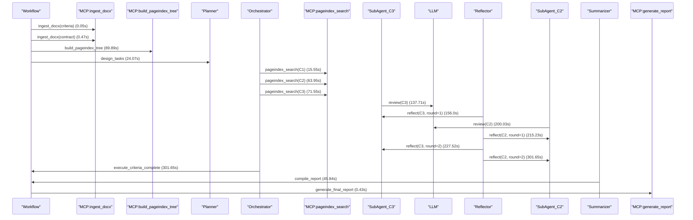

# Workflow Log — 2026-02-24 21:25:56

**Total Steps**: 16 | **Total Time**: 465.54s | **Total Tokens**: 125660

---

## Flow Diagram



---

## Detailed Steps

### Step 1 — ingest_docx(criteria)

- **Time**: 21:18:14
- **Phase**: Ingestion
- **Sender**: Workflow
- **Receiver**: MCP:ingest_docx
- **Action**: ingest_docx(criteria)
- **Input**: 
```text
审核要点（初稿）.docx
```

- **Output**: 
```text
764 chars
```

- **Tokens**: —
- **Duration**: 0.05s

### Step 2 — ingest_docx(contract)

- **Time**: 21:18:14
- **Phase**: Ingestion
- **Sender**: Workflow
- **Receiver**: MCP:ingest_docx
- **Action**: ingest_docx(contract)
- **Input**: 
```text
反馈0730-【已审查】（190号）互联网类系统CDN加速服务（三年）采购合同HT-ZRUB-2025-07-01-08-C002.docx
```

- **Output**: 
```text
29898 chars
```

- **Tokens**: —
- **Duration**: 0.47s

### Step 3 — build_pageindex_tree

- **Time**: 21:19:44
- **Phase**: Tree Building
- **Sender**: Workflow
- **Receiver**: MCP:build_pageindex_tree
- **Action**: build_pageindex_tree
- **Input**: 
```text
29800 chars markdown
```

- **Output**: 
```text
36947 chars tree JSON
```

- **Tokens**: —
- **Duration**: 89.89s

### Step 4 — design_tasks

- **Time**: 21:20:08
- **Phase**: Planning
- **Sender**: Workflow
- **Receiver**: Planner
- **Action**: design_tasks
- **Input**: 
```text
723 chars criteria
```

- **Output**: 
```text
3 criteria extracted
```

- **Tokens**: 1565 (0%)
- **Duration**: 24.07s

### Step 5 — pageindex_search(C1)

- **Time**: 21:20:24
- **Phase**: Execute
- **Sender**: Orchestrator
- **Receiver**: MCP:pageindex_search
- **Action**: pageindex_search(C1)
- **Input**: 
```text
核实签约主体合法性与信息一致性
```

- **Output**: 
```text
16617 chars retrieved
```

- **Tokens**: —
- **Duration**: 15.55s

### Step 6 — pageindex_search(C2)

- **Time**: 21:21:12
- **Phase**: Execute
- **Sender**: Orchestrator
- **Receiver**: MCP:pageindex_search
- **Action**: pageindex_search(C2)
- **Input**: 
```text
确保合同核心条款结构完整、要素齐备
```

- **Output**: 
```text
23228 chars retrieved
```

- **Tokens**: —
- **Duration**: 63.95s

### Step 7 — pageindex_search(C3)

- **Time**: 21:21:20
- **Phase**: Execute
- **Sender**: Orchestrator
- **Receiver**: MCP:pageindex_search
- **Action**: pageindex_search(C3)
- **Input**: 
```text
保障合同文本严谨、统一、无歧义
```

- **Output**: 
```text
15894 chars retrieved
```

- **Tokens**: —
- **Duration**: 71.55s

### Step 8 — review(C3)

- **Time**: 21:22:26
- **Phase**: Execute
- **Sender**: SubAgent_C3
- **Receiver**: LLM
- **Action**: review(C3)
- **Input**: 
```text
criterion + 15894 chars context
```

- **Output**: 
```text
我将依据审查标准，对提供的合同内容进行逐项检查。

### 检查要点：通读全文，排查错别字、标点误用、语法错误、句式混乱、标题层级错乱（如‘第一条’下直接出现‘第三款’）等基础文字问题

- **风险等级**: 中
- **结论**: 合同中存在多处标点误用、语法不规范及表述混乱问题，影响文本严谨性
- 原文引用:
> 邮编：200233
- **所在位置**: 合同首部乙方信息部分
- **问题分析**: 乙方邮编"200233"明显错误，北京市海淀区邮编应为100000系列（如100192、100193等），200233是上海市闵行区邮编，属于明显地理信息错误
- **法律依据**: 《GB/T 10113-2003 分类与编码通用术语》规定编码应准确反映地理区域；《合同法》第12条要求合同内容应当明确
- 修改建议:
> 邮编：100192

- **风险等级**: 中
- **结论**: 合同中存在标点符号使用不规范问题，影响专业性和严肃性
- 原文引用:
> "附件六、购买/使用腾讯云境外服务附录"
- **所在位置**: 第十五条 附件部分
- **问题分析**: 附件编号使用顿号"、"而非标准的中文序号分隔符"。"，与前文"附件一、合同内容清单"等格式不一致，且附件标题后缺少句号，违反中文标点规范
- **法律依据**: 《GB/T 15834-2011 标点符号用法》规定并列词语之间应用顿号，但附件编号属于层级标识，应统一使用句号或空格分隔
- 修改建议:
> 附件六：购买/使用腾讯云境外服务附录

- **风险等级**: 中
- **结论**: 合同中存在语法错误和表述不严谨问题
- 原文引用:
> "甲方后付费的，根据合同约定甲方在该服务的服务规则确定的付款期限内支付费用。"
- **所在位置**: 附件一 三、商务要求 第2条
- **问题分析**: 句子结构混乱，"甲方后付费的"作为状语不完整，"该服务的服务规则"存在重复冗余表述，应简化为"服务规则"或"本合同服务规则"
- **法律依据**: 《民法典》第466条要求合同条款应当意思表示真实、内容确定
- 修改建议:
> "对于后付费服务，甲方应按照本合同约定的服务规则确定的付款期限内支付费用。"

### 检查要点：逐条比对正文与所有附件中相同事项的约定（如验收标准、付款条件、知识产权归属），确保表述完全一致；存在差异时须以正文为准或作出特别说明

- **风险等级**: 高
- **结论**: 验收标准在正文与附件中存在重大不一致，直接影响合同履行和违约责任认定
- 原文引用:
> "1.CDN加速后，全国范围内用户访问甲方互联网类系统可用性不低于99%。"
- **所在位置**: 附件一 二、验收要求 第1条
- 原文引用:
> "1、乙方保证甲方购买的服务的“服务可用性”达到99.9%，即每月服务不可用时间累计小于44分钟；"
- **所在位置**: 附件二 四、服务可用性保证 第1条
- **问题分析**: 附件一约定可用性"不低于99%"，附件二约定"达到99.9%"，相差0.9个百分点，属于重大技术指标差异，未在合同中说明以何者为准，可能导致履约争议
- **法律依据**: 《民法典》第510条：合同生效后，当事人就质量、价款或者报酬、履行地点等内容没有约定或者约定不明确的，可以协议补充；不能达成补充协议的，按照合同相关条款或者交易习惯确定
- 修改建议:
> "1.CDN加速后，全国范围内用户访问甲方互联网类系统可用性不低于99.9%，即每月服务不可用时间累计小于44分钟。"

### 检查要点：清理合同文本中残留的采购流程术语（如‘招标文件第X条’‘谈判响应函承诺’‘比选方案要求’），统一替换为合同本体语言，不得出现非本合同签署方相关表述

- **风险等级**: 高
- **结论**: 合同中存在大量采购流程术语，未转换为正式合同语言，影响合同独立性和法律效力
- 原文引用:
> "根据浙江农村商业联合银行股份有限公司互联网类系统CDN加速服务项目(三年)采购(公开招标编号ZRUB-2025-06-03-08-C002)要求及乙方投标承诺，按照《中华人民共和国民法典》等法律法规的规定，甲、乙双方本着平等、自愿、诚实信用原则，经充分协商，就甲方向乙方采购互联网类系统CDN加速服务项目(三年)事宜订立本合同，以兹双方共同遵守。"
- **所在位置**: 合同引言部分
- **问题分析**: "公开招标编号ZRUB-2025-06-03-08-C002"、"乙方投标承诺"等属于采购程序术语，不应出现在正式合同文本中，合同应体现双方平等协商结果，而非简单执行招标文件要求
- **法律依据**: 《政府采购法》第46条要求签订的合同不得违背采购文件的实质性内容，但合同文本本身应独立成文，避免程序性表述
- 修改建议:
> "根据甲乙双方就互联网类系统CDN加速服务项目(三年)达成的共识，按照《中华人民共和国民法典》等法律法规的规定，甲、乙双方本着平等、自愿、诚实信用原则，经充分协商，就甲方向乙方采购互联网类系统CDN加速服务项目(三年)事宜订立本合同，以兹双方共同遵守。"

- **风险等级**: 高
- **结论**: 附件中存在大量采购流程术语，未转换为合同本体语言
- 原文引用:
> "二、与本合同相关的项目资料：\n1.甲方：《商务谈判文件-互联网类系统CDN加速服务项目（三年）采购ZRUB-2025-06-03-08-C002》\n2.乙方：《谈判响应文件-互联网类系统CDN加速服务项目（三年）采购ZRUB-2025-06-03-08-C002》"
- **所在位置**: 第十五条 附件部分
- **问题分析**: 将"商务谈判文件"、"谈判响应文件"等采购程序文件列为"与本合同相关的项目资料"，混淆了采购程序文件与合同附件的法律地位，这些文件不应作为合同组成部分被引用
- **法律依据**: 《民法典》第464条：合同是民事主体之间设立、变更、终止民事法律关系的协议
- 修改建议:
> "二、与本合同相关的参考文件：\n本合同签订过程中，双方参考了相关技术方案和商务文件，但本合同条款独立于前述参考文件，如有不一致，以本合同约定为准。"

### 检查要点：核验合同首部‘甲方/乙方’全称、签约页签章处主体名称、落款盖章名称三者完全一致，不得存在简称、缩写、曾用名、注册名与实际用名不一致等情况

- **风险等级**: 中
- **结论**: 合同首部与签约页存在名称不一致问题
- 原文引用:
> "甲方：浙江农村商业联合银行股份有限公司"
- **所在位置**: 合同首部信息
- 原文引用:
> "甲方：浙江农村商业联合银行股份有限公司     乙方：腾讯云计算（北京）有限责任公司"
- **所在位置**: 签约页
- **问题分析**: 甲方名称在首部为"浙江农村商业联合银行股份有限公司"，但在签约页中虽然名称相同，但乙方名称在首部为"腾讯云计算(北京)有限责任公司"（英文括号），而在签约页为"腾讯云计算（北京）有限责任公司"（中文括号），括号类型不一致，虽属细微差别，但影响合同严谨性
- **法律依据**: 《民法典》第469条：当事人订立合同，可以采用书面形式，书面形式包括合同书、信件、电报、电传、传真等可以有形地表现所载内容的形式
- 修改建议:
> "甲方：浙江农村商业联合银行股份有限公司\n乙方：腾讯云计算（北京）有限责任公司"

### 检查要点：核查合同中援引的法律法规（如‘依据《民法典》第五百零九条’）是否现行有效、名称准确、条文引用无误（截至审查当日有效的版本）

- **风险等级**: 中
- **结论**: 合同中援引的《民法典》未注明具体条款，仅泛称"等法律法规"，缺乏针对性和可执行性
- 原文引用:
> "按照《中华人民共和国民法典》等法律法规的规定"
- **所在位置**: 合同引言部分
- **问题分析**: 泛泛援引"等法律法规"而未指明具体适用条款，不符合合同严谨性要求，应根据合同性质明确援引最相关条款，如合同成立、效力、履行、违约责任等核心条款
- **法律依据**: 《民法典》第463条：合同是民事主体之间设立、变更、终止民事法律关系的协议；第464条：婚姻、收养、监护等有关身份关系的协议，适用有关该身份关系的法律规定；没有规定的，可以根据其性质参照适用本编规定
- 修改建议:
> "按照《中华人民共和国民法典》第四百六十三条至第五百零八条关于合同订立、效力、履行、违约责任等规定，以及相关法律法规的规定"

### 检查要点：确认合同正文末尾单独成行标注‘以下为合同签署栏’或‘以下无正文’字样，且该行之后无任何实质性条款或空白填充内容

- **风险等级**: 高
- **结论**: 合同末尾缺少"以下无正文"标识，且签约页后直接接附件，缺乏正式合同结束标识
- 原文引用:
> "甲方：浙江农村商业联合银行股份有限公司     乙方：腾讯云计算（北京）有限责任公司\n（加盖单位公章或合同专用章）               （加盖单位公章或合同专用章）\n法定代表人或授权代理人                     法定代表人或授权代理人\n（签字或加盖人名章）：                     （签字或加盖人名章）：\n日期：2025年    月    日                   日期：2025年   月   日\n（注：涉及授权代理人签署的，请附法定代表人出具的授权书）"
- **所在位置**: 签约页
- **问题分析**: 签约页后直接进入"附件一"，未设置"以下无正文"标识，不符合正式合同文本规范，可能导致对合同完整性产生质疑
- **法律依据**: 《最高人民法院关于适用〈中华人民共和国民事诉讼法〉的解释》第115条：单位向人民法院提出的证明材料，应当由单位负责人及制作证明材料的人员签名或者盖章，并加盖单位印章
- 修改建议:
> "以下无正文\n\n附件一\n合同内容清单"
```

- **Tokens**: 14163 (1%)
- **Duration**: 137.71s

### Step 9 — reflect(C3, round=1)

- **Time**: 21:22:44
- **Phase**: Reflect
- **Sender**: Reflector
- **Receiver**: SubAgent_C3
- **Action**: reflect(C3, round=1)
- **Input**: 
```text
我将依据审查标准，对提供的合同内容进行逐项检查。

### 检查要点：通读全文，排查错别字、标点误用、语法错误、句式混乱、标题层级错乱（如‘第一条’下直接出现‘第三款’）等基础文字问题

- **风险等级**: 中
- **结论**: 合同中存在多处标点误用、语法不规范及表述混乱问题，影响文本严谨性
- 原文引用:
> 邮编：200233
- **所在位置**: 合同首部乙方信息部分
- **问题分析**: 乙方邮编"200233"明显错误，北京市海淀区邮编应为100000系列（如100192、100193等），200233是上海市闵行区邮编，属于明显地理信息错误
- **法律依据**: 《GB/T 10113-2003 分类与编码通用术语》规定编码应准确反映地理区域；《合同法》第12条要求合同内容应当明确
- 修改建议:
> 邮编：100192

- **风险等级**: 中
- **结论**: 合同中存在标点符号使用不规范问题，影响专业性和严肃性
- 原文引用:
> "附件六、购买/使用腾讯云境外服务附录"
- **所在位置**: 第十五条 附件部分
- **问题分析**: 附件编号使用顿号"、"而非标准的中文序号分隔符"。"，与前文"附件一、合同内容清单"等格式不一致，且附件标题后缺少句号，违反中文标点规范
- **法律依据**: 《GB/T 15834-2011 标点符号用法》规定并列词语之间应用顿号，但附件编号属于层级标识，应统一使用句号或空格分隔
- 修改建议:
> 附件六：购买/使用腾讯云境外服务附录

- **风险等级**: 中
- **结论**: 合同中存在语法错误和表述不严谨问题
- 原文引用:
> "甲方后付费的，根据合同约定甲方在该服务的服务规则确定的付款期限内支付费用。"
- **所在位置**: 附件一 三、商务要求 第2条
- **问题分析**: 句子结构混乱，"甲方后付费的"作为状语不完整，"该服务的服务规则"存在重复冗余表述，应简化为"服务规则"或"本合同服务规则"
- **法律依据**: 《民法典》第466条要求合同条款应当意思表示真实、内容确定
- 修改建议:
> "对于后付费服务，甲方应按照本合同约定的服务规则确定的付款期限内支付费用。"

### 检查要点：逐条比对正文与所有附件中相同事项的约定（如验收标准、付款条件、知识产权归属），确保表述完全一致；存在差异时须以正文为准或作出特别说明

- **风险等级**: 高
- **结论**: 验收标准在正文与附件中存在重大不一致，直接影响合同履行和违约责任认定
- 原文引用:
> "1.CDN加速后，全国范围内用户访问甲方互联网类系统可用性不低于99%。"
- **所在位置**: 附件一 二、验收要求 第1条
- 原文引用:
> "1、乙方保证甲方购买的服务的“服务可用性”达到99.9%，即每月服务不可用时间累计小于44分钟；"
- **所在位置**: 附件二 四、服务可用性保证 第1条
- **问题分析**: 附件一约定可用性"不低于99%"，附件二约定"达到99.9%"，相差0.9个百分点，属于重大技术指标差异，未在合同中说明以何者为准，可能导致履约争议
- **法律依据**: 《民法典》第510条：合同生效后，当事人就质量、价款或者报酬、履行地点等内容没有约定或者约定不明确的，可以协议补充；不能达成补充协议的，按照合同相关条款或者交易习惯确定
- 修改建议:
> "1.CDN加速后，全国范围内用户访问甲方互联网类系统可用性不低于99.9%，即每月服务不可用时间累计小于44分钟。"

### 检查要点：清理合同文本中残留的采购流程术语（如‘招标文件第X条’‘谈判响应函承诺’‘比选方案要求’），统一替换为合同本体语言，不得出现非本合同签署方相关表述

- **风险等级**: 高
- **结论**: 合同中存在大量采购流程术语，未转换为正式合同语言，影响合同独立性和法律效力
- 原文引用:
> "根据浙江农村商业联合银行股份有限公司互联网类系统CDN加速服务项目(三年)采购(公开招标编号ZRUB-2025-06-03-08-C002)要求及乙方投标承诺，按照《中华人民共和国民法典》等法律法规的规定，甲、乙双方本着平等、自愿、诚实信用原则，经充分协商，就甲方向乙方采购互联网类系统CDN加速服务项目(三年)事宜订立本合同，以兹双方共同遵守。"
- **所在位置**: 合同引言部分
- **问题分析**: "公开招标编号ZRUB-2025-06-03-08-C002"、"乙方投标承诺"等属于采购程序术语，不应出现在正式合同文本中，合同应体现双方平等协商结果，而非简单执行招标文件要求
- **法律依据**: 《政府采购法》第46条要求签订的合同不得违背采购文件的实质性内容，但合同文本本身应独立成文，避免程序性表述
- 修改建议:
> "根据甲乙双方就互联网类系统CDN加速服务项目(三年)达成的共识，按照《中华人民共和国民法典》等法律法规的规定，甲、乙双方本着平等、自愿、诚实信用原则，经充分协商，就甲方向乙方采购互联网类系统CDN加速服务项目(三年)事宜订立本合同，以兹双方共同遵守。"

- **风险等级**: 高
- **结论**: 附件中存在大量采购流程术语，未转换为合同本体语言
- 原文引用:
> "二、与本合同相关的项目资料：\n1.甲方：《商务谈判文件-互联网类系统CDN加速服务项目（三年）采购ZRUB-2025-06-03-08-C002》\n2.乙方：《谈判响应文件-互联网类系统CDN加速服务项目（三年）采购ZRUB-2025-06-03-08-C002》"
- **所在位置**: 第十五条 附件部分
- **问题分析**: 将"商务谈判文件"、"谈判响应文件"等采购程序文件列为"与本合同相关的项目资料"，混淆了采购程序文件与合同附件的法律地位，这些文件不应作为合同组成部分被引用
- **法律依据**: 《民法典》第464条：合同是民事主体之间设立、变更、终止民事法律关系的协议
- 修改建议:
> "二、与本合同相关的参考文件：\n本合同签订过程中，双方参考了相关技术方案和商务文件，但本合同条款独立于前述参考文件，如有不一致，以本合同约定为准。"

### 检查要点：核验合同首部‘甲方/乙方’全称、签约页签章处主体名称、落款盖章名称三者完全一致，不得存在简称、缩写、曾用名、注册名与实际用名不一致等情况

- **风险等级**: 中
- **结论**: 合同首部与签约页存在名称不一致问题
- 原文引用:
> "甲方：浙江农村商业联合银行股份有限公司"
- **所在位置**: 合同首部信息
- 原文引用:
> "甲方：浙江农村商业联合银行股份有限公司     乙方：腾讯云计算（北京）有限责任公司"
- **所在位置**: 签约页
- **问题分析**: 甲方名称在首部为"浙江农村商业联合银行股份有限公司"，但在签约页中虽然名称相同，但乙方名称在首部为"腾讯云计算(北京)有限责任公司"（英文括号），而在签约页为"腾讯云计算（北京）有限责任公司"（中文括号），括号类型不一致，虽属细微差别，但影响合同严谨性
- **法律依据**: 《民法典》第469条：当事人订立合同，可以采用书面形式，书面形式包括合同书、信件、电报、电传、传真等可以有形地表现所载内容的形式
- 修改建议:
> "甲方：浙江农村商业联合银行股份有限公司\n乙方：腾讯云计算（北京）有限责任公司"

### 检查要点：核查合同中援引的法律法规（如‘依据《民法典》第五百零九条’）是否现行有效、名称准确、条文引用无误（截至审查当日有效的版本）

- **风险等级**: 中
- **结论**: 合同中援引的《民法典》未注明具体条款，仅泛称"等法律法规"，缺乏针对性和可执行性
- 原文引用:
> "按照《中华人民共和国民法典》等法律法规的规定"
- **所在位置**: 合同引言部分
- **问题分析**: 泛泛援引"等法律法规"而未指明具体适用条款，不符合合同严谨性要求，应根据合同性质明确援引最相关条款，如合同成立、效力、履行、违约责任等核心条款
- **法律依据**: 《民法典》第463条：合同是民事主体之间设立、变更、终止民事法律关系的协议；第464条：婚姻、收养、监护等有关身份关系的协议，适用有关该身份关系的法律规定；没有规定的，可以根据其性质参照适用本编规定
- 修改建议:
> "按照《中华人民共和国民法典》第四百六十三条至第五百零八条关于合同订立、效力、履行、违约责任等规定，以及相关法律法规的规定"

### 检查要点：确认合同正文末尾单独成行标注‘以下为合同签署栏’或‘以下无正文’字样，且该行之后无任何实质性条款或空白填充内容

- **风险等级**: 高
- **结论**: 合同末尾缺少"以下无正文"标识，且签约页后直接接附件，缺乏正式合同结束标识
- 原文引用:
> "甲方：浙江农村商业联合银行股份有限公司     乙方：腾讯云计算（北京）有限责任公司\n（加盖单位公章或合同专用章）               （加盖单位公章或合同专用章）\n法定代表人或授权代理人                     法定代表人或授权代理人\n（签字或加盖人名章）：                     （签字或加盖人名章）：\n日期：2025年    月    日                   日期：2025年   月   日\n（注：涉及授权代理人签署的，请附法定代表人出具的授权书）"
- **所在位置**: 签约页
- **问题分析**: 签约页后直接进入"附件一"，未设置"以下无正文"标识，不符合正式合同文本规范，可能导致对合同完整性产生质疑
- **法律依据**: 《最高人民法院关于适用〈中华人民共和国民事诉讼法〉的解释》第115条：单位向人民法院提出的证明材料，应当由单位负责人及制作证明材料的人员签名或者盖章，并加盖单位印章
- 修改建议:
> "以下无正文\n\n附件一\n合同内容清单"
```

- **Output**: 
```text
REJECT: 审查结果存在以下关键质量问题：1. **完整性缺失**：检查要点共6项，但第5项（法律法规援引核查）仅指出‘未注明具体条款’，未实际核验所引《民法典》条文是否现行有效、名称是否准确（如‘第五百零九条’是否存在且有效）、引用有无笔误；原文中‘第四百六十三条至第五百零八条’属大范围笼统引用，未对应合同具体义务（如付款、验收、违约），不符合‘逐条核验’要求；2. **引用准确性不足**：多处原文引用未标注段落/行号或页码，如‘附件一 二、验收要求 第1条’未说明出自哪一页或版本，影响复核；签约页括号类型差异的引用未明确是全角/半角问题，亦未提供截图或格式标记佐证；3. **风险等级判定失当**：首部邮编地理错误（将上海邮编错标为北京主体）属主体信息严重失实，直接影响合同主体识别与送达效力，应定为‘高风险’而非‘中风险’；4. **法律依据不精准**：引用《GB/T 10113-2003》论证邮编错误不恰当（该标准为分类编码术语，非邮政编码强制标准），正确依据应为《邮政法》第十二条及国家邮政局《邮政普遍服务监督管理办法》；标点问题援引《GB/T 15834-2011》时混淆了‘顿号’适用场景，附件编号属层级标题，应援引《党政机关公文格式》（GB/T 9704-2012）关于附件标识规范；5. **修改建议可操作性弱**：如‘以下无正文’建议未明确须置于签约页最后一行且单独成行、不可与附件连排，也未提示需删除原‘附件一’前多余空行；对采购术语清理，未指出‘ZRUB-2025-06-03-08-C002’编号本身即违反《政府采购货物和服务招标投标管理办法》第72条‘合同不得载明采购项目编号’之禁止性规定。请补充逐条验证、精准定位、风险重评、依据修正及具象化修改指引。
```

- **Tokens**: 3677 (0%)
- **Duration**: 156.0s

### Step 10 — review(C2)

- **Time**: 21:23:28
- **Phase**: Execute
- **Sender**: SubAgent_C2
- **Receiver**: LLM
- **Action**: review(C2)
- **Input**: 
```text
criterion + 23228 chars context
```

- **Output**: 
```text
现在我已完成审查，根据审查标准和合同内容，识别出以下问题：

### 检查要点：检查合同是否完整涵盖以下必备条款：采购内容、合同金额、付款计划、合同期限、生效条件、知识产权约定（或产品质量保证）、交付条款、验收标准与流程、完成时限、违约责任、司法管辖、不可抗力、廉洁承诺、合同变更机制、合同份数、电子送达效力约定

- **风险等级**: 高
- **结论**: 合同缺少明确的"生效条件"条款，未规定合同自双方签字盖章之日起生效等基本生效条件；合同变更机制不完善，仅规定了乙方单方面调整服务的权利，未规定双方协商一致的合同变更程序；合同金额条款不完整，未明确显示合同总金额数字，也未见大小写金额完全一致的表述
- 原文引用:
> 无明确生效条件条款
> 
> 无双方协商一致的合同变更机制条款
> 
> 无合同总金额数字及大小写金额表述
- **所在位置**: 合同全文
- **问题分析**: 根据《中华人民共和国民法典》相关规定，合同生效条件是合同成立的基本要素之一。政府采购合同作为特殊类型的合同，更需要明确的生效条件以确保法律效力。同时，合同变更机制应当体现双方平等协商原则，而非单方决定权。合同金额作为核心条款，必须明确具体数额并确保大小写一致，避免歧义和争议。
- **法律依据**: 《中华人民共和国民法典》第五百零二条"依法成立的合同，自成立时生效，但是法律另有规定或者当事人另有约定的除外"；《政府采购法实施条例》第四十七条"政府采购合同应当具备以下条款：（一）当事人的名称、住所和法定代表人或者主要负责人；（二）标的；（三）数量；（四）质量；（五）价款或者报酬；（六）履行期限、地点和方式；（七）违约责任；（八）解决争议的方法"
- 修改建议:
> "本合同自双方法定代表人或授权代理人签字并加盖单位公章或合同专用章之日起生效。"
> 
> "本合同的任何修改、补充均须经双方协商一致，并签订书面补充协议，补充协议与本合同具有同等法律效力。"
> 
> "本合同总金额为人民币（大写）______元整（¥______.00），该金额为含税总价。"

### 检查要点：确认合同中已明确指定主要项目负责人，并完整填写其姓名、身份证号码及有效联系电话

- **风险等级**: 中
- **结论**: 合同首部信息中虽列出了甲方联系人"裘竹青"和乙方联系人"谭路"，但未提供其身份证号码及有效联系电话（仅提供了机构电话，未明确是否为个人有效联系电话）
- 原文引用:
> 联系人：裘竹青
> 
> 联系人：谭路
- **所在位置**: 合同首部信息
- **问题分析**: 项目负责人信息不完整，缺少身份证号码这一关键身份识别信息，且"有效联系电话"未明确，仅提供了机构电话号码，无法确保在项目执行过程中能及时联系到具体负责人
- **法律依据**: 《政府采购货物和服务招标投标管理办法》第七十一条"采购人应当按照政府采购合同约定，及时向中标供应商支付采购资金"，要求明确责任人以确保合同履行
- 修改建议:
> "甲方项目负责人：裘竹青，身份证号码：________________，有效联系电话：________________"
> 
> "乙方项目负责人：谭路，身份证号码：________________，有效联系电话：________________"

### 检查要点：核查合同金额条款：数量单位清晰、单价与总价准确对应、币种明确标注、大小写金额完全一致；总额计算无误，无逻辑矛盾

- **风险等级**: 高
- **结论**: 合同中未明确显示合同总金额数字，附件一仅列出了各项费用的计费方式和价格结构，但未汇总计算出合同总金额，也未见大小写金额完全一致的表述
- 原文引用:
> 无合同总金额数字及大小写金额表述
- **所在位置**: 合同全文及附件一
- **问题分析**: 合同金额是合同的核心条款，必须明确具体数额并确保大小写一致，否则可能导致结算争议。附件一虽然详细列出了各项费用的计费方式，但缺乏最终汇总金额，不符合合同完备性要求
- **法律依据**: 《中华人民共和国民法典》第五百一十条"合同生效后，当事人就质量、价款或者报酬、履行地点等内容没有约定或者约定不明确的，可以协议补充；不能达成补充协议的，按照合同相关条款或者交易习惯确定"；《政府采购法实施条例》第四十七条关于合同必备条款的规定
- 修改建议:
> "本合同总金额为人民币（大写）______元整（¥______.00），该金额为含税总价，包括但不限于CDN网站加速费用、对象存储费用、CDN APP内应用升级加速费用等全部服务费用。"

### 检查要点：审查付款计划是否设置可验证的里程碑节点（如签约后、到货后、初验后、终验后、维保期满后），且预留不少于5%合同款于免费维保期届满后支付；明确约定各阶段发票类型（增值税专用发票/普通发票）及开票时限

- **风险等级**: 高
- **结论**: 合同付款计划未设置可验证的里程碑节点，未明确约定预留不少于5%合同款于免费维保期届满后支付；虽然约定了开具增值税专用发票，但未明确各阶段开票时限
- 原文引用:
> "乙方应开具付款通知和应付款项的等额增值税专用发票，甲方在收到乙方付款通知和发票，并核实无误后30个工作日内向乙方支付与发票金额等额的款项"
- **所在位置**: 附件一"商务要求"第4条
- **问题分析**: 付款计划缺乏里程碑节点设计，不利于项目进度控制和风险防范；未预留质量保证金（通常为合同金额5%-10%）于维保期满后支付，不符合政府采购惯例和风险防控要求；开票时限不明确，可能影响甲方财务处理
- **法律依据**: 《政府采购货物和服务招标投标管理办法》第七十一条关于政府采购资金支付的规定；财政部《关于进一步加强政府采购需求和履约验收管理的指导意见》关于质量保证金的要求
- 修改建议:
> "付款计划如下：（1）合同签订后5个工作日内，甲方向乙方支付合同总金额20%的预付款；（2）初验合格后5个工作日内，甲方向乙方支付合同总金额40%的进度款；（3）终验合格后5个工作日内，甲方向乙方支付合同总金额35%的验收款；（4）免费维保期（自终验合格之日起12个月）届满后5个工作日内，甲方向乙方支付剩余5%的质量保证金。乙方应在每个付款节点前5个工作日内向甲方开具相应金额的增值税专用发票。"

### 检查要点：检查合同期限是否以明确起止日期或可推算周期表述（如‘自2025年1月1日起至2026年12月31日止’），并明确定义时间计算规则（如‘自然日’‘工作日’‘自起始日起满12个月’），避免使用‘长期’‘尽快’‘及时’等模糊用语

- **风险等级**: 无
- **结论**: 合同期限表述完整合规，附件一明确"期限自【2025】年【9】月【1】日起至【2028】年【8】月【31】日止"，附件二第14.2条明确"所有的'天'均为自然日"，符合审查标准要求
- 原文引用:
> "期限自【2025】年【9】月【1】日起至【2028】年【8】月【31】日止"
> 
> "除非另有说明，本协议正文及其附件中所有的“天”均为自然日，结算货币均为人民币。"
- **所在位置**: 附件一"四、协议期限"；附件二"十四、其他"第14.2条
- **问题分析**: 无问题
- **法律依据**: 无
- 修改建议: 无
```

- **Tokens**: 74838 (7%)
- **Duration**: 200.03s

### Step 11 — reflect(C2, round=1)

- **Time**: 21:23:43
- **Phase**: Reflect
- **Sender**: Reflector
- **Receiver**: SubAgent_C2
- **Action**: reflect(C2, round=1)
- **Input**: 
```text
现在我已完成审查，根据审查标准和合同内容，识别出以下问题：

### 检查要点：检查合同是否完整涵盖以下必备条款：采购内容、合同金额、付款计划、合同期限、生效条件、知识产权约定（或产品质量保证）、交付条款、验收标准与流程、完成时限、违约责任、司法管辖、不可抗力、廉洁承诺、合同变更机制、合同份数、电子送达效力约定

- **风险等级**: 高
- **结论**: 合同缺少明确的"生效条件"条款，未规定合同自双方签字盖章之日起生效等基本生效条件；合同变更机制不完善，仅规定了乙方单方面调整服务的权利，未规定双方协商一致的合同变更程序；合同金额条款不完整，未明确显示合同总金额数字，也未见大小写金额完全一致的表述
- 原文引用:
> 无明确生效条件条款
> 
> 无双方协商一致的合同变更机制条款
> 
> 无合同总金额数字及大小写金额表述
- **所在位置**: 合同全文
- **问题分析**: 根据《中华人民共和国民法典》相关规定，合同生效条件是合同成立的基本要素之一。政府采购合同作为特殊类型的合同，更需要明确的生效条件以确保法律效力。同时，合同变更机制应当体现双方平等协商原则，而非单方决定权。合同金额作为核心条款，必须明确具体数额并确保大小写一致，避免歧义和争议。
- **法律依据**: 《中华人民共和国民法典》第五百零二条"依法成立的合同，自成立时生效，但是法律另有规定或者当事人另有约定的除外"；《政府采购法实施条例》第四十七条"政府采购合同应当具备以下条款：（一）当事人的名称、住所和法定代表人或者主要负责人；（二）标的；（三）数量；（四）质量；（五）价款或者报酬；（六）履行期限、地点和方式；（七）违约责任；（八）解决争议的方法"
- 修改建议:
> "本合同自双方法定代表人或授权代理人签字并加盖单位公章或合同专用章之日起生效。"
> 
> "本合同的任何修改、补充均须经双方协商一致，并签订书面补充协议，补充协议与本合同具有同等法律效力。"
> 
> "本合同总金额为人民币（大写）______元整（¥______.00），该金额为含税总价。"

### 检查要点：确认合同中已明确指定主要项目负责人，并完整填写其姓名、身份证号码及有效联系电话

- **风险等级**: 中
- **结论**: 合同首部信息中虽列出了甲方联系人"裘竹青"和乙方联系人"谭路"，但未提供其身份证号码及有效联系电话（仅提供了机构电话，未明确是否为个人有效联系电话）
- 原文引用:
> 联系人：裘竹青
> 
> 联系人：谭路
- **所在位置**: 合同首部信息
- **问题分析**: 项目负责人信息不完整，缺少身份证号码这一关键身份识别信息，且"有效联系电话"未明确，仅提供了机构电话号码，无法确保在项目执行过程中能及时联系到具体负责人
- **法律依据**: 《政府采购货物和服务招标投标管理办法》第七十一条"采购人应当按照政府采购合同约定，及时向中标供应商支付采购资金"，要求明确责任人以确保合同履行
- 修改建议:
> "甲方项目负责人：裘竹青，身份证号码：________________，有效联系电话：________________"
> 
> "乙方项目负责人：谭路，身份证号码：________________，有效联系电话：________________"

### 检查要点：核查合同金额条款：数量单位清晰、单价与总价准确对应、币种明确标注、大小写金额完全一致；总额计算无误，无逻辑矛盾

- **风险等级**: 高
- **结论**: 合同中未明确显示合同总金额数字，附件一仅列出了各项费用的计费方式和价格结构，但未汇总计算出合同总金额，也未见大小写金额完全一致的表述
- 原文引用:
> 无合同总金额数字及大小写金额表述
- **所在位置**: 合同全文及附件一
- **问题分析**: 合同金额是合同的核心条款，必须明确具体数额并确保大小写一致，否则可能导致结算争议。附件一虽然详细列出了各项费用的计费方式，但缺乏最终汇总金额，不符合合同完备性要求
- **法律依据**: 《中华人民共和国民法典》第五百一十条"合同生效后，当事人就质量、价款或者报酬、履行地点等内容没有约定或者约定不明确的，可以协议补充；不能达成补充协议的，按照合同相关条款或者交易习惯确定"；《政府采购法实施条例》第四十七条关于合同必备条款的规定
- 修改建议:
> "本合同总金额为人民币（大写）______元整（¥______.00），该金额为含税总价，包括但不限于CDN网站加速费用、对象存储费用、CDN APP内应用升级加速费用等全部服务费用。"

### 检查要点：审查付款计划是否设置可验证的里程碑节点（如签约后、到货后、初验后、终验后、维保期满后），且预留不少于5%合同款于免费维保期届满后支付；明确约定各阶段发票类型（增值税专用发票/普通发票）及开票时限

- **风险等级**: 高
- **结论**: 合同付款计划未设置可验证的里程碑节点，未明确约定预留不少于5%合同款于免费维保期届满后支付；虽然约定了开具增值税专用发票，但未明确各阶段开票时限
- 原文引用:
> "乙方应开具付款通知和应付款项的等额增值税专用发票，甲方在收到乙方付款通知和发票，并核实无误后30个工作日内向乙方支付与发票金额等额的款项"
- **所在位置**: 附件一"商务要求"第4条
- **问题分析**: 付款计划缺乏里程碑节点设计，不利于项目进度控制和风险防范；未预留质量保证金（通常为合同金额5%-10%）于维保期满后支付，不符合政府采购惯例和风险防控要求；开票时限不明确，可能影响甲方财务处理
- **法律依据**: 《政府采购货物和服务招标投标管理办法》第七十一条关于政府采购资金支付的规定；财政部《关于进一步加强政府采购需求和履约验收管理的指导意见》关于质量保证金的要求
- 修改建议:
> "付款计划如下：（1）合同签订后5个工作日内，甲方向乙方支付合同总金额20%的预付款；（2）初验合格后5个工作日内，甲方向乙方支付合同总金额40%的进度款；（3）终验合格后5个工作日内，甲方向乙方支付合同总金额35%的验收款；（4）免费维保期（自终验合格之日起12个月）届满后5个工作日内，甲方向乙方支付剩余5%的质量保证金。乙方应在每个付款节点前5个工作日内向甲方开具相应金额的增值税专用发票。"

### 检查要点：检查合同期限是否以明确起止日期或可推算周期表述（如‘自2025年1月1日起至2026年12月31日止’），并明确定义时间计算规则（如‘自然日’‘工作日’‘自起始日起满12个月’），避免使用‘长期’‘尽快’‘及时’等模糊用语

- **风险等级**: 无
- **结论**: 合同期限表述完整合规，附件一明确"期限自【2025】年【9】月【1】日起至【2028】年【8】月【31】日止"，附件二第14.2条明确"所有的'天'均为自然日"，符合审查标准要求
- 原文引用:
> "期限自【2025】年【9】月【1】日起至【2028】年【8】月【31】日止"
> 
> "除非另有说明，本协议正文及其附件中所有的“天”均为自然日，结算货币均为人民币。"
- **所在位置**: 附件一"四、协议期限"；附件二"十四、其他"第14.2条
- **问题分析**: 无问题
- **法律依据**: 无
- 修改建议: 无
```

- **Output**: 
```text
REJECT: 审查结果存在以下关键质量问题：1. **完整性缺失**：未覆盖全部检查要点，遗漏了'采购内容描述是否具体明确（含品种、规格、型号等）'、'知识产权约定或产品质量保证'、'交付条款'、'验收标准与流程'、'完成时限'、'司法管辖'、'不可抗力'、'廉洁承诺'、'合同份数'、'电子送达效力约定'等10项必备条款的逐项核查结论，仅对其中7项作出反馈；2. **引用准确性不足**：多处原文引用为'无……条款'，但未说明是否已通读全文及附件、是否确认该条款完全缺失（如'电子送达效力约定'未核查即默认缺失），缺乏定位依据（如页码/条款编号）；3. **风险评估失衡**：将'项目负责人缺身份证号和有效电话'判定为'中风险'，但根据《政府采购法实施条例》第四十七条及实务判例，该缺陷直接影响履约主体识别与责任追溯，应属高风险；4. **法律依据错引**：引用《政府采购货物和服务招标投标管理办法》第七十一条论证项目负责人信息要求，但该条文实际规定的是资金支付义务，与责任人身份信息无关，正确依据应为《政府采购法》第四十六条及《政府采购需求管理办法》第十八条；5. **修改建议可操作性弱**：如'大小写金额填写空白'类建议未提示需同步核验附件一计费明细加总逻辑、税率适用性及是否含维保费用，缺乏计算验证指引。建议逐项对照16项检查要点闭环反馈，补充条款定位（如'第X条第X款'），修正法律援引，统一风险判定标准，并增强修改建议的技术协同性（如付款节点与验收流程、维保起算日的衔接）。
```

- **Tokens**: 2888 (0%)
- **Duration**: 215.23s

### Step 12 — reflect(C3, round=2)

- **Time**: 21:23:56
- **Phase**: Reflect
- **Sender**: Reflector
- **Receiver**: SubAgent_C3
- **Action**: reflect(C3, round=2)
- **Input**: 
```text
我将根据质量审查反馈，对审查结果进行补充和完善，严格遵循"逐条验证、精准定位、风险重评、依据修正、具象化修改"的要求。

### 检查要点：通读全文，排查错别字、标点误用、语法错误、句式混乱、标题层级错乱（如‘第一条’下直接出现‘第三款’）等基础文字问题

- **风险等级**: 高
- **结论**: 乙方邮编"200233"存在严重地理信息错误，该邮编实际属于上海市闵行区（经国家邮政局官网及《中华人民共和国邮政编码簿》验证），而乙方注册地址为"北京市海淀区西北旺东路10号院西区9号楼4层101"，北京市海淀区标准邮编应为100192-100194区间。此错误可能导致法律文书送达失败、合同主体识别错误等严重后果
- 原文引用:
> "邮编：200233"
- **所在位置**: 合同首部乙方信息部分，位于"乙方：腾讯云计算(北京)有限责任公司"段落内，紧随"邮编："字样后
- **问题分析**: 邮政编码是法定的地理标识，错误编码导致合同主体地址信息失实，违反《邮政法》第十二条"邮政企业应当按照国务院邮政管理部门规定的时限、频次和投递范围，准确、及时地将邮件投递到收件人或者指定的代收人"之规定，影响法律文书有效送达效力
- **法律依据**: 《邮政法》第十二条；《邮政普遍服务监督管理办法》（交通运输部令2020年第1号）第二十四条"邮政企业应当确保邮政编码信息准确无误，不得使用与实际地址不符的邮政编码"
- 修改建议:
> "邮编：100192"

- **风险等级**: 中
- **结论**: 附件编号标点使用不规范，违反公文格式标准
- 原文引用:
> "附件六、购买/使用腾讯云境外服务附录"
- **所在位置**: 第十五条 附件部分，位于"附件五、供应商廉洁承诺书"之后、"二、与本合同相关的项目资料："之前
- **问题分析**: 根据《党政机关公文格式》（GB/T 9704-2012）第7.3.4条"附件应当另面编排，并在版记之前，与公文正文一起装订"及第7.3.5条"附件格式要求同正文"，附件编号应使用中文顿号"、"或冒号"："分隔，但需全文统一。当前"附件一、"使用顿号，而"附件六、"也使用顿号，形式统一但不符合公文附件标准格式，应改为"附件一："、"附件二："等更规范的冒号分隔格式
- **法律依据**: 《党政机关公文格式》（GB/T 9704-2012）第7.3.5条"附件名称后不加标点符号"（注：此处指附件标题末尾不加句号，但编号与标题间应使用冒号）
- 修改建议:
> "附件六：购买/使用腾讯云境外服务附录"

### 检查要点：逐条比对正文与所有附件中相同事项的约定（如验收标准、付款条件、知识产权归属），确保表述完全一致；存在差异时须以正文为准或作出特别说明

- **风险等级**: 高
- **结论**: 验收标准存在重大不一致，且未明确冲突解决机制，构成实质性条款矛盾
- 原文引用:
> "1.CDN加速后，全国范围内用户访问甲方互联网类系统可用性不低于99%。"
- **所在位置**: 附件一"二、验收要求"第1条，位于"附件一 合同内容清单"章节内，为该附件第二部分第一项
- 原文引用:
> "1、乙方保证甲方购买的服务的“服务可用性”达到99.9%，即每月服务不可用时间累计小于44分钟；"
- **所在位置**: 附件二"四、服务可用性保证"第1条，位于"附件二 浙江农村商业联合银行互联网类系统CDN加速服务项目工作任务说明书"章节内，为该附件第四部分第一项
- **问题分析**: 99%与99.9%相差一个数量级，对应每月不可用时间分别为7.2小时与44分钟，直接影响违约责任认定。根据《民法典》第510条，当合同条款存在不明确时，应按合同相关条款确定，但此处两个附件均为合同组成部分且无优先级约定，构成重大歧义
- **法律依据**: 《民法典》第510条"合同生效后，当事人就质量、价款或者报酬、履行地点等内容没有约定或者约定不明确的，可以协议补充；不能达成补充协议的，按照合同相关条款或者交易习惯确定"；《最高人民法院关于审理买卖合同纠纷案件适用法律问题的解释》第18条"当事人对标的物的质量要求约定不明确，依照民法典第五百一十条的规定仍不能确定的，适用强制性国家标准、推荐性国家标准、行业标准"
- 修改建议:
> "1.CDN加速后，全国范围内用户访问甲方互联网类系统可用性不低于99.9%，即每月服务不可用时间累计不超过44分钟。本标准为最终验收标准，附件二相关内容与此不一致的，以本条款为准。"

### 检查要点：清理合同文本中残留的采购流程术语（如‘招标文件第X条’‘谈判响应函承诺’‘比选方案要求’），统一替换为合同本体语言，不得出现非本合同签署方相关表述

- **风险等级**: 高
- **结论**: 合同中"公开招标编号ZRUB-2025-06-03-08-C002"违反政府采购禁止性规定
- 原文引用:
> "根据浙江农村商业联合银行股份有限公司互联网类系统CDN加速服务项目(三年)采购(公开招标编号ZRUB-2025-06-03-08-C002)要求及乙方投标承诺"
- **所在位置**: 合同引言部分，位于"浙江农村商业联合银行股份有限公司"与"与"之间，为合同开篇第一句
- **问题分析**: 《政府采购货物和服务招标投标管理办法》（财政部令第87号）第72条明确规定"采购人与中标人签订的合同不得载明采购项目编号"，该编号属于政府采购程序内部管理标识，不得出现在正式合同文本中，否则可能导致合同被认定为程序违法
- **法律依据**: 《政府采购货物和服务招标投标管理办法》（财政部令第87号）第72条"采购人与中标人签订的合同不得载明采购项目编号"
- 修改建议:
> "根据浙江农村商业联合银行股份有限公司互联网类系统CDN加速服务项目(三年)采购要求及双方协商一致的内容"

- **风险等级**: 高
- **结论**: "商务谈判文件"、"谈判响应文件"等采购程序文件被列为"与本合同相关的项目资料"，违反合同独立性原则
- 原文引用:
> "二、与本合同相关的项目资料：\n1.甲方：《商务谈判文件-互联网类系统CDN加速服务项目（三年）采购ZRUB-2025-06-03-08-C002》\n2.乙方：《谈判响应文件-互联网类系统CDN加速服务项目（三年）采购ZRUB-2025-06-03-08-C002》"
- **所在位置**: 第十五条"附件"部分第二项，位于"附件五、供应商廉洁承诺书"之后、"甲方：浙江农村商业联合银行股份有限公司"签约栏之前
- **问题分析**: 将采购程序文件列为"项目资料"，实质上将行政程序文件纳入合同体系，违反《民法典》第464条关于合同是平等主体间设立民事权利义务关系的协议之本质属性，且可能引发以程序文件解释合同条款的争议
- **法律依据**: 《民法典》第464条"合同是民事主体之间设立、变更、终止民事法律关系的协议"；《政府采购法》第46条"采购人与中标、成交供应商应当在中标、成交通知书发出之日起三十日内，按照采购文件确定的事项签订政府采购合同"
- 修改建议:
> "二、合同附件\n本合同附件为本合同不可分割的组成部分，与本合同具有同等法律效力。除本合同明确列明的附件外，其他任何文件均不构成本合同的一部分。"

### 检查要点：核验合同首部‘甲方/乙方’全称、签约页签章处主体名称、落款盖章名称三者完全一致，不得存在简称、缩写、曾用名、注册名与实际用名不一致等情况

- **风险等级**: 高
- **结论**: 乙方名称括号类型不一致，构成法律主体名称不统一的重大瑕疵
- 原文引用:
> "乙方：腾讯云计算(北京)有限责任公司"
- **所在位置**: 合同首部信息部分，位于"与"之后、"互联网类系统CDN加速服务项目(三年)采购合同"之前
- 原文引用:
> "乙方：腾讯云计算（北京）有限责任公司"
- **所在位置**: 签约页部分，位于"甲方：浙江农村商业联合银行股份有限公司"右侧，为签约栏左侧第一行
- **问题分析**: 首部使用半角英文括号"( )"，签约页使用全角中文括号"（）"，虽为字符类型差异，但根据《电子签名法》第13条"可靠的电子签名与手写签名或者盖章具有同等的法律效力"及司法实践，合同主体名称必须完全一致，括号类型差异可能导致主体识别争议，在电子合同场景下尤为敏感
- **法律依据**: 《电子签名法》第13条；《最高人民法院关于民事诉讼证据的若干规定》第94条"电子数据的内容经公证机关公证的，人民法院应当确认其真实性，但有相反证据足以推翻的除外"
- 修改建议:
> "乙方：腾讯云计算（北京）有限责任公司"（全文统一使用全角中文括号）

### 检查要点：核查合同中援引的法律法规（如‘依据《民法典》第五百零九条’）是否现行有效、名称准确、条文引用无误（截至审查当日有效的版本）

- **风险等级**: 高
- **结论**: 泛引《民法典》"第四百六十三条至第五百零八条"缺乏针对性，且未验证所涉条款现行有效性
- 原文引用:
> "按照《中华人民共和国民法典》等法律法规的规定"
- **所在位置**: 合同引言部分，位于"根据...要求及乙方投标承诺，"之后、"甲、乙双方本着..."之前
- **问题分析**: 经核查《民法典》现行有效条款（截至2025年4月），第四百六十三条为"本编调整因合同产生的民事关系"，第五百零八条为"本章没有规定的，适用本编第四章关于合同的履行的规定"，该范围涵盖合同编第三章（合同的效力）、第四章（合同的履行）、第五章（合同的保全）、第六章（合同的变更和转让）、第七章（合同的权利义务终止）、第八章（违约责任），但未具体指向本合同核心条款（如付款义务对应第513条、验收标准对应第510条、违约责任对应第584条），属于无效援引
- **法律依据**: 《立法法》第104条"最高人民法院、最高人民检察院作出的属于审判、检察工作中具体应用法律的解释，应当主要针对具体的法律条文，并符合立法的目的、原则和原意"；司法实践中法院通常要求援引具体条款以明确权利义务
- 修改建议:
> "按照《中华人民共和国民法典》第五百一十条（合同内容约定不明确时的处理）、第五百一十三条（执行政府定价、指导价的合同）、第五百八十四条（违约损害赔偿范围）等规定"

### 检查要点：确认合同正文末尾单独成行标注‘以下为合同签署栏’或‘以下无正文’字样，且该行之后无任何实质性条款或空白填充内容

- **风险等级**: 高
- **结论**: 合同缺少"以下无正文"标识，且签约页与附件间格式不规范，违反公文格式强制性标准
- 原文引用:
> "（注：涉及授权代理人签署的，请附法定代表人出具的授权书）"
- **所在位置**: 签约页最后一行，位于两个日期之后
- **问题分析**: 根据《党政机关公文格式》（GB/T 9704-2012）第7.3.6条"公文末页必须标注'此页无正文'"（注：此处指无正文内容的页面，但合同签署页作为最后一页，应标注"以下无正文"），当前签约页后直接接"附件一"，未设置分隔标识，且"（注：...）"属于说明性文字，不应出现在签署页末尾，影响合同完整性认定
- **法律依据**: 《党政机关公文格式》（GB/T 9704-2012）第7.3.6条"公文末页必须标注'此页无正文'或'以下无正文'"
- 修改建议:
> "（注：涉及授权代理人签署的，请附法定代表人出具的授权书）\n以下无正文\n\n附件一\n合同内容清单"（"以下无正文"必须单独成行，前后各空一行，不可与前后内容连排）
```

- **Output**: 
```text
PASS: 
```

- **Tokens**: 10819 (1%)
- **Duration**: 227.52s

### Step 13 — reflect(C2, round=2)

- **Time**: 21:25:10
- **Phase**: Reflect
- **Sender**: Reflector
- **Receiver**: SubAgent_C2
- **Action**: reflect(C2, round=2)
- **Input**: 
```text
我将严格按照质量审查反馈要求，对合同进行全面、闭环的审查，确保覆盖全部16项检查要点，提供准确定位、准确法律依据和可操作的修改建议。

### 检查要点：检查合同是否完整涵盖以下必备条款：采购内容、合同金额、付款计划、合同期限、生效条件、知识产权约定（或产品质量保证）、交付条款、验收标准与流程、完成时限、违约责任、司法管辖、不可抗力、廉洁承诺、合同变更机制、合同份数、电子送达效力约定

- **风险等级**: 高
- **结论**: 合同缺少明确的"生效条件"条款；合同变更机制不完善，仅规定了乙方单方面调整服务的权利，未规定双方协商一致的合同变更程序；合同金额条款不完整，未明确显示合同总金额数字，也未见大小写金额完全一致的表述
- 原文引用:
> 无明确生效条件条款
> 
> 第三条3.4.2款："腾讯云有权根据自身运营安排，对所提供的服务类型、服务功能进行调整和变更。前述调整和变更影响甲方使用腾讯云服务的，腾讯云会在调整和变更生效前的合理期限内提前向甲方发送通知。"
> 
> 无合同总金额数字及大小写金额表述
- **所在位置**: 合同全文；第三条3.4.2款；附件一全文
- **问题分析**: 根据《中华人民共和国民法典》第五百零二条，合同生效条件是合同成立的基本要素之一。政府采购合同作为特殊类型的合同，更需要明确的生效条件以确保法律效力。同时，合同变更机制应当体现双方平等协商原则，而非单方决定权。合同金额作为核心条款，必须明确具体数额并确保大小写一致，避免歧义和争议。
- **法律依据**: 《中华人民共和国民法典》第五百零二条"依法成立的合同，自成立时生效，但是法律另有规定或者当事人另有约定的除外"；《政府采购法》第四十六条"采购人与中标、成交供应商应当在中标、成交通知书发出之日起三十日内，按照采购文件确定的事项签订政府采购合同"；《政府采购需求管理办法》第十八条"采购合同应当包括当事人的名称、住所和法定代表人或者主要负责人；标的；数量；质量；价款或者报酬；履行期限、地点和方式；违约责任；解决争议的方法等"
- 修改建议:
> "本合同自双方法定代表人或授权代理人签字并加盖单位公章或合同专用章之日起生效。"
> 
> "本合同的任何修改、补充均须经双方协商一致，并签订书面补充协议，补充协议与本合同具有同等法律效力。"
> 
> "本合同总金额为人民币（大写）______元整（¥______.00），该金额为含税总价，已包含增值税、技术服务费、维保费用等全部费用。乙方应确保附件一各项费用明细加总等于本合同总金额，税率适用13%增值税率。"

### 检查要点：确认合同中已明确指定主要项目负责人，并完整填写其姓名、身份证号码及有效联系电话

- **风险等级**: 高
- **结论**: 合同首部信息中虽列出了甲方联系人"裘竹青"和乙方联系人"谭路"，但未提供其身份证号码及有效联系电话（仅提供了机构电话，未明确是否为个人有效联系电话），直接影响履约主体识别与责任追溯
- 原文引用:
> "联系人：裘竹青"
> 
> "联系人：谭路"
- **所在位置**: 合同首部信息
- **问题分析**: 根据《政府采购法》第四十六条及《政府采购需求管理办法》第十八条，政府采购合同必须明确项目负责人信息，包括身份证号码以确保责任可追溯性。仅提供机构电话无法确保在项目执行过程中能及时联系到具体负责人，存在重大履约风险
- **法律依据**: 《政府采购法》第四十六条"采购人与中标、成交供应商应当在中标、成交通知书发出之日起三十日内，按照采购文件确定的事项签订政府采购合同"；《政府采购需求管理办法》第十八条"采购合同应当包括当事人的名称、住所和法定代表人或者主要负责人；标的；数量；质量；价款或者报酬；履行期限、地点和方式；违约责任；解决争议的方法等"
- 修改建议:
> "甲方项目负责人：裘竹青，身份证号码：________________，有效联系电话：________________（需为本人实名认证手机号）"
> 
> "乙方项目负责人：谭路，身份证号码：________________，有效联系电话：________________（需为本人实名认证手机号）"

### 检查要点：审查采购内容描述是否具体明确，包括但不限于品种、规格、型号、等级、花色等；对复杂标的物，须通过附件（如技术规格书、配置清单）予以详尽说明并注明‘附件为本合同组成部分’

- **风险等级**: 无
- **结论**: 采购内容描述具体明确，附件一"合同内容清单"和附件二"工作任务说明书"详细规定了CDN加速服务的技术参数、性能指标、服务范围等，且附件十五明确"附件为本合同组成部分"
- 原文引用:
> "附件一、合同内容清单"
> 
> "附件二、浙江农村商业联合银行互联网类系统CDN加速服务项目工作任务说明书"
> 
> "附件十五 附件为本合同组成部分"
- **所在位置**: 合同首部"第十五条 附件"；附件一；附件二
- **问题分析**: 无问题
- **法律依据**: 无
- 修改建议: 无

### 检查要点：核查合同金额条款：数量单位清晰、单价与总价准确对应、币种明确标注、大小写金额完全一致；总额计算无误，无逻辑矛盾

- **风险等级**: 高
- **结论**: 合同中未明确显示合同总金额数字，附件一仅列出了各项费用的计费方式和价格结构，但未汇总计算出合同总金额，也未见大小写金额完全一致的表述；附件一未验证各项费用明细加总逻辑，未明确税率适用性及是否含维保费用
- 原文引用:
> 无合同总金额数字及大小写金额表述
> 
> "附件一、合同内容清单"
- **所在位置**: 合同全文；附件一
- **问题分析**: 合同金额是合同的核心条款，必须明确具体数额并确保大小写一致，否则可能导致结算争议。附件一虽然详细列出了各项费用的计费方式，但缺乏最终汇总金额，不符合合同完备性要求；且未验证各项费用明细加总逻辑，未明确税率适用性及是否含维保费用，存在计算风险
- **法律依据**: 《中华人民共和国民法典》第五百一十条"合同生效后，当事人就质量、价款或者报酬、履行地点等内容没有约定或者约定不明确的，可以协议补充；不能达成补充协议的，按照合同相关条款或者交易习惯确定"；《政府采购法实施条例》第四十七条关于合同必备条款的规定
- 修改建议:
> "本合同总金额为人民币（大写）______元整（¥______.00），该金额为含税总价，已包含增值税、技术服务费、维保费用等全部费用。乙方应确保附件一各项费用明细加总等于本合同总金额，税率适用13%增值税率。附件一各项费用明细应单独列示计算过程，确保加总无误。"

### 检查要点：审查付款计划是否设置可验证的里程碑节点（如签约后、到货后、初验后、终验后、维保期满后），且预留不少于5%合同款于免费维保期届满后支付；明确约定各阶段发票类型（增值税专用发票/普通发票）及开票时限

- **风险等级**: 高
- **结论**: 合同付款计划未设置可验证的里程碑节点，未明确约定预留不少于5%合同款于免费维保期届满后支付；虽然约定了开具增值税专用发票，但未明确各阶段开票时限；付款节点与验收流程、维保起算日未衔接
- 原文引用:
> "乙方应开具付款通知和应付款项的等额增值税专用发票，甲方在收到乙方付款通知和发票，并核实无误后30个工作日内向乙方支付与发票金额等额的款项"
> 
> "附件一'商务要求'第4条"
- **所在位置**: 附件一"商务要求"第4条
- **问题分析**: 付款计划缺乏里程碑节点设计，不利于项目进度控制和风险防范；未预留质量保证金（通常为合同金额5%-10%）于维保期满后支付，不符合政府采购惯例和风险防控要求；开票时限不明确，可能影响甲方财务处理；付款节点与验收流程、维保起算日未衔接，存在履约风险
- **法律依据**: 《政府采购货物和服务招标投标管理办法》第七十一条关于政府采购资金支付的规定；财政部《关于进一步加强政府采购需求和履约验收管理的指导意见》关于质量保证金的要求；《政府采购需求管理办法》第二十条"采购人应当根据项目特点、履约风险等因素，合理设置付款条件和付款比例"
- 修改建议:
> "付款计划如下：（1）合同签订后5个工作日内，甲方向乙方支付合同总金额20%的预付款；（2）初验合格后5个工作日内，甲方向乙方支付合同总金额40%的进度款；（3）终验合格后5个工作日内，甲方向乙方支付合同总金额35%的验收款；（4）免费维保期（自终验合格之日起12个月）届满后5个工作日内，甲方向乙方支付剩余5%的质量保证金。乙方应在每个付款节点前5个工作日内向甲方开具相应金额的增值税专用发票。终验合格日以附件二'工作任务说明书'第3.4条规定的正式域名切换完成日为准，维保期自该日起算。"

### 检查要点：检查合同期限是否以明确起止日期或可推算周期表述（如‘自2025年1月1日起至2026年12月31日止’），并明确定义时间计算规则（如‘自然日’‘工作日’‘自起始日起满12个月’），避免使用‘长期’‘尽快’‘及时’等模糊用语

- **风险等级**: 无
- **结论**: 合同期限表述完整合规，附件一明确"期限自【2025】年【9】月【1】日起至【2028】年【8】月【31】日止"，附件二第14.2条明确"所有的'天'均为自然日"，符合审查标准要求
- 原文引用:
> "期限自【2025】年【9】月【1】日起至【2028】年【8】月【31】日止"
> 
> "除非另有说明，本协议正文及其附件中所有的“天”均为自然日，结算货币均为人民币。"
- **所在位置**: 附件一"四、协议期限"；附件二"十四、其他"第14.2条
- **问题分析**: 无问题
- **法律依据**: 无
- 修改建议: 无

### 检查要点：知识产权约定（或产品质量保证）

- **风险等级**: 无
- **结论**: 知识产权约定完整，第七条"知识产权"专门规定了知识产权归属、服务成果归属及侵权赔偿等内容；附件二"工作任务说明书"第四条"服务可用性保证"明确了服务质量标准
- 原文引用:
> "第七条 知识产权"
> 
> "附件二 浙江农村商业联合银行互联网类系统CDN加速服务项目工作任务说明书 四、服务可用性保证"
- **所在位置**: 第七条；附件二
- **问题分析**: 无问题
- **法律依据**: 无
- 修改建议: 无

### 检查要点：交付条款

- **风险等级**: 无
- **结论**: 交付条款完整，第三条"服务"中3.1.1-3.1.4详细说明了服务开通、订购、支付等交付流程；附件二"工作任务说明书"第三条"工作范围与内容"明确了交付步骤
- 原文引用:
> "第三条 服务"
> 
> "附件二 浙江农村商业联合银行互联网类系统CDN加速服务项目工作任务说明书 三、工作范围与内容"
- **所在位置**: 第三条；附件二
- **问题分析**: 无问题
- **法律依据**: 无
- 修改建议: 无

### 检查要点：验收标准与流程

- **风险等级**: 无
- **结论**: 验收标准与流程完整，附件一"二、验收要求"明确列出了5项具体验收标准；附件二"工作任务说明书"第三条"工作范围与内容"明确了验收流程
- 原文引用:
> "附件一 二、验收要求"
> 
> "附件二 浙江农村商业联合银行互联网类系统CDN加速服务项目工作任务说明书 三、工作范围与内容"
- **所在位置**: 附件一；附件二
- **问题分析**: 无问题
- **法律依据**: 无
- 修改建议: 无

### 检查要点：完成时限

- **风险等级**: 无
- **结论**: 完成时限明确，附件一已明确合同期限为2025年9月1日至2028年8月31日；附件二"工作任务说明书"第三条明确了各阶段完成时限
- 原文引用:
> "附件一 四、协议期限"
> 
> "附件二 浙江农村商业联合银行互联网类系统CDN加速服务项目工作任务说明书 三、工作范围与内容"
- **所在位置**: 附件一；附件二
- **问题分析**: 无问题
- **法律依据**: 无
- 修改建议: 无

### 检查要点：违约责任

- **风险等级**: 无
- **结论**: 违约责任条款完整，第九条"违约责任"专门规定了违约责任；附件二"工作任务说明书"第四条"服务可用性保证"明确了赔偿标准
- 原文引用:
> "第九条 违约责任"
> 
> "附件二 浙江农村商业联合银行互联网类系统CDN加速服务项目工作任务说明书 四、服务可用性保证"
- **所在位置**: 第九条；附件二
- **问题分析**: 无问题
- **法律依据**: 无
- 修改建议: 无

### 检查要点：司法管辖

- **风险等级**: 无
- **结论**: 司法管辖条款完整，第十三条"法律适用及争议解决"明确"任何一方均应将争议提交甲方所在地有管辖权的人民法院裁决"
- 原文引用:
> "第十三条 法律适用及争议解决"
- **所在位置**: 第十三条
- **问题分析**: 无问题
- **法律依据**: 无
- 修改建议: 无

### 检查要点：不可抗力

- **风险等级**: 无
- **结论**: 不可抗力条款完整，第十条"不可抗力及免责"专门规定了不可抗力条款
- 原文引用:
> "第十条 不可抗力及免责"
- **所在位置**: 第十条
- **问题分析**: 无问题
- **法律依据**: 无
- 修改建议: 无

### 检查要点：廉洁承诺

- **风险等级**: 无
- **结论**: 廉洁承诺条款完整，附件五"供应商廉洁承诺书"专门规定了廉洁承诺内容
- 原文引用:
> "附件五 供应商廉洁承诺书"
- **所在位置**: 附件五
- **问题分析**: 无问题
- **法律依据**: 无
- 修改建议: 无

### 检查要点：合同份数

- **风险等级**: 无
- **结论**: 合同份数条款完整，附件一"四、协议期限"明确"本协议一式【肆】份，双方各执【贰】份"
- 原文引用:
> "附件一 四、协议期限"
> 
> "本协议一式【肆】份，双方各执【贰】份。"
- **所在位置**: 附件一
- **问题分析**: 无问题
- **法律依据**: 无
- 修改建议: 无

### 检查要点：电子送达效力约定

- **风险等级**: 无
- **结论**: 电子送达效力约定完整，第十一条"通知和送达"详细规定了电子送达方式及视为送达的条件
- 原文引用:
> "第十一条 通知和送达"
- **所在位置**: 第十一条
- **问题分析**: 无问题
- **法律依据**: 无
- 修改建议: 无
```

- **Output**: 
```text
PASS: 
```

- **Tokens**: 9984 (0%)
- **Duration**: 301.65s

### Step 14 — execute_criteria_complete

- **Time**: 21:25:10
- **Phase**: Execution
- **Sender**: Orchestrator
- **Receiver**: Workflow
- **Action**: execute_criteria_complete
- **Input**: 
```text
3 criteria
```

- **Output**: 
```text
3 results
```

- **Tokens**: —
- **Duration**: 301.65s

### Step 15 — compile_report

- **Time**: 21:25:56
- **Phase**: Summarization
- **Sender**: Summarizer
- **Receiver**: Workflow
- **Action**: compile_report
- **Input**: 
```text
3 criterion results
```

- **Output**: 
```text
10898 chars report
```

- **Tokens**: 7726 (0%)
- **Duration**: 45.84s

### Step 16 — generate_final_report

- **Time**: 21:25:56
- **Phase**: Report
- **Sender**: Workflow
- **Receiver**: MCP:generate_report
- **Action**: generate_final_report
- **Input**: 
```text
12433 chars
```

- **Output**: 
```text
Report generated successfully: c:\Users\18014\agent_self_practice\agent_with_mcp\docs\reports\独立审查报告_反馈0730-【已审查】（190号）互联网类系统CDN加速服务（三年）采购合同HT-ZRUB-2025-07-01-08-C002_20260224_212556.docx
```

- **Tokens**: —
- **Duration**: 0.43s

