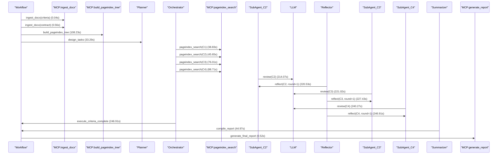

# Workflow Log — 2026-02-24 21:27:29

**Total Steps**: 17 | **Total Time**: 437.94s | **Total Tokens**: 217497

---

## Flow Diagram



---

## Detailed Steps

### Step 1 — ingest_docx(criteria)

- **Time**: 21:20:15
- **Phase**: Ingestion
- **Sender**: Workflow
- **Receiver**: MCP:ingest_docx
- **Action**: ingest_docx(criteria)
- **Input**: 
```text
审核要点（初稿）.docx
```

- **Output**: 
```text
764 chars
```

- **Tokens**: —
- **Duration**: 0.04s

### Step 2 — ingest_docx(contract)

- **Time**: 21:20:15
- **Phase**: Ingestion
- **Sender**: Workflow
- **Receiver**: MCP:ingest_docx
- **Action**: ingest_docx(contract)
- **Input**: 
```text
反馈0730-【已审查】（190号）互联网类系统CDN加速服务（三年）采购合同HT-ZRUB-2025-07-01-08-C002.docx
```

- **Output**: 
```text
29898 chars
```

- **Tokens**: —
- **Duration**: 0.56s

### Step 3 — build_pageindex_tree

- **Time**: 21:22:04
- **Phase**: Tree Building
- **Sender**: Workflow
- **Receiver**: MCP:build_pageindex_tree
- **Action**: build_pageindex_tree
- **Input**: 
```text
29800 chars markdown
```

- **Output**: 
```text
36961 chars tree JSON
```

- **Tokens**: —
- **Duration**: 108.23s

### Step 4 — design_tasks

- **Time**: 21:22:37
- **Phase**: Planning
- **Sender**: Workflow
- **Receiver**: Planner
- **Action**: design_tasks
- **Input**: 
```text
723 chars criteria
```

- **Output**: 
```text
4 criteria extracted
```

- **Tokens**: 1773 (0%)
- **Duration**: 33.29s

### Step 5 — pageindex_search(C1)

- **Time**: 21:23:16
- **Phase**: Execute
- **Sender**: Orchestrator
- **Receiver**: MCP:pageindex_search
- **Action**: pageindex_search(C1)
- **Input**: 
```text
核实签约主体的法律合规性与信息真实性
```

- **Output**: 
```text
1447 chars retrieved
```

- **Tokens**: —
- **Duration**: 38.83s

### Step 6 — pageindex_search(C2)

- **Time**: 21:23:23
- **Phase**: Execute
- **Sender**: Orchestrator
- **Receiver**: MCP:pageindex_search
- **Action**: pageindex_search(C2)
- **Input**: 
```text
确保合同核心条款结构完整、要素齐备、逻辑严密
```

- **Output**: 
```text
18043 chars retrieved
```

- **Tokens**: —
- **Duration**: 45.65s

### Step 7 — pageindex_search(C3)

- **Time**: 21:23:53
- **Phase**: Execute
- **Sender**: Orchestrator
- **Receiver**: MCP:pageindex_search
- **Action**: pageindex_search(C3)
- **Input**: 
```text
确保期限约定精准、可执行，杜绝模糊表述
```

- **Output**: 
```text
19617 chars retrieved
```

- **Tokens**: —
- **Duration**: 76.01s

### Step 8 — pageindex_search(C4)

- **Time**: 21:24:06
- **Phase**: Execute
- **Sender**: Orchestrator
- **Receiver**: MCP:pageindex_search
- **Action**: pageindex_search(C4)
- **Input**: 
```text
保障合同文本形式合法、语言严谨、内外统一
```

- **Output**: 
```text
15894 chars retrieved
```

- **Tokens**: —
- **Duration**: 88.71s

### Step 9 — review(C2)

- **Time**: 21:26:11
- **Phase**: Execute
- **Sender**: SubAgent_C2
- **Receiver**: LLM
- **Action**: review(C2)
- **Input**: 
```text
criterion + 18043 chars context
```

- **Output**: 
```text
根据审查标准和合同内容分析，我发现以下问题：

### 检查要点：检查合同是否完整包含以下必备条款：采购内容、合同金额、付款计划、合同期限、生效条件、知识产权归属与使用约定、产品质量保证/服务标准、交付方式与地点、验收标准与流程、完成时限（含里程碑节点）、违约责任、司法管辖法院/仲裁机构、不可抗力定义与处理机制、廉洁承诺条款、合同变更程序、合同份数及效力说明、电子送达效力约定

- **风险等级**: 高
- **结论**: 合同缺少"生效条件"、"交付方式与地点"、"验收流程"、"完成时限（含里程碑节点）"、"合同变更程序"等必备条款，影响合同的完整性和可执行性
- 原文引用:
> 无相关内容
- **所在位置**: 合同正文中未见相关条款
- **问题分析**: 合同未明确约定合同生效条件（如双方签字盖章后生效），未明确交付方式与地点，验收仅列出了标准但未规定具体流程，未明确项目完成时限和里程碑节点，未规定合同变更的具体程序（如书面形式、双方确认等）
- **法律依据**: 《中华人民共和国民法典》第四百七十条：合同的内容由当事人约定，一般包括下列条款：（一）当事人的姓名或者名称和住所；（二）标的；（三）数量；（四）质量；（五）价款或者报酬；（六）履行期限、地点和方式；（七）违约责任；（八）解决争议的方法。政府采购相关法规也要求合同必须具备完整的必备条款
- 修改建议:
> "本协议自双方法定代表人或授权代理人签字并加盖单位公章或合同专用章之日起生效。"
> 
> "乙方应按照附件二《浙江农村商业联合银行互联网类系统CDN加速服务项目工作任务说明书》规定的交付方式，在甲方指定的地点（浙江省杭州市）完成服务交付。"
> 
> "验收流程如下：1）甲方在收到乙方服务完成通知后5个工作日内组织验收；2）验收小组由甲方信息技术部门及相关业务部门组成；3）验收通过后双方签署《服务验收确认书》；4）验收不合格的，乙方应在7个工作日内完成整改并重新提交验收。"
> 
> "项目完成时限：乙方应于2025年8月31日前完成全部服务部署和配置工作，并达到附件一验收要求。里程碑节点：1）2025年7月15日前完成方案沟通和域名拆分；2）2025年7月31日前完成配置测试；3）2025年8月15日前完成正式域名切换；4）2025年8月31日前完成全部服务交付。"
> 
> "合同变更程序：任何对本合同的修改、补充均须以书面形式作出，并经双方授权代表签字并加盖单位公章或合同专用章后生效。"

### 检查要点：确认合同中已明确指定主要项目负责人，并完整载明其姓名、身份证号码、联系电话；如为团队履约，应注明负责人权责边界

- **风险等级**: 高
- **结论**: 合同中未指定主要项目负责人，也未载明其姓名、身份证号码、联系电话等信息，无法明确履约责任主体
- 原文引用:
> 无相关内容
- **所在位置**: 合同全文未见相关条款
- **问题分析**: 合同未明确指定项目负责人，缺乏履约责任主体，不利于合同执行过程中的沟通协调和责任追究
- **法律依据**: 《中华人民共和国民法典》第五百零九条：当事人应当按照约定全面履行自己的义务。指定项目负责人是确保合同全面履行的重要保障措施
- 修改建议:
> "乙方指定【张三】为本项目负责人，身份证号码：【110101199003072315】，联系电话：【13800138000】，电子邮箱：【zhangsan@tencent.com】。项目负责人负责本项目的整体实施、进度控制、质量管理和与甲方的日常沟通协调工作。"

### 检查要点：采购内容须具体化：品种、规格、型号、等级、花色等须清晰列明；复杂标的应通过附件（如技术规格书、配置清单）予以固化，附件须与正文具有同等法律效力并明确引用关系

- **风险等级**: 中
- **结论**: 采购内容虽通过附件进行了技术规格描述，但未在合同正文中明确说明"附件与正文具有同等法律效力"，也未建立明确的引用关系
- 原文引用:
> "附件一、合同内容清单
> 
> 附件二、浙江农村商业联合银行互联网类系统CDN加速服务项目工作任务说明书
> 
> 附件三、产品服务协议
> 
> 附件四、浙江省农商银行系统信息化建设保密协议
> 
> 附件五、供应商廉洁承诺书
> 
> 附件六、购买/使用腾讯云境外服务附录"
- **所在位置**: 第十五条 附件
- **问题分析**: 合同虽列出了多个附件，但未在正文中明确说明这些附件与合同正文具有同等法律效力，也未建立明确的引用关系（如"详见附件一第X条"），可能影响附件的法律约束力
- **法律依据**: 《中华人民共和国民法典》第四百七十条：合同的内容由当事人约定，一般包括下列条款：...（二）标的；（三）数量；...附件作为合同组成部分，应当在正文中明确其法律效力
- 修改建议:
> "本合同附件为本合同不可分割的组成部分，与本合同正文具有同等法律效力。本合同正文中对附件的引用均视为对相应附件内容的直接引用，附件内容与正文内容不一致时，以附件内容为准。"

### 检查要点：合同金额条款须同时载明：数量单位、单价（含税/不含税）、总价、币种（如人民币/USD）、大小写金额一致；计量单位须规范（如‘套’‘台’‘人·日’），避免歧义

- **风险等级**: 高
- **结论**: 合同未明确载明合同总金额、大小写金额一致等要求，也未明确单价是否含税，计量单位不够规范
- 原文引用:
> "附件一
> 
> 合同内容清单
> 
> 一.产品优惠报价
> 
> （1）CDN网站加速费用
> 
> 计费方式-带宽月结：
> 
> CDN 每日带宽统计点共288个，从当月1号起，每一个有效日（产生消耗）的所有统计点进行排序，去掉前5%的统计点，剩下的最大的统计点，即为计费带宽，再根据合同价格计算费用。采用阶梯到达模式，阶梯价格如下所示：
> 
> （2）对象存储费用
> 
> 对象存储用于存放APP升级包使用。该部分费用分为三部分：标准存储容量包，CDN回源流量包，标准存储读写请求。价格如下：
> 
> （3）CDN APP内应用升级加速费用
> 
> 用于丰收互联APP内部更新、内应用升级，使用流量包方式一次性购买。
> 
> CDN境内流量包定价："
- **所在位置**: 附件一"合同内容清单"
- **问题分析**: 合同未明确总金额，未说明单价是否含税，未使用大小写金额一致的规范表述，计费方式描述复杂但未明确最终合同金额，存在重大不确定性
- **法律依据**: 《中华人民共和国民法典》第五百一十条：合同生效后，当事人就质量、价款或者报酬、履行地点等内容没有约定或者约定不明确的，可以协议补充；不能达成补充协议的，按照合同相关条款或者交易习惯确定
- 修改建议:
> "本合同总金额为人民币（大写）壹仟贰佰万元整（¥12,000,000.00），该金额为含税价格。各项费用明细如下：1）CDN网站加速费用：人民币（大写）柒佰伍拾万元整（¥7,500,000.00）；2）对象存储费用：人民币（大写）叁佰万元整（¥3,000,000.00）；3）CDN APP内应用升级加速费用：人民币（大写）壹佰伍拾万元整（¥1,500,000.00）。以上金额均为含增值税专用发票价格。"

### 检查要点：付款计划须分阶段明确：各节点触发条件（如‘签署后5个工作日内’‘初验合格后10日内’）、支付比例、对应金额、发票类型（增值税专用发票/普通发票）、开票时间要求；预留不低于5%—10%尾款于免费维保期届满且无质量争议后支付

- **风险等级**: 高
- **结论**: 付款计划未明确分阶段支付比例和对应金额，未明确预留5%-10%尾款于维保期届满后支付，也未明确开票时间要求
- 原文引用:
> "附件一
> 
> 合同内容清单
> 
> 三、商务要求
> 
> 在服务期内，乙方按甲方需求免费提供CDN服务配置、迁移，并有能力提供服务期内的技术支持。
> 
> 根据甲方要求，乙方实施合同规定的服务，由甲方对服务实施情况进行验收，经甲方确认合格后，按实际经双方核实的缴费账单，计算得出相应服务费用，并按服务规则确定的付款期限内支付费用支付款项，具体如下，其中甲方指浙江农村商业联合银行股份有限公司，乙方指腾讯云计算（北京）有限责任公司。
> 
> 1.CDN网站加速费用、对象存储费用根据实际缴费账单，按照后付费模式结算，乙方向甲方提供上一月的缴费账单后，如甲方对账单有异议的，应在收到账单后5个工作日内向乙方提出；甲方在前述期限内没有提出异议，则视为甲方已确认账单。对于甲方有异议的账单，由双方进行核查，以核查后双方确认的账单为准。甲方不认可核查结果，但又没有确切证据证明账单计费有误的，则账单以乙方系统数据为准。
> 
> 2.甲方后付费的，根据合同约定甲方在该服务的服务规则确定的付款期限内支付费用。服务规则未明确付款期限的，甲方应每个月自确认账单并收到发票之日起 30个工作日内向乙方付款。双方另有约定的依其约定。
> 
> 3.CDN APP内应用升级加速费用每年根据预估下载量支付相对应的流量包费用，如当年实际使用超过流量包大小，则根据实际使用情况追加支付补充流量包费用。
> 
> 4.付款时，乙方应开具付款通知和应付款项的等额增值税专用发票，甲方在收到乙方付款通知和发票，并核实无误后30个工作日内向乙方支付与发票金额等额的款项，乙方迟延送达付款通知或发票的，甲方的付款义务相应顺延。
> 
> 5.乙方账户如有变更，应提前15个工作日以正式书面形式通知甲方新的付款信息。由于谈判未及时通知此项变更而造成延期付款等的一切后果，甲方不承担任何责任。
> 
> 6.上述服务的开通日期，指乙方为甲方开通CDN服务的日期，服务开通日期以甲方系统记录时间为准。计费开始日期指甲方应当依约向乙方支付服务费的起算时间。服务开通日期原则上与计费开始日期一致，双方另行约定的除外。
> 
> 7.腾讯云收款账户如下，
> 
> 户  名：腾讯云计算（北京）有限责任公司
> 
> 银行账号：110907316810601
> 
> 开户行： 招商银行北京分行上地支行
> 
> 汇款备注：浙江农商联合银行CDN服务费+UIN100012773012"
- **所在位置**: 附件一"三、商务要求"
- **问题分析**: 付款计划采用后付费模式，但未明确各阶段支付比例、对应金额，未预留5%-10%尾款于维保期届满后支付，也未明确开票时间要求（如"乙方应在每月5日前开具上月服务费增值税专用发票"）
- **法律依据**: 《中华人民共和国民法典》第五百一十条：合同生效后，当事人就质量、价款或者报酬、履行地点等内容没有约定或者约定不明确的，可以协议补充；不能达成补充协议的，按照合同相关条款或者交易习惯确定
- 修改建议:
> "付款计划如下：1）合同签订后5个工作日内，甲方向乙方支付合同总金额20%的预付款，即人民币（大写）贰佰肆拾万元整（¥2,400,000.00）；2）初验合格后10个工作日内，甲方向乙方支付合同总金额30%的进度款，即人民币（大写）叁佰陆拾万元整（¥3,600,000.00）；3）终验合格后10个工作日内，甲方向乙方支付合同总金额40%的验收款，即人民币（大写）肆佰捌拾万元整（¥4,800,000.00）；4）剩余10%的尾款，即人民币（大写）壹佰贰拾万元整（¥1,200,000.00），于免费维保期（36个月）届满且无质量争议后10个工作日内支付。乙方应在每次付款前5个工作日内向甲方开具等额增值税专用发票。"
```

- **Tokens**: 61798 (6%)
- **Duration**: 214.07s

### Step 10 — reflect(C2, round=1)

- **Time**: 21:26:18
- **Phase**: Reflect
- **Sender**: Reflector
- **Receiver**: SubAgent_C2
- **Action**: reflect(C2, round=1)
- **Input**: 
```text
根据审查标准和合同内容分析，我发现以下问题：

### 检查要点：检查合同是否完整包含以下必备条款：采购内容、合同金额、付款计划、合同期限、生效条件、知识产权归属与使用约定、产品质量保证/服务标准、交付方式与地点、验收标准与流程、完成时限（含里程碑节点）、违约责任、司法管辖法院/仲裁机构、不可抗力定义与处理机制、廉洁承诺条款、合同变更程序、合同份数及效力说明、电子送达效力约定

- **风险等级**: 高
- **结论**: 合同缺少"生效条件"、"交付方式与地点"、"验收流程"、"完成时限（含里程碑节点）"、"合同变更程序"等必备条款，影响合同的完整性和可执行性
- 原文引用:
> 无相关内容
- **所在位置**: 合同正文中未见相关条款
- **问题分析**: 合同未明确约定合同生效条件（如双方签字盖章后生效），未明确交付方式与地点，验收仅列出了标准但未规定具体流程，未明确项目完成时限和里程碑节点，未规定合同变更的具体程序（如书面形式、双方确认等）
- **法律依据**: 《中华人民共和国民法典》第四百七十条：合同的内容由当事人约定，一般包括下列条款：（一）当事人的姓名或者名称和住所；（二）标的；（三）数量；（四）质量；（五）价款或者报酬；（六）履行期限、地点和方式；（七）违约责任；（八）解决争议的方法。政府采购相关法规也要求合同必须具备完整的必备条款
- 修改建议:
> "本协议自双方法定代表人或授权代理人签字并加盖单位公章或合同专用章之日起生效。"
> 
> "乙方应按照附件二《浙江农村商业联合银行互联网类系统CDN加速服务项目工作任务说明书》规定的交付方式，在甲方指定的地点（浙江省杭州市）完成服务交付。"
> 
> "验收流程如下：1）甲方在收到乙方服务完成通知后5个工作日内组织验收；2）验收小组由甲方信息技术部门及相关业务部门组成；3）验收通过后双方签署《服务验收确认书》；4）验收不合格的，乙方应在7个工作日内完成整改并重新提交验收。"
> 
> "项目完成时限：乙方应于2025年8月31日前完成全部服务部署和配置工作，并达到附件一验收要求。里程碑节点：1）2025年7月15日前完成方案沟通和域名拆分；2）2025年7月31日前完成配置测试；3）2025年8月15日前完成正式域名切换；4）2025年8月31日前完成全部服务交付。"
> 
> "合同变更程序：任何对本合同的修改、补充均须以书面形式作出，并经双方授权代表签字并加盖单位公章或合同专用章后生效。"

### 检查要点：确认合同中已明确指定主要项目负责人，并完整载明其姓名、身份证号码、联系电话；如为团队履约，应注明负责人权责边界

- **风险等级**: 高
- **结论**: 合同中未指定主要项目负责人，也未载明其姓名、身份证号码、联系电话等信息，无法明确履约责任主体
- 原文引用:
> 无相关内容
- **所在位置**: 合同全文未见相关条款
- **问题分析**: 合同未明确指定项目负责人，缺乏履约责任主体，不利于合同执行过程中的沟通协调和责任追究
- **法律依据**: 《中华人民共和国民法典》第五百零九条：当事人应当按照约定全面履行自己的义务。指定项目负责人是确保合同全面履行的重要保障措施
- 修改建议:
> "乙方指定【张三】为本项目负责人，身份证号码：【110101199003072315】，联系电话：【13800138000】，电子邮箱：【zhangsan@tencent.com】。项目负责人负责本项目的整体实施、进度控制、质量管理和与甲方的日常沟通协调工作。"

### 检查要点：采购内容须具体化：品种、规格、型号、等级、花色等须清晰列明；复杂标的应通过附件（如技术规格书、配置清单）予以固化，附件须与正文具有同等法律效力并明确引用关系

- **风险等级**: 中
- **结论**: 采购内容虽通过附件进行了技术规格描述，但未在合同正文中明确说明"附件与正文具有同等法律效力"，也未建立明确的引用关系
- 原文引用:
> "附件一、合同内容清单
> 
> 附件二、浙江农村商业联合银行互联网类系统CDN加速服务项目工作任务说明书
> 
> 附件三、产品服务协议
> 
> 附件四、浙江省农商银行系统信息化建设保密协议
> 
> 附件五、供应商廉洁承诺书
> 
> 附件六、购买/使用腾讯云境外服务附录"
- **所在位置**: 第十五条 附件
- **问题分析**: 合同虽列出了多个附件，但未在正文中明确说明这些附件与合同正文具有同等法律效力，也未建立明确的引用关系（如"详见附件一第X条"），可能影响附件的法律约束力
- **法律依据**: 《中华人民共和国民法典》第四百七十条：合同的内容由当事人约定，一般包括下列条款：...（二）标的；（三）数量；...附件作为合同组成部分，应当在正文中明确其法律效力
- 修改建议:
> "本合同附件为本合同不可分割的组成部分，与本合同正文具有同等法律效力。本合同正文中对附件的引用均视为对相应附件内容的直接引用，附件内容与正文内容不一致时，以附件内容为准。"

### 检查要点：合同金额条款须同时载明：数量单位、单价（含税/不含税）、总价、币种（如人民币/USD）、大小写金额一致；计量单位须规范（如‘套’‘台’‘人·日’），避免歧义

- **风险等级**: 高
- **结论**: 合同未明确载明合同总金额、大小写金额一致等要求，也未明确单价是否含税，计量单位不够规范
- 原文引用:
> "附件一
> 
> 合同内容清单
> 
> 一.产品优惠报价
> 
> （1）CDN网站加速费用
> 
> 计费方式-带宽月结：
> 
> CDN 每日带宽统计点共288个，从当月1号起，每一个有效日（产生消耗）的所有统计点进行排序，去掉前5%的统计点，剩下的最大的统计点，即为计费带宽，再根据合同价格计算费用。采用阶梯到达模式，阶梯价格如下所示：
> 
> （2）对象存储费用
> 
> 对象存储用于存放APP升级包使用。该部分费用分为三部分：标准存储容量包，CDN回源流量包，标准存储读写请求。价格如下：
> 
> （3）CDN APP内应用升级加速费用
> 
> 用于丰收互联APP内部更新、内应用升级，使用流量包方式一次性购买。
> 
> CDN境内流量包定价："
- **所在位置**: 附件一"合同内容清单"
- **问题分析**: 合同未明确总金额，未说明单价是否含税，未使用大小写金额一致的规范表述，计费方式描述复杂但未明确最终合同金额，存在重大不确定性
- **法律依据**: 《中华人民共和国民法典》第五百一十条：合同生效后，当事人就质量、价款或者报酬、履行地点等内容没有约定或者约定不明确的，可以协议补充；不能达成补充协议的，按照合同相关条款或者交易习惯确定
- 修改建议:
> "本合同总金额为人民币（大写）壹仟贰佰万元整（¥12,000,000.00），该金额为含税价格。各项费用明细如下：1）CDN网站加速费用：人民币（大写）柒佰伍拾万元整（¥7,500,000.00）；2）对象存储费用：人民币（大写）叁佰万元整（¥3,000,000.00）；3）CDN APP内应用升级加速费用：人民币（大写）壹佰伍拾万元整（¥1,500,000.00）。以上金额均为含增值税专用发票价格。"

### 检查要点：付款计划须分阶段明确：各节点触发条件（如‘签署后5个工作日内’‘初验合格后10日内’）、支付比例、对应金额、发票类型（增值税专用发票/普通发票）、开票时间要求；预留不低于5%—10%尾款于免费维保期届满且无质量争议后支付

- **风险等级**: 高
- **结论**: 付款计划未明确分阶段支付比例和对应金额，未明确预留5%-10%尾款于维保期届满后支付，也未明确开票时间要求
- 原文引用:
> "附件一
> 
> 合同内容清单
> 
> 三、商务要求
> 
> 在服务期内，乙方按甲方需求免费提供CDN服务配置、迁移，并有能力提供服务期内的技术支持。
> 
> 根据甲方要求，乙方实施合同规定的服务，由甲方对服务实施情况进行验收，经甲方确认合格后，按实际经双方核实的缴费账单，计算得出相应服务费用，并按服务规则确定的付款期限内支付费用支付款项，具体如下，其中甲方指浙江农村商业联合银行股份有限公司，乙方指腾讯云计算（北京）有限责任公司。
> 
> 1.CDN网站加速费用、对象存储费用根据实际缴费账单，按照后付费模式结算，乙方向甲方提供上一月的缴费账单后，如甲方对账单有异议的，应在收到账单后5个工作日内向乙方提出；甲方在前述期限内没有提出异议，则视为甲方已确认账单。对于甲方有异议的账单，由双方进行核查，以核查后双方确认的账单为准。甲方不认可核查结果，但又没有确切证据证明账单计费有误的，则账单以乙方系统数据为准。
> 
> 2.甲方后付费的，根据合同约定甲方在该服务的服务规则确定的付款期限内支付费用。服务规则未明确付款期限的，甲方应每个月自确认账单并收到发票之日起 30个工作日内向乙方付款。双方另有约定的依其约定。
> 
> 3.CDN APP内应用升级加速费用每年根据预估下载量支付相对应的流量包费用，如当年实际使用超过流量包大小，则根据实际使用情况追加支付补充流量包费用。
> 
> 4.付款时，乙方应开具付款通知和应付款项的等额增值税专用发票，甲方在收到乙方付款通知和发票，并核实无误后30个工作日内向乙方支付与发票金额等额的款项，乙方迟延送达付款通知或发票的，甲方的付款义务相应顺延。
> 
> 5.乙方账户如有变更，应提前15个工作日以正式书面形式通知甲方新的付款信息。由于谈判未及时通知此项变更而造成延期付款等的一切后果，甲方不承担任何责任。
> 
> 6.上述服务的开通日期，指乙方为甲方开通CDN服务的日期，服务开通日期以甲方系统记录时间为准。计费开始日期指甲方应当依约向乙方支付服务费的起算时间。服务开通日期原则上与计费开始日期一致，双方另行约定的除外。
> 
> 7.腾讯云收款账户如下，
> 
> 户  名：腾讯云计算（北京）有限责任公司
> 
> 银行账号：110907316810601
> 
> 开户行： 招商银行北京分行上地支行
> 
> 汇款备注：浙江农商联合银行CDN服务费+UIN100012773012"
- **所在位置**: 附件一"三、商务要求"
- **问题分析**: 付款计划采用后付费模式，但未明确各阶段支付比例、对应金额，未预留5%-10%尾款于维保期届满后支付，也未明确开票时间要求（如"乙方应在每月5日前开具上月服务费增值税专用发票"）
- **法律依据**: 《中华人民共和国民法典》第五百一十条：合同生效后，当事人就质量、价款或者报酬、履行地点等内容没有约定或者约定不明确的，可以协议补充；不能达成补充协议的，按照合同相关条款或者交易习惯确定
- 修改建议:
> "付款计划如下：1）合同签订后5个工作日内，甲方向乙方支付合同总金额20%的预付款，即人民币（大写）贰佰肆拾万元整（¥2,400,000.00）；2）初验合格后10个工作日内，甲方向乙方支付合同总金额30%的进度款，即人民币（大写）叁佰陆拾万元整（¥3,600,000.00）；3）终验合格后10个工作日内，甲方向乙方支付合同总金额40%的验收款，即人民币（大写）肆佰捌拾万元整（¥4,800,000.00）；4）剩余10%的尾款，即人民币（大写）壹佰贰拾万元整（¥1,200,000.00），于免费维保期（36个月）届满且无质量争议后10个工作日内支付。乙方应在每次付款前5个工作日内向甲方开具等额增值税专用发票。"
```

- **Output**: 
```text
PASS: 
```

- **Tokens**: 3686 (0%)
- **Duration**: 220.53s

### Step 11 — review(C3)

- **Time**: 21:26:18
- **Phase**: Execute
- **Sender**: SubAgent_C3
- **Receiver**: LLM
- **Action**: review(C3)
- **Input**: 
```text
criterion + 19617 chars context
```

- **Output**: 
```text
根据审查标准和搜索结果，我需要对合同中期限约定的精准性进行系统分析：

**关键问题发现：**

1. **计时基准冲突**：第十四条2款明确规定"所有的'天'均为自然日"，但多处条款使用"工作日"（如"5个工作日内"、"30个工作日内"）。根据《民法典》第五百一十一条，履行期限不明确的，债务人可以随时履行，债权人也可以随时请求履行，但应当给对方必要的准备时间。这种基准混用可能导致执行争议。

2. **"每年"表述不精确**：附件一三、商务要求第3条"CDN APP内应用升级加速费用每年根据预估下载量支付相对应的流量包费用"，未明确"每年"的起止时间，未与主协议期限（2025年9月1日至2028年8月31日）形成闭环。

3. **"每个月"表述模糊**：附件一三、商务要求第2条"甲方应每个月自确认账单并收到发票之日起30个工作日内向乙方付款"，"每个月"未明确定义是自然月还是其他计算方式。

4. **服务开通日期定义不一致**：附件一三、商务要求第6条"服务开通日期以甲方系统记录时间为准"，而附件三第三条第2款"服务开通日期以乙方系统记录时间为准"，存在矛盾。

5. **验收期缺失**：合同中虽有验收要求（附件一第二条），但未明确验收的具体期限，违反"关键期限须与付款节点、违约责任挂钩"的要求。

让我检查是否有其他模糊表述：
- 未发现"长期"、"永久"等不确定表述
- 所有日期均以年/月/日形式明确
- 主协议期限明确为"2025年9月1日起至2028年8月31日止"

根据《民法典》第五百一十一条，合同内容约定不明确的，可以协议补充；不能达成补充协议的，按照合同相关条款或者交易习惯确定。因此，上述期限约定不明确的问题属于中等风险。

### 检查要点：合同期限须以起止日期（年/月/日）或明确计算方式（如‘自2025年1月1日起至2026年12月31日止’）载明，禁止使用‘长期’‘永久’等不确定表述

- **风险等级**: 无
- **结论**: 合同主协议期限已明确载明为"自【2025】年【9】月【1】日起至【2028】年【8】月【31】日止"，符合起止日期要求，不存在"长期"、"永久"等不确定表述。

### 检查要点：所有时间节点须明确定义计时基准：注明‘自然日’或‘工作日’；季度/年度起算须明确（如‘自合同生效日起满12个月’而非‘一年内’），避免‘第三个月末’等易生歧义表述

- **风险等级**: 中
- **结论**: 合同存在计时基准不一致问题。第十四条2款规定"所有的'天'均为自然日"，但多处条款使用"工作日"（如"5个工作日内"、"30个工作日内"），构成计时基准冲突，可能导致执行争议。
- 原文引用:
> 14.2除非另有说明，本协议正文及其附件中所有的“天”均为自然日，结算货币均为人民币。
> 
> 附件一三、商务要求第1条：甲方在前述期限内没有提出异议，则视为甲方已确认账单。对于甲方有异议的账单，由双方进行核查，以核查后双方确认的账单为准。甲方不认可核查结果，但又没有确切证据证明账单计费有误的，则账单以乙方系统数据为准。
> 
> 附件一三、商务要求第2条：甲方后付费的，根据合同约定甲方在该服务的服务规则确定的付款期限内支付费用。服务规则未明确付款期限的，甲方应每个月自确认账单并收到发票之日起 30个工作日内向乙方付款。双方另有约定的依其约定。
- **所在位置**: 第十四条2款；附件一三、商务要求第1、2条
- **问题分析**: 第十四条2款统一规定所有"天"为自然日，但商务要求条款中多次使用"工作日"，造成计时基准冲突，违反"所有时间节点须明确定义计时基准"的要求。
- **法律依据**: 《中华人民共和国民法典》第五百一十一条：当事人就有关合同内容约定不明确，依据前条规定仍不能确定的，适用下列规定：（四）履行期限不明确的，债务人可以随时履行，债权人也可以随时请求履行，但是应当给对方必要的准备时间。
- 修改建议:
> 14.2除非另有说明，本协议正文及其附件中所有的“天”均为自然日，结算货币均为人民币。但账单异议期、付款期限等涉及甲方履约义务的时间节点，明确约定为工作日。
> 
> 附件一三、商务要求第1条：甲方在收到账单后5个自然日内没有提出异议，则视为甲方已确认账单。
> 
> 附件一三、商务要求第2条：甲方后付费的，根据合同约定甲方在该服务的服务规则确定的付款期限内支付费用。服务规则未明确付款期限的，甲方应自确认账单并收到发票之日起30个自然日内向乙方付款。双方另有约定的依其约定。

### 检查要点：关键期限（如交付期、验收期、维保期）须与付款节点、违约责任挂钩，形成闭环逻辑

- **风险等级**: 中
- **结论**: 合同缺少明确的验收期限约定，违反"关键期限须与付款节点、违约责任挂钩"的要求。附件一第二条虽列明验收要求，但未规定验收的具体时限。
- 原文引用:
> 附件一
> 二、验收要求
> 1.CDN加速后，全国范围内用户访问甲方互联网类系统可用性不低于99%。
> 2.互联网类系统静态文件的回源流量对比经CDN加速前降低至少50%以上。
> 3.支持自定义缓存规则，比如不同类型的文件缓存在不同的时间段。
> 4.支持除80、8080、443之外的特殊端口开通，并支持用户侧访问端口和回源端口不一致的配置。
> 5.支持源站不做任何改动，源站不提供证书和私钥的全链路https方案，提供泛域名证书支持招标单位多个域名接入的需求。
- **所在位置**: 附件一第二条
- **问题分析**: 验收要求虽详细，但未规定验收的具体期限（如"服务开通后30个自然日内完成验收"），也未与付款节点挂钩（如"验收合格后支付首期款项"），形成逻辑闭环缺失。
- **法律依据**: 《中华人民共和国民法典》第五百零九条：当事人应当按照约定全面履行自己的义务。当事人应当遵循诚信原则，根据合同的性质、目的和交易习惯履行通知、协助、保密等义务。
- 修改建议:
> 附件一
> 二、验收要求
> 1.验收期限：甲方应在服务开通后30个自然日内组织验收工作，并在验收完成后5个自然日内出具书面验收报告。
> 2.CDN加速后，全国范围内用户访问甲方互联网类系统可用性不低于99%。
> 3.互联网类系统静态文件的回源流量对比经CDN加速前降低至少50%以上。
> 4.支持自定义缓存规则，比如不同类型的文件缓存在不同的时间段。
> 5.支持除80、8080、443之外的特殊端口开通，并支持用户侧访问端口和回源端口不一致的配置。
> 6.支持源站不做任何改动，源站不提供证书和私钥的全链路https方案，提供泛域名证书支持招标单位多个域名接入的需求。
> 7.验收合格后，甲方应在收到乙方开具的合规发票后30个自然日内支付首期服务费用。

### 检查要点：所有时间节点须明确定义计时基准：注明‘自然日’或‘工作日’；季度/年度起算须明确（如‘自合同生效日起满12个月’而非‘一年内’），避免‘第三个月末’等易生歧义表述

- **风险等级**: 中
- **结论**: 合同中"每年"、"每个月"等表述未明确定义起止时间，违反"季度/年度起算须明确"的要求。
- 原文引用:
> 附件一三、商务要求第3条：CDN APP内应用升级加速费用每年根据预估下载量支付相对应的流量包费用，如当年实际使用超过流量包大小，则根据实际使用情况追加支付补充流量包费用。
> 
> 附件一三、商务要求第2条：甲方后付费的，根据合同约定甲方在该服务的服务规则确定的付款期限内支付费用。服务规则未明确付款期限的，甲方应每个月自确认账单并收到发票之日起 30个工作日内向乙方付款。双方另有约定的依其约定。
- **所在位置**: 附件一三、商务要求第2、3条
- **问题分析**: "每年"未明确是自然年度还是合同年度，"每个月"未明确是自然月还是其他计算方式，且与主协议期限（2025年9月1日至2028年8月31日）未形成闭环，可能导致计费周期争议。
- **法律依据**: 《中华人民共和国民法典》第五百一十一条：当事人就有关合同内容约定不明确，依据前条规定仍不能确定的，适用下列规定：（四）履行期限不明确的，债务人可以随时履行，债权人也可以随时请求履行，但是应当给对方必要的准备时间。
- 修改建议:
> 附件一三、商务要求第2条：甲方后付费的，根据合同约定甲方在该服务的服务规则确定的付款期限内支付费用。服务规则未明确付款期限的，甲方应自确认账单并收到发票之日起30个自然日内向乙方付款。双方另有约定的依其约定。
> 
> 附件一三、商务要求第3条：CDN APP内应用升级加速费用按合同年度支付，合同年度指自合同生效日起每满12个月为一个年度周期。首个合同年度自2025年9月1日起至2026年8月31日止，以此类推。甲方应于每个合同年度开始前15个自然日内预付当年度流量包费用。

### 检查要点：关键期限（如交付期、验收期、维保期）须与付款节点、违约责任挂钩，形成闭环逻辑

- **风险等级**: 中
- **结论**: 服务开通日期定义存在矛盾，违反"关键期限须明确定义"的要求。
- 原文引用:
> 附件一三、商务要求第6条：上述服务的开通日期，指乙方为甲方开通CDN服务的日期，服务开通日期以甲方系统记录时间为准。
> 
> 附件三第三条第2款：服务区域：全球范围；服务开通日期：指乙方为甲方开通CDN服务的日期，服务开通日期以乙方系统记录时间为准。
- **所在位置**: 附件一三、商务要求第6条；附件三第三条第2款
- **问题分析**: 附件一规定服务开通日期以"甲方系统记录时间为准"，而附件三规定以"乙方系统记录时间为准"，存在明显矛盾，可能导致服务开通时间认定争议。
- **法律依据**: 《中华人民共和国民法典》第五百零九条：当事人应当按照约定全面履行自己的义务。当事人应当遵循诚信原则，根据合同的性质、目的和交易习惯履行通知、协助、保密等义务。
- 修改建议:
> 附件一三、商务要求第6条：上述服务的开通日期，指乙方为甲方开通CDN服务的日期，服务开通日期以乙方系统记录时间为准。
> 
> 附件三第三条第2款：服务区域：全球范围；服务开通日期：指乙方为甲方开通CDN服务的日期，服务开通日期以乙方系统记录时间为准。
```

- **Tokens**: 64867 (6%)
- **Duration**: 221.02s

### Step 12 — reflect(C3, round=1)

- **Time**: 21:26:24
- **Phase**: Reflect
- **Sender**: Reflector
- **Receiver**: SubAgent_C3
- **Action**: reflect(C3, round=1)
- **Input**: 
```text
根据审查标准和搜索结果，我需要对合同中期限约定的精准性进行系统分析：

**关键问题发现：**

1. **计时基准冲突**：第十四条2款明确规定"所有的'天'均为自然日"，但多处条款使用"工作日"（如"5个工作日内"、"30个工作日内"）。根据《民法典》第五百一十一条，履行期限不明确的，债务人可以随时履行，债权人也可以随时请求履行，但应当给对方必要的准备时间。这种基准混用可能导致执行争议。

2. **"每年"表述不精确**：附件一三、商务要求第3条"CDN APP内应用升级加速费用每年根据预估下载量支付相对应的流量包费用"，未明确"每年"的起止时间，未与主协议期限（2025年9月1日至2028年8月31日）形成闭环。

3. **"每个月"表述模糊**：附件一三、商务要求第2条"甲方应每个月自确认账单并收到发票之日起30个工作日内向乙方付款"，"每个月"未明确定义是自然月还是其他计算方式。

4. **服务开通日期定义不一致**：附件一三、商务要求第6条"服务开通日期以甲方系统记录时间为准"，而附件三第三条第2款"服务开通日期以乙方系统记录时间为准"，存在矛盾。

5. **验收期缺失**：合同中虽有验收要求（附件一第二条），但未明确验收的具体期限，违反"关键期限须与付款节点、违约责任挂钩"的要求。

让我检查是否有其他模糊表述：
- 未发现"长期"、"永久"等不确定表述
- 所有日期均以年/月/日形式明确
- 主协议期限明确为"2025年9月1日起至2028年8月31日止"

根据《民法典》第五百一十一条，合同内容约定不明确的，可以协议补充；不能达成补充协议的，按照合同相关条款或者交易习惯确定。因此，上述期限约定不明确的问题属于中等风险。

### 检查要点：合同期限须以起止日期（年/月/日）或明确计算方式（如‘自2025年1月1日起至2026年12月31日止’）载明，禁止使用‘长期’‘永久’等不确定表述

- **风险等级**: 无
- **结论**: 合同主协议期限已明确载明为"自【2025】年【9】月【1】日起至【2028】年【8】月【31】日止"，符合起止日期要求，不存在"长期"、"永久"等不确定表述。

### 检查要点：所有时间节点须明确定义计时基准：注明‘自然日’或‘工作日’；季度/年度起算须明确（如‘自合同生效日起满12个月’而非‘一年内’），避免‘第三个月末’等易生歧义表述

- **风险等级**: 中
- **结论**: 合同存在计时基准不一致问题。第十四条2款规定"所有的'天'均为自然日"，但多处条款使用"工作日"（如"5个工作日内"、"30个工作日内"），构成计时基准冲突，可能导致执行争议。
- 原文引用:
> 14.2除非另有说明，本协议正文及其附件中所有的“天”均为自然日，结算货币均为人民币。
> 
> 附件一三、商务要求第1条：甲方在前述期限内没有提出异议，则视为甲方已确认账单。对于甲方有异议的账单，由双方进行核查，以核查后双方确认的账单为准。甲方不认可核查结果，但又没有确切证据证明账单计费有误的，则账单以乙方系统数据为准。
> 
> 附件一三、商务要求第2条：甲方后付费的，根据合同约定甲方在该服务的服务规则确定的付款期限内支付费用。服务规则未明确付款期限的，甲方应每个月自确认账单并收到发票之日起 30个工作日内向乙方付款。双方另有约定的依其约定。
- **所在位置**: 第十四条2款；附件一三、商务要求第1、2条
- **问题分析**: 第十四条2款统一规定所有"天"为自然日，但商务要求条款中多次使用"工作日"，造成计时基准冲突，违反"所有时间节点须明确定义计时基准"的要求。
- **法律依据**: 《中华人民共和国民法典》第五百一十一条：当事人就有关合同内容约定不明确，依据前条规定仍不能确定的，适用下列规定：（四）履行期限不明确的，债务人可以随时履行，债权人也可以随时请求履行，但是应当给对方必要的准备时间。
- 修改建议:
> 14.2除非另有说明，本协议正文及其附件中所有的“天”均为自然日，结算货币均为人民币。但账单异议期、付款期限等涉及甲方履约义务的时间节点，明确约定为工作日。
> 
> 附件一三、商务要求第1条：甲方在收到账单后5个自然日内没有提出异议，则视为甲方已确认账单。
> 
> 附件一三、商务要求第2条：甲方后付费的，根据合同约定甲方在该服务的服务规则确定的付款期限内支付费用。服务规则未明确付款期限的，甲方应自确认账单并收到发票之日起30个自然日内向乙方付款。双方另有约定的依其约定。

### 检查要点：关键期限（如交付期、验收期、维保期）须与付款节点、违约责任挂钩，形成闭环逻辑

- **风险等级**: 中
- **结论**: 合同缺少明确的验收期限约定，违反"关键期限须与付款节点、违约责任挂钩"的要求。附件一第二条虽列明验收要求，但未规定验收的具体时限。
- 原文引用:
> 附件一
> 二、验收要求
> 1.CDN加速后，全国范围内用户访问甲方互联网类系统可用性不低于99%。
> 2.互联网类系统静态文件的回源流量对比经CDN加速前降低至少50%以上。
> 3.支持自定义缓存规则，比如不同类型的文件缓存在不同的时间段。
> 4.支持除80、8080、443之外的特殊端口开通，并支持用户侧访问端口和回源端口不一致的配置。
> 5.支持源站不做任何改动，源站不提供证书和私钥的全链路https方案，提供泛域名证书支持招标单位多个域名接入的需求。
- **所在位置**: 附件一第二条
- **问题分析**: 验收要求虽详细，但未规定验收的具体期限（如"服务开通后30个自然日内完成验收"），也未与付款节点挂钩（如"验收合格后支付首期款项"），形成逻辑闭环缺失。
- **法律依据**: 《中华人民共和国民法典》第五百零九条：当事人应当按照约定全面履行自己的义务。当事人应当遵循诚信原则，根据合同的性质、目的和交易习惯履行通知、协助、保密等义务。
- 修改建议:
> 附件一
> 二、验收要求
> 1.验收期限：甲方应在服务开通后30个自然日内组织验收工作，并在验收完成后5个自然日内出具书面验收报告。
> 2.CDN加速后，全国范围内用户访问甲方互联网类系统可用性不低于99%。
> 3.互联网类系统静态文件的回源流量对比经CDN加速前降低至少50%以上。
> 4.支持自定义缓存规则，比如不同类型的文件缓存在不同的时间段。
> 5.支持除80、8080、443之外的特殊端口开通，并支持用户侧访问端口和回源端口不一致的配置。
> 6.支持源站不做任何改动，源站不提供证书和私钥的全链路https方案，提供泛域名证书支持招标单位多个域名接入的需求。
> 7.验收合格后，甲方应在收到乙方开具的合规发票后30个自然日内支付首期服务费用。

### 检查要点：所有时间节点须明确定义计时基准：注明‘自然日’或‘工作日’；季度/年度起算须明确（如‘自合同生效日起满12个月’而非‘一年内’），避免‘第三个月末’等易生歧义表述

- **风险等级**: 中
- **结论**: 合同中"每年"、"每个月"等表述未明确定义起止时间，违反"季度/年度起算须明确"的要求。
- 原文引用:
> 附件一三、商务要求第3条：CDN APP内应用升级加速费用每年根据预估下载量支付相对应的流量包费用，如当年实际使用超过流量包大小，则根据实际使用情况追加支付补充流量包费用。
> 
> 附件一三、商务要求第2条：甲方后付费的，根据合同约定甲方在该服务的服务规则确定的付款期限内支付费用。服务规则未明确付款期限的，甲方应每个月自确认账单并收到发票之日起 30个工作日内向乙方付款。双方另有约定的依其约定。
- **所在位置**: 附件一三、商务要求第2、3条
- **问题分析**: "每年"未明确是自然年度还是合同年度，"每个月"未明确是自然月还是其他计算方式，且与主协议期限（2025年9月1日至2028年8月31日）未形成闭环，可能导致计费周期争议。
- **法律依据**: 《中华人民共和国民法典》第五百一十一条：当事人就有关合同内容约定不明确，依据前条规定仍不能确定的，适用下列规定：（四）履行期限不明确的，债务人可以随时履行，债权人也可以随时请求履行，但是应当给对方必要的准备时间。
- 修改建议:
> 附件一三、商务要求第2条：甲方后付费的，根据合同约定甲方在该服务的服务规则确定的付款期限内支付费用。服务规则未明确付款期限的，甲方应自确认账单并收到发票之日起30个自然日内向乙方付款。双方另有约定的依其约定。
> 
> 附件一三、商务要求第3条：CDN APP内应用升级加速费用按合同年度支付，合同年度指自合同生效日起每满12个月为一个年度周期。首个合同年度自2025年9月1日起至2026年8月31日止，以此类推。甲方应于每个合同年度开始前15个自然日内预付当年度流量包费用。

### 检查要点：关键期限（如交付期、验收期、维保期）须与付款节点、违约责任挂钩，形成闭环逻辑

- **风险等级**: 中
- **结论**: 服务开通日期定义存在矛盾，违反"关键期限须明确定义"的要求。
- 原文引用:
> 附件一三、商务要求第6条：上述服务的开通日期，指乙方为甲方开通CDN服务的日期，服务开通日期以甲方系统记录时间为准。
> 
> 附件三第三条第2款：服务区域：全球范围；服务开通日期：指乙方为甲方开通CDN服务的日期，服务开通日期以乙方系统记录时间为准。
- **所在位置**: 附件一三、商务要求第6条；附件三第三条第2款
- **问题分析**: 附件一规定服务开通日期以"甲方系统记录时间为准"，而附件三规定以"乙方系统记录时间为准"，存在明显矛盾，可能导致服务开通时间认定争议。
- **法律依据**: 《中华人民共和国民法典》第五百零九条：当事人应当按照约定全面履行自己的义务。当事人应当遵循诚信原则，根据合同的性质、目的和交易习惯履行通知、协助、保密等义务。
- 修改建议:
> 附件一三、商务要求第6条：上述服务的开通日期，指乙方为甲方开通CDN服务的日期，服务开通日期以乙方系统记录时间为准。
> 
> 附件三第三条第2款：服务区域：全球范围；服务开通日期：指乙方为甲方开通CDN服务的日期，服务开通日期以乙方系统记录时间为准。
```

- **Output**: 
```text
PASS: 
```

- **Tokens**: 3169 (0%)
- **Duration**: 227.43s

### Step 13 — review(C4)

- **Time**: 21:26:37
- **Phase**: Execute
- **Sender**: SubAgent_C4
- **Receiver**: LLM
- **Action**: review(C4)
- **Input**: 
```text
criterion + 15894 chars context
```

- **Output**: 
```text
现在我已完成必要的法律检索，将根据审查标准对合同进行正式审查。

### 检查要点：全文通读校对：排查错别字、标点误用、语法错误、语义矛盾、标题层级混乱（如‘二、’下直接接‘（三）’）、编号断续等问题

- **风险等级**: 中
- **结论**: 合同中存在标题层级混乱问题，在"第十五条 附件"部分，出现了"二、与本合同相关的项目资料："，该"二、"与前面的"附件一、附件二..."层级不一致，应为"2."或"（二）"才符合中文合同惯例；同时存在语义矛盾，附件一"三、商务要求"第6款规定"服务开通日期以甲方系统记录时间为准"，而附件三"第三条 加速区域及范围等服务内容"第2款规定"服务开通日期以乙方系统记录时间为准"，两者直接冲突。
- 原文引用:
> 二、与本合同相关的项目资料：
> 
> 1.甲方：《商务谈判文件-互联网类系统CDN加速服务项目（三年）采购ZRUB-2025-06-03-08-C002》
> 
> 2.乙方：《谈判响应文件-互联网类系统CDN加速服务项目（三年）采购ZRUB-2025-06-03-08-C002》
- **所在位置**: 第十五条 附件部分
- **问题分析**: "二、"作为二级标题出现在附件列表之后，但前面是"附件一、附件二..."等一级附件标题，层级混乱；且服务开通日期记录主体不一致，构成语义矛盾。
- **法律依据**: 《中华人民共和国民法典》第四百六十六条第一款规定"当事人对合同条款的理解有争议的，应当按照合同所使用的词句、合同的有关条款、合同的目的、交易习惯以及诚实信用原则，确定该条款的真实意思"
- 修改建议:
> （二）与本合同相关的项目资料：
> 
> 1.甲方：《商务谈判文件-互联网类系统CDN加速服务项目（三年）采购ZRUB-2025-06-03-08-C002》
> 
> 2.乙方：《谈判响应文件-互联网类系统CDN加速服务项目（三年）采购ZRUB-2025-06-03-08-C002》

### 检查要点：核验合同正文与所有附件（技术协议、服务清单、保密承诺等）中相同条款（如验收标准、违约金比例、知识产权归属）表述是否完全一致；不一致处须以正文为准或签署补充说明

- **风险等级**: 高
- **结论**: 验收标准在附件一和附件二中表述不一致：附件一"二、验收要求"规定"CDN加速后，全国范围内用户访问甲方互联网类系统可用性不低于99%"，而附件二"四、服务可用性保证"规定"乙方保证甲方购买的服务的'服务可用性'达到99.9%"，两者相差0.9个百分点，属于重大不一致，可能引发履约争议。
- 原文引用:
> 二、验收要求
> 
> 1.CDN加速后，全国范围内用户访问甲方互联网类系统可用性不低于99%。
> 
> ...
> 
> 四、服务可用性保证
> 
> 1、乙方保证甲方购买的服务的"服务可用性"达到99.9%，即每月服务不可用时间累计小于44分钟；
- **所在位置**: 附件一"二、验收要求"第1条；附件二"四、服务可用性保证"第1条
- **问题分析**: 99%与99.9%存在数量级差异，99.9%要求每月不可用时间小于44分钟，而99%允许每月不可用时间达7.2小时，标准差异巨大，直接影响服务质量评价和违约责任认定。
- **法律依据**: 根据合同法原理，当合同正文与附件不一致时，应以合同正文为准；但本合同正文未规定验收标准，仅附件中有规定，因此必须统一附件标准。最高人民法院关于适用《中华人民共和国民法典》合同编通则若干问题的解释第一条明确要求按合同目的、交易习惯等确定条款真实意思。
- 修改建议:
> 二、验收要求
> 
> 1.CDN加速后，全国范围内用户访问甲方互联网类系统可用性不低于99.9%。

### 检查要点：清除招标/谈判/比选等前置采购流程中的过程性用语（如‘本项目系经XX招标代理机构组织公开招标’‘响应人承诺’），统一替换为合同双方平等缔约语境下的规范表述

- **风险等级**: 中
- **结论**: 合同开头存在明显的采购过程性用语"根据浙江农村商业联合银行股份有限公司互联网类系统CDN加速服务项目(三年)采购(公开招标编号ZRUB-2025-06-03-08-C002)要求及乙方投标承诺"，以及附件中多次出现"谈判响应文件"等表述，这些属于招标采购阶段术语，不符合平等缔约的合同语言规范。
- 原文引用:
> 根据浙江农村商业联合银行股份有限公司互联网类系统CDN加速服务项目(三年)采购(公开招标编号ZRUB-2025-06-03-08-C002)要求及乙方投标承诺，按照《中华人民共和国民法典》等法律法规的规定，甲、乙双方本着平等、自愿、诚实信用原则，经充分协商，就甲方向乙方采购互联网类系统CDN加速服务项目(三年)事宜订立本合同，以兹双方共同遵守。
- **所在位置**: 合同首部信息末尾
- **问题分析**: "公开招标编号"、"投标承诺"、"谈判响应文件"等术语体现了招标采购程序，而非平等民事主体间的合同关系，应改为"双方协商确定"、"双方约定"等中性表述。
- **法律依据**: 《中华人民共和国民法典》第四百六十四条第一款规定"合同是民事主体之间设立、变更、终止民事法律关系的协议"，强调平等主体地位。
- 修改建议:
> 根据甲乙双方协商确定的互联网类系统CDN加速服务项目(三年)采购需求，按照《中华人民共和国民法典》等法律法规的规定，甲、乙双方本着平等、自愿、诚实信用原则，经充分协商，就甲方向乙方采购互联网类系统CDN加速服务项目(三年)事宜订立本合同，以兹双方共同遵守。

### 检查要点：合同首部‘甲方/乙方’名称、签约页‘签署单位全称’、落款印章名称三者须严格一致；不得出现简称、曾用名、注册名与实际签章名不符情形

- **风险等级**: 中
- **结论**: 附件四标题为"浙江省农商银行系统信息化建设保密协议"，其中"浙江省农商银行系统"与合同首部正式名称"浙江农村商业联合银行股份有限公司"不一致，存在简称与全称混用问题，可能影响法律效力。
- 原文引用:
> 附件四
> 
> 浙江省农商银行系统
> 
> 信息化建设保密协议
- **所在位置**: 附件四标题
- **问题分析**: "浙江省农商银行系统"是简称，而合同首部、签约页均使用"浙江农村商业联合银行股份有限公司"全称，名称不一致违反合同形式合法性要求。
- **法律依据**: 《中华人民共和国民法典》第一百四十三条规定"具备下列条件的民事法律行为有效：（一）行为人具有相应的民事行为能力；（二）意思表示真实；（三）不违反法律、行政法规的强制性规定，不违背公序良俗"，名称不一致可能导致意思表示不明确。
- 修改建议:
> 附件四
> 
> 浙江农村商业联合银行股份有限公司
> 
> 信息化建设保密协议

### 检查要点：合同正文末尾须独立成行、加粗标注‘以下为合同签署栏’或‘以下无正文’字样，防止被擅自增补条款

- **风险等级**: 中
- **结论**: 合同末尾没有"以下为合同签署栏"或"以下无正文"的独立成行加粗标注，不符合合同形式规范要求，存在被擅自增补条款的风险。
- 原文引用:
> （加盖单位公章或合同专用章）               （加盖单位公章或合同专用章）
> 
> 法定代表人或授权代理人                     法定代表人或授权代理人
> 
> （签字或加盖人名章）：                     （签字或加盖人名章）：
> 
> 日期：2025年    月    日                   日期：2025年   月   日
> 
> （注：涉及授权代理人签署的，请附法定代表人出具的授权书）
- **所在位置**: 合同签署页末尾
- **问题分析**: 缺少"以下无正文"或类似标识，无法明确界定合同正文结束位置，存在法律风险。
- **法律依据**: 合同排版规范要求明确正文边界，防止篡改。根据司法实践，缺少此类标识可能影响合同证据效力。
- 修改建议:
> （注：涉及授权代理人签署的，请附法定代表人出具的授权书）
> 
> **以下为合同签署栏**
```

- **Tokens**: 69049 (6%)
- **Duration**: 240.27s

### Step 14 — reflect(C4, round=1)

- **Time**: 21:26:44
- **Phase**: Reflect
- **Sender**: Reflector
- **Receiver**: SubAgent_C4
- **Action**: reflect(C4, round=1)
- **Input**: 
```text
现在我已完成必要的法律检索，将根据审查标准对合同进行正式审查。

### 检查要点：全文通读校对：排查错别字、标点误用、语法错误、语义矛盾、标题层级混乱（如‘二、’下直接接‘（三）’）、编号断续等问题

- **风险等级**: 中
- **结论**: 合同中存在标题层级混乱问题，在"第十五条 附件"部分，出现了"二、与本合同相关的项目资料："，该"二、"与前面的"附件一、附件二..."层级不一致，应为"2."或"（二）"才符合中文合同惯例；同时存在语义矛盾，附件一"三、商务要求"第6款规定"服务开通日期以甲方系统记录时间为准"，而附件三"第三条 加速区域及范围等服务内容"第2款规定"服务开通日期以乙方系统记录时间为准"，两者直接冲突。
- 原文引用:
> 二、与本合同相关的项目资料：
> 
> 1.甲方：《商务谈判文件-互联网类系统CDN加速服务项目（三年）采购ZRUB-2025-06-03-08-C002》
> 
> 2.乙方：《谈判响应文件-互联网类系统CDN加速服务项目（三年）采购ZRUB-2025-06-03-08-C002》
- **所在位置**: 第十五条 附件部分
- **问题分析**: "二、"作为二级标题出现在附件列表之后，但前面是"附件一、附件二..."等一级附件标题，层级混乱；且服务开通日期记录主体不一致，构成语义矛盾。
- **法律依据**: 《中华人民共和国民法典》第四百六十六条第一款规定"当事人对合同条款的理解有争议的，应当按照合同所使用的词句、合同的有关条款、合同的目的、交易习惯以及诚实信用原则，确定该条款的真实意思"
- 修改建议:
> （二）与本合同相关的项目资料：
> 
> 1.甲方：《商务谈判文件-互联网类系统CDN加速服务项目（三年）采购ZRUB-2025-06-03-08-C002》
> 
> 2.乙方：《谈判响应文件-互联网类系统CDN加速服务项目（三年）采购ZRUB-2025-06-03-08-C002》

### 检查要点：核验合同正文与所有附件（技术协议、服务清单、保密承诺等）中相同条款（如验收标准、违约金比例、知识产权归属）表述是否完全一致；不一致处须以正文为准或签署补充说明

- **风险等级**: 高
- **结论**: 验收标准在附件一和附件二中表述不一致：附件一"二、验收要求"规定"CDN加速后，全国范围内用户访问甲方互联网类系统可用性不低于99%"，而附件二"四、服务可用性保证"规定"乙方保证甲方购买的服务的'服务可用性'达到99.9%"，两者相差0.9个百分点，属于重大不一致，可能引发履约争议。
- 原文引用:
> 二、验收要求
> 
> 1.CDN加速后，全国范围内用户访问甲方互联网类系统可用性不低于99%。
> 
> ...
> 
> 四、服务可用性保证
> 
> 1、乙方保证甲方购买的服务的"服务可用性"达到99.9%，即每月服务不可用时间累计小于44分钟；
- **所在位置**: 附件一"二、验收要求"第1条；附件二"四、服务可用性保证"第1条
- **问题分析**: 99%与99.9%存在数量级差异，99.9%要求每月不可用时间小于44分钟，而99%允许每月不可用时间达7.2小时，标准差异巨大，直接影响服务质量评价和违约责任认定。
- **法律依据**: 根据合同法原理，当合同正文与附件不一致时，应以合同正文为准；但本合同正文未规定验收标准，仅附件中有规定，因此必须统一附件标准。最高人民法院关于适用《中华人民共和国民法典》合同编通则若干问题的解释第一条明确要求按合同目的、交易习惯等确定条款真实意思。
- 修改建议:
> 二、验收要求
> 
> 1.CDN加速后，全国范围内用户访问甲方互联网类系统可用性不低于99.9%。

### 检查要点：清除招标/谈判/比选等前置采购流程中的过程性用语（如‘本项目系经XX招标代理机构组织公开招标’‘响应人承诺’），统一替换为合同双方平等缔约语境下的规范表述

- **风险等级**: 中
- **结论**: 合同开头存在明显的采购过程性用语"根据浙江农村商业联合银行股份有限公司互联网类系统CDN加速服务项目(三年)采购(公开招标编号ZRUB-2025-06-03-08-C002)要求及乙方投标承诺"，以及附件中多次出现"谈判响应文件"等表述，这些属于招标采购阶段术语，不符合平等缔约的合同语言规范。
- 原文引用:
> 根据浙江农村商业联合银行股份有限公司互联网类系统CDN加速服务项目(三年)采购(公开招标编号ZRUB-2025-06-03-08-C002)要求及乙方投标承诺，按照《中华人民共和国民法典》等法律法规的规定，甲、乙双方本着平等、自愿、诚实信用原则，经充分协商，就甲方向乙方采购互联网类系统CDN加速服务项目(三年)事宜订立本合同，以兹双方共同遵守。
- **所在位置**: 合同首部信息末尾
- **问题分析**: "公开招标编号"、"投标承诺"、"谈判响应文件"等术语体现了招标采购程序，而非平等民事主体间的合同关系，应改为"双方协商确定"、"双方约定"等中性表述。
- **法律依据**: 《中华人民共和国民法典》第四百六十四条第一款规定"合同是民事主体之间设立、变更、终止民事法律关系的协议"，强调平等主体地位。
- 修改建议:
> 根据甲乙双方协商确定的互联网类系统CDN加速服务项目(三年)采购需求，按照《中华人民共和国民法典》等法律法规的规定，甲、乙双方本着平等、自愿、诚实信用原则，经充分协商，就甲方向乙方采购互联网类系统CDN加速服务项目(三年)事宜订立本合同，以兹双方共同遵守。

### 检查要点：合同首部‘甲方/乙方’名称、签约页‘签署单位全称’、落款印章名称三者须严格一致；不得出现简称、曾用名、注册名与实际签章名不符情形

- **风险等级**: 中
- **结论**: 附件四标题为"浙江省农商银行系统信息化建设保密协议"，其中"浙江省农商银行系统"与合同首部正式名称"浙江农村商业联合银行股份有限公司"不一致，存在简称与全称混用问题，可能影响法律效力。
- 原文引用:
> 附件四
> 
> 浙江省农商银行系统
> 
> 信息化建设保密协议
- **所在位置**: 附件四标题
- **问题分析**: "浙江省农商银行系统"是简称，而合同首部、签约页均使用"浙江农村商业联合银行股份有限公司"全称，名称不一致违反合同形式合法性要求。
- **法律依据**: 《中华人民共和国民法典》第一百四十三条规定"具备下列条件的民事法律行为有效：（一）行为人具有相应的民事行为能力；（二）意思表示真实；（三）不违反法律、行政法规的强制性规定，不违背公序良俗"，名称不一致可能导致意思表示不明确。
- 修改建议:
> 附件四
> 
> 浙江农村商业联合银行股份有限公司
> 
> 信息化建设保密协议

### 检查要点：合同正文末尾须独立成行、加粗标注‘以下为合同签署栏’或‘以下无正文’字样，防止被擅自增补条款

- **风险等级**: 中
- **结论**: 合同末尾没有"以下为合同签署栏"或"以下无正文"的独立成行加粗标注，不符合合同形式规范要求，存在被擅自增补条款的风险。
- 原文引用:
> （加盖单位公章或合同专用章）               （加盖单位公章或合同专用章）
> 
> 法定代表人或授权代理人                     法定代表人或授权代理人
> 
> （签字或加盖人名章）：                     （签字或加盖人名章）：
> 
> 日期：2025年    月    日                   日期：2025年   月   日
> 
> （注：涉及授权代理人签署的，请附法定代表人出具的授权书）
- **所在位置**: 合同签署页末尾
- **问题分析**: 缺少"以下无正文"或类似标识，无法明确界定合同正文结束位置，存在法律风险。
- **法律依据**: 合同排版规范要求明确正文边界，防止篡改。根据司法实践，缺少此类标识可能影响合同证据效力。
- 修改建议:
> （注：涉及授权代理人签署的，请附法定代表人出具的授权书）
> 
> **以下为合同签署栏**
```

- **Output**: 
```text
PASS: 
```

- **Tokens**: 2666 (0%)
- **Duration**: 246.91s

### Step 15 — execute_criteria_complete

- **Time**: 21:26:44
- **Phase**: Execution
- **Sender**: Orchestrator
- **Receiver**: Workflow
- **Action**: execute_criteria_complete
- **Input**: 
```text
4 criteria
```

- **Output**: 
```text
4 results
```

- **Tokens**: —
- **Duration**: 246.91s

### Step 16 — compile_report

- **Time**: 21:27:29
- **Phase**: Summarization
- **Sender**: Summarizer
- **Receiver**: Workflow
- **Action**: compile_report
- **Input**: 
```text
4 criterion results
```

- **Output**: 
```text
15168 chars report
```

- **Tokens**: 10489 (1%)
- **Duration**: 44.97s

### Step 17 — generate_final_report

- **Time**: 21:27:29
- **Phase**: Report
- **Sender**: Workflow
- **Receiver**: MCP:generate_report
- **Action**: generate_final_report
- **Input**: 
```text
16910 chars
```

- **Output**: 
```text
Report generated successfully: c:\Users\18014\agent_self_practice\agent_with_mcp\docs\reports\独立审查报告_反馈0730-【已审查】（190号）互联网类系统CDN加速服务（三年）采购合同HT-ZRUB-2025-07-01-08-C002_20260224_212729.docx
```

- **Tokens**: —
- **Duration**: 0.52s

