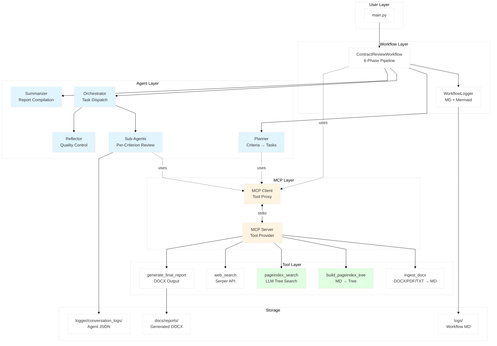
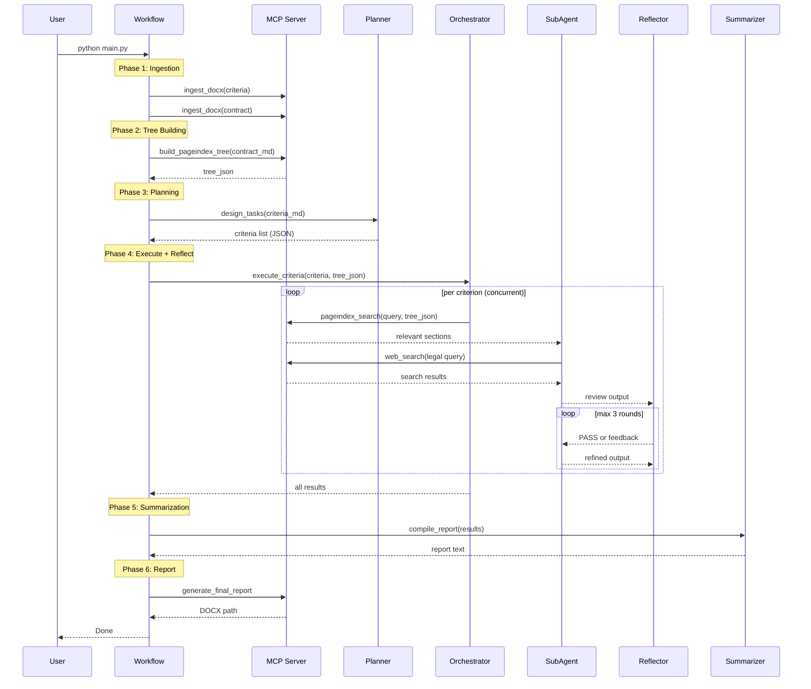
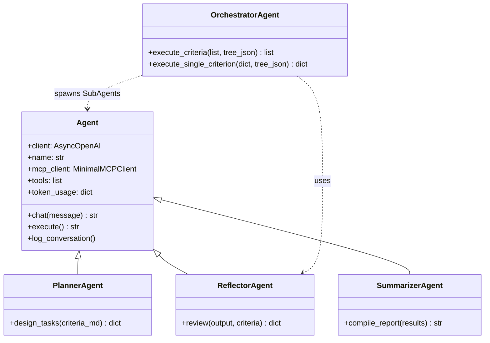
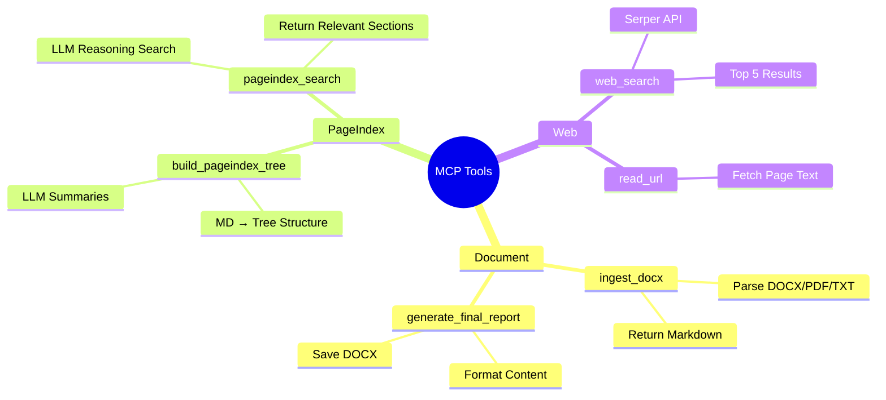
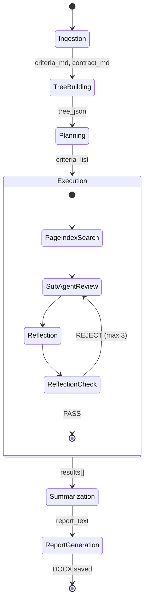
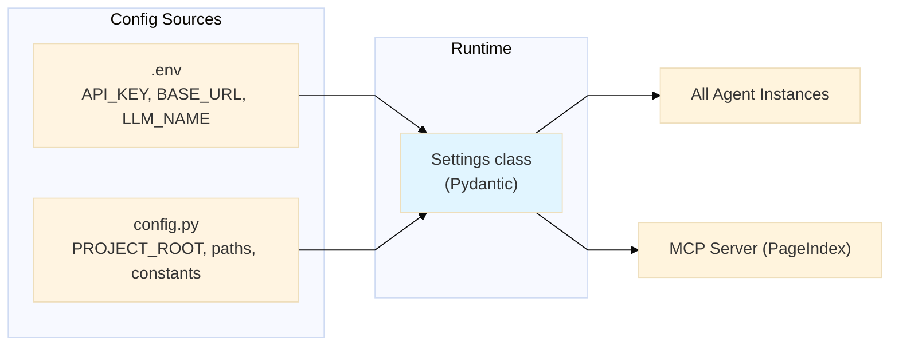

# Contract Review System — Architecture & Data Flow

---

## System Architecture

---

## Workflow Data Flow

---

## Agent Class Hierarchy

---

## MCP Tool Registry

---

## Workflow Phases (State Diagram)

---

## Configuration Flow

