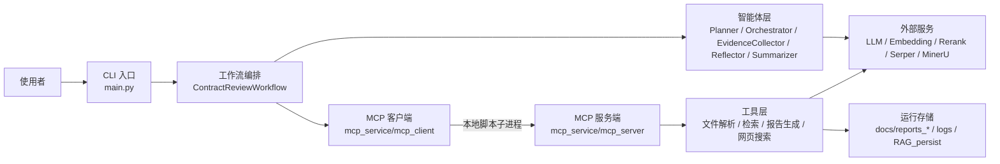
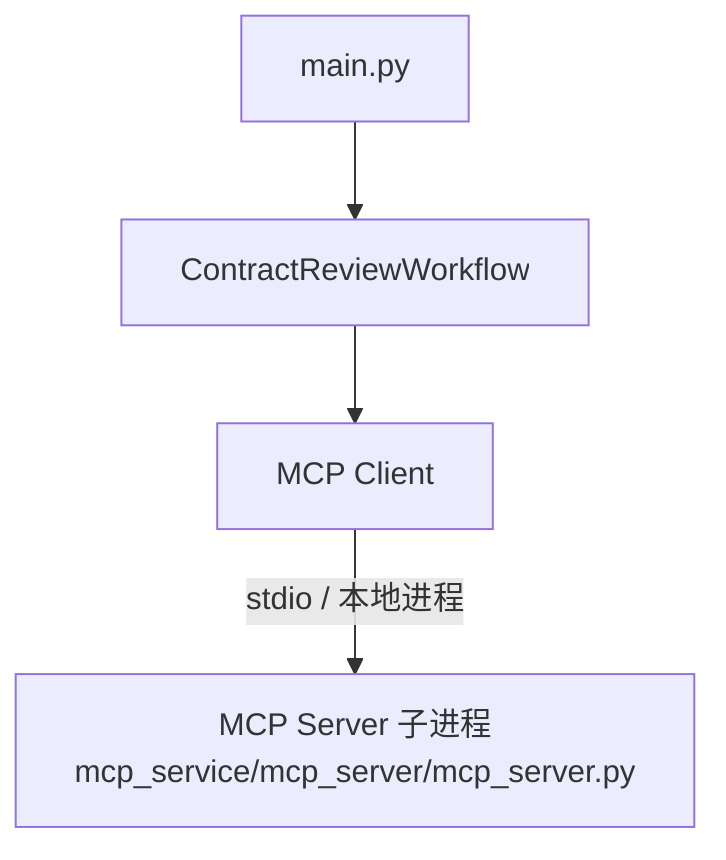
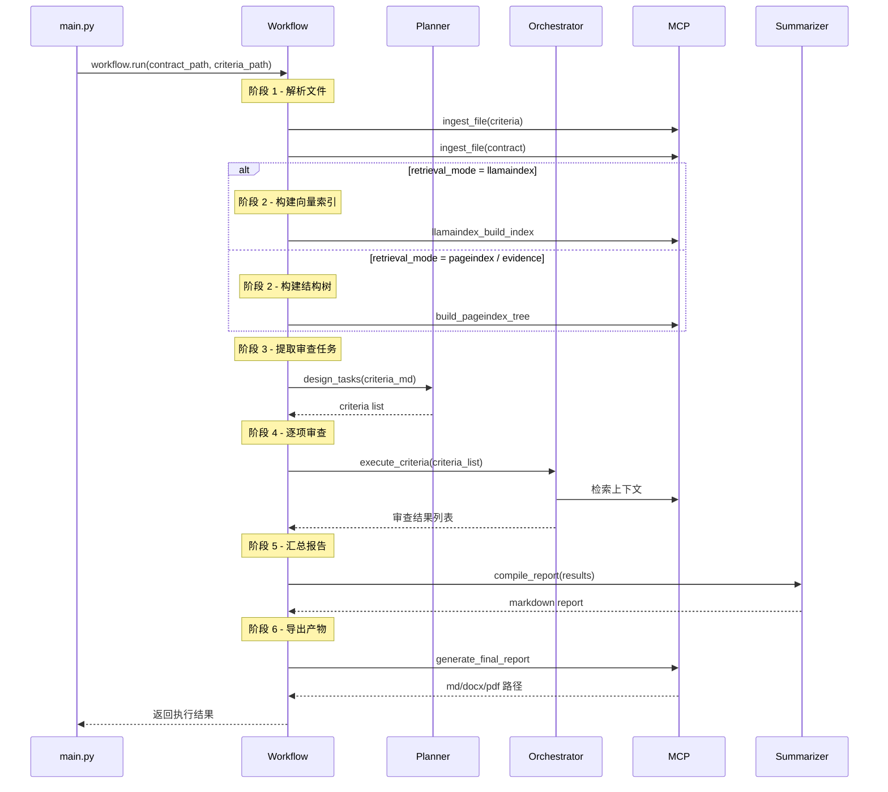
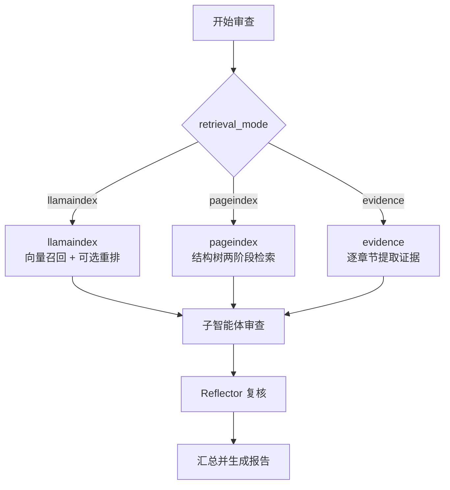
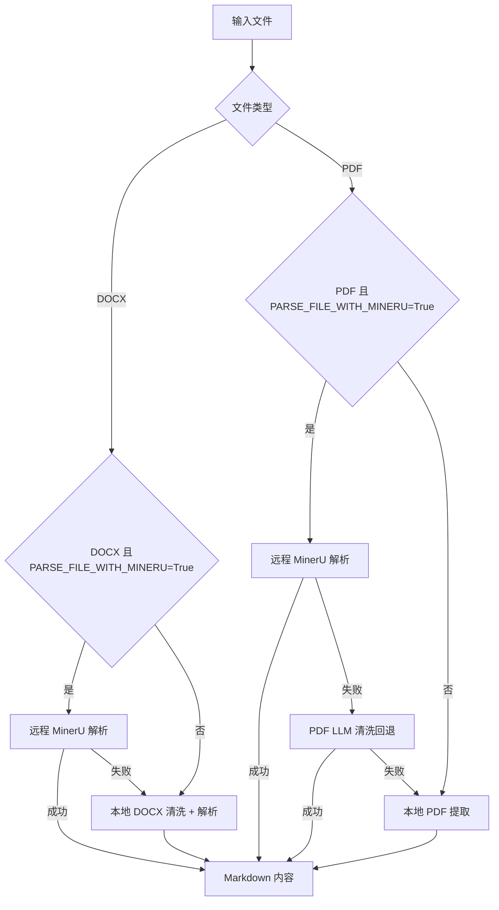
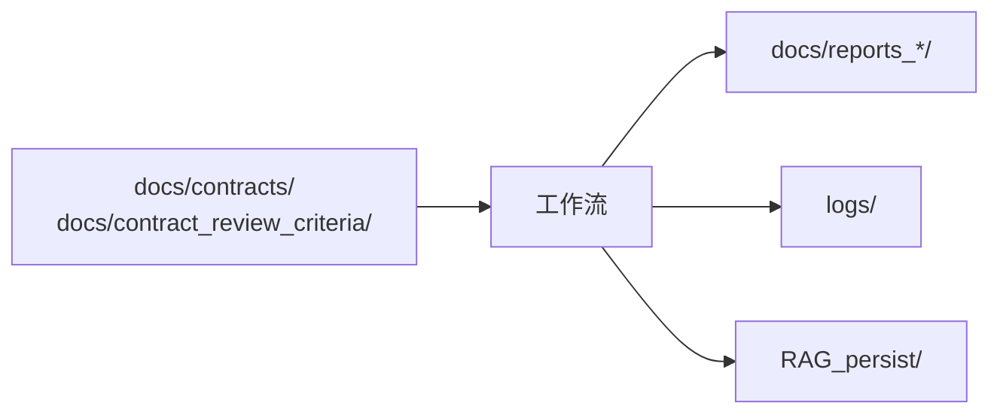

# 系统架构说明

## 1. 架构总览

当前系统是一个「CLI 入口 + 多智能体工作流 + MCP 工具层」的组合式架构。

从职责划分上看：

- CLI 入口负责加载输入文件并启动工作流
- 工作流负责组织完整审查链路，维护阶段状态
- 智能体层负责规划、调度、反思、汇总
- MCP 工具层统一封装文件解析、检索、报告导出、网页搜索

> 当前分支 (`rollback-0313-with-mineru`) 不包含前端工作台与 FastAPI 后端，因此本文不再描述 Web / HTTP 部署视角。

## 2. 总体组件图

## 3. CLI 运行视角

CLI 模式下，MCP 服务由 `MCPClient` 通过 `server_script_path` 启动一个本地 Python 子进程，不需要监听 HTTP 端口。

关键点：

- 整套链路都在一台机器上、一次进程内完成
- MCP 服务端的生命周期跟随 CLI 进程

## 4. 核心模块分层

### 4.1 入口层

位置：

- `main.py`

职责：

- 校验合同文件后缀
- 解析合同与审查标准的文件路径
- 启动 `ContractReviewWorkflow`

### 4.2 工作流层

位置：

- `main_workflow/main_workflow.py`
- `main_workflow/workflow_logger.py`

职责：

- 定义完整执行顺序
- 在每个阶段记录日志
- 汇总结果并触发报告生成

工作流阶段：

- `ingesting`
- `building_index`
- `building_tree`
- `planning`
- `reviewing`
- `summarizing`
- `generating_report`

### 4.3 智能体层

位置：

- `agents/base_agent.py`
- `agents/planner.py`
- `agents/orchestrator.py`
- `agents/evidence_collector.py`
- `agents/reflector.py`
- `agents/summarizer.py`
- `agents/agent_logger.py`
- `agents/prompts/`

职责分工：

| 组件 | 职责 |
| --- | --- |
| Planner | 从审查标准抽取结构化审查项 |
| Orchestrator | 协调整体检索、子智能体执行与反思 |
| EvidenceCollector | 在 `evidence` 模式下收集证据 |
| Reflector | 审查子智能体输出质量 |
| Summarizer | 汇总全部审查结果 |

### 4.4 MCP 工具层

位置：

- `mcp_service/mcp_server/mcp_server.py`
- `mcp_service/mcp_client/`

当前注册的关键工具包括：

- `ingest_file`
- `build_pageindex_tree`
- `pageindex_search`
- `llamaindex_build_index`
- `llamaindex_search`
- `generate_final_report`
- `web_search`
- `read_url`

## 5. 审查任务执行流程

## 6. 检索策略分支

`retrieval_mode` 来源：

- 仅由 `.env` 中的 `LLAMA_INDEX` / `PAGEINDEX_SEARCH` 通过 `config.get_default_retrieval_mode()` 推导
- `workflow.run()` 与 `OrchestratorAgent.__init__()` 都不再接受覆盖参数；切换模式必须修改 `.env`

## 7. 文件解析链路

文件解析的主入口是 `ingest_file`，底层由 `tools/document/file_parser.py` 和各解析器实现。

当前链路如下：

补充说明：

- `.docx` 会先做修订/批注清理，再进入本地解析
- `.pdf` 在没有 MinerU 时，会尝试走本地提取或兼容的 LLM 清洗回退
- CLI 入口当前只接受 `.pdf` 和 `.docx`

## 8. 报告导出架构

报告导出由 `generate_final_report` 调用 `tools/document/` 下的报告生成器完成。

输出目录：

- `docs/reports_md/`
- `docs/reports_docx/`
- `docs/reports_pdf/`

导出策略：

- MD：直接保存汇总后的 Markdown
- DOCX：
  - 如果源合同是 `.docx`，优先尝试在原合同上插入批注
  - 如果无法批注，则退回普通报告 DOCX
- PDF：将 Markdown 转 HTML，再通过 `xhtml2pdf` 导出

## 9. 状态与存储

### 9.1 任务状态

当前 CLI 模式下没有显式的任务表：一次 `python main.py` 就是一次完整的工作流执行，状态通过日志反映，不在内存中长期保留。

### 9.2 持久化目录

说明：

- `docs/contracts/`、`docs/contract_review_criteria/` 是输入文件
- `docs/reports_*` 保存导出报告
- `logs/` 保存运行日志
- `RAG_persist/` 保存树缓存、向量索引和 manifest

## 10. 当前架构的优先级与边界

当前设计明显偏向「可运行、可迭代、便于调试」，而不是「重型企业生产架构」。这意味着：

- 优先打通端到端链路
- 优先保留日志和可观测性
- 优先支持检索策略实验

但也意味着当前仍缺少：

- HTTP API 与前端工作台
- 数据库持久化
- 正式任务队列
- 用户与权限系统
- 多租户隔离
- 更严格的文件校验与安全策略

## 11. 推荐阅读顺序

建议按这个顺序理解系统：

1. 先看 [`PROJECT_OVERVIEW.md`](./PROJECT_OVERVIEW.md)
2. 再看 [`DEPLOYMENT.md`](../DEPLOYMENT.md)
3. 最后结合 `main.py`、`main_workflow/`、`mcp_service/` 阅读具体实现
