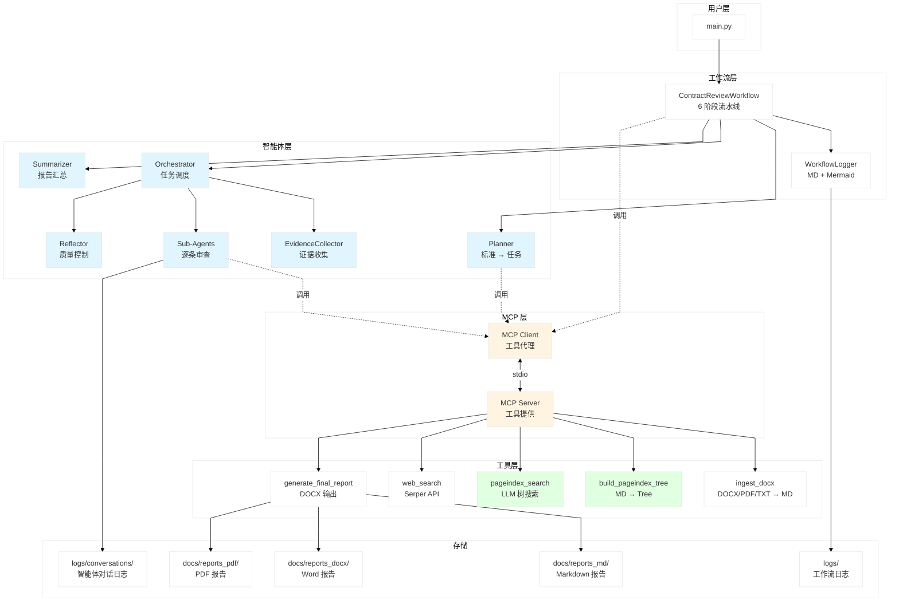
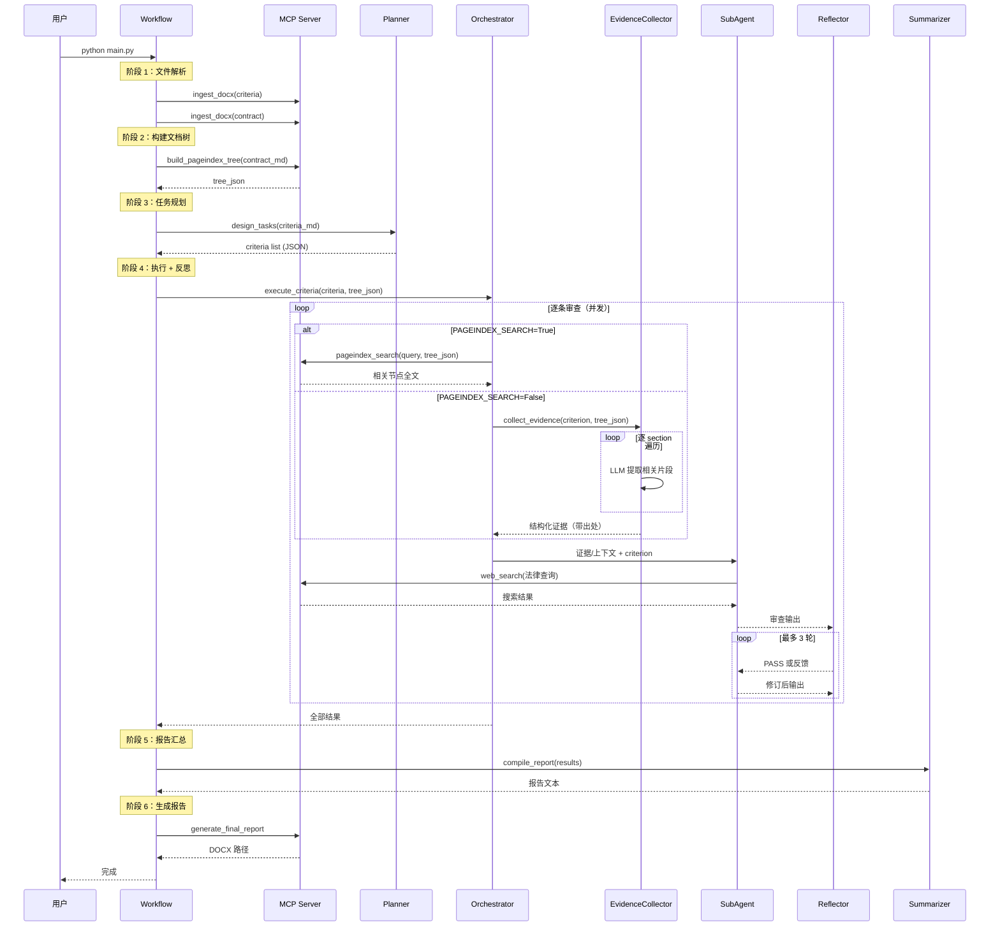
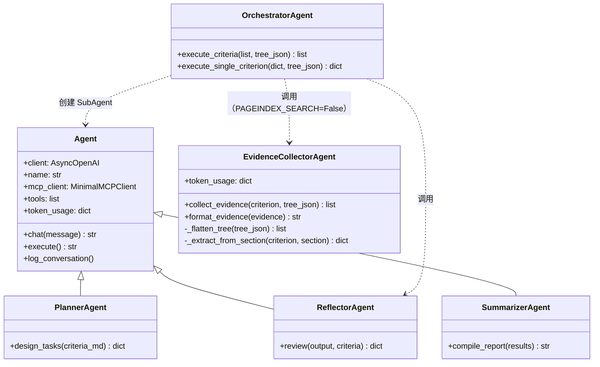
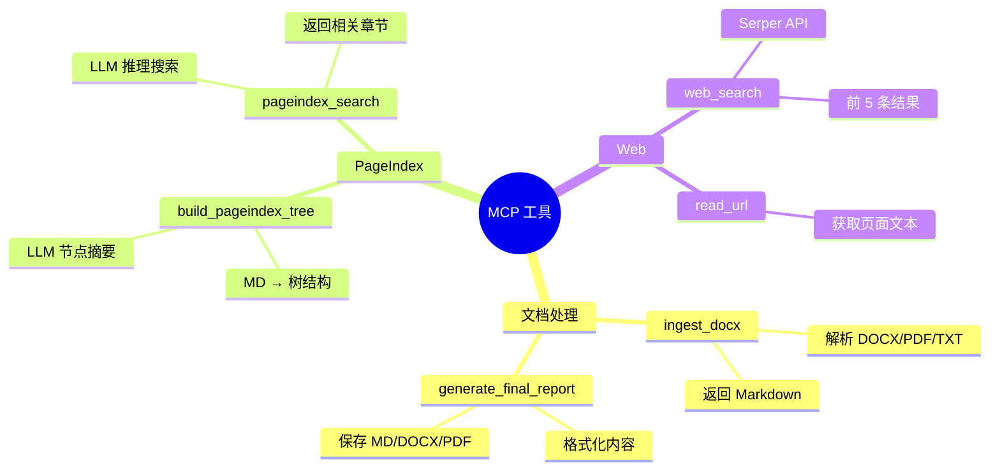
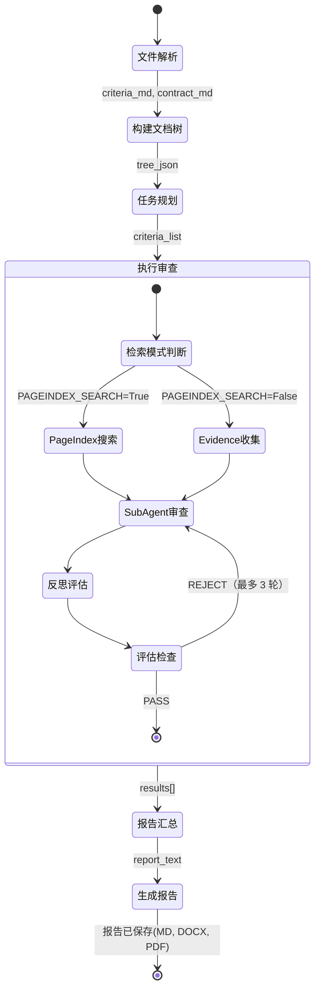
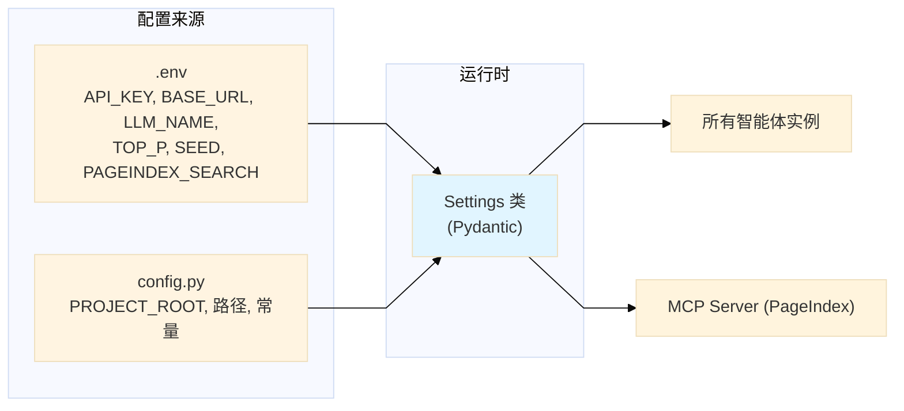

# 合同审查系统 — 架构与数据流

---

## 系统架构

```mermaid
%%{init: {'theme':'base', 'themeVariables': {'primaryColor':'#fff'}, 'flowchart':{'curve':'linear'}}}%%
graph TB
    subgraph "用户层"
        CLI[main.py]
    end

    subgraph "工作流层"
        MainWorkflow["ContractReviewWorkflow<br/>6 阶段流水线"]
        Logger["WorkflowLogger<br/>MD + Mermaid"]
    end

    subgraph "智能体层"
        Planner["Planner<br/>标准 → 任务"]
        Orchestrator["Orchestrator<br/>任务调度"]
        EvidenceCollector["EvidenceCollector<br/>证据收集"]
        SubAgents["Sub-Agents<br/>逐条审查"]
        Reflector["Reflector<br/>质量控制"]
        Summarizer["Summarizer<br/>报告汇总"]
    end

    subgraph "MCP 层"
        MCPClient["MCP Client<br/>工具代理"]
        MCPServer["MCP Server<br/>工具提供"]
    end

    subgraph "工具层"
        FileParser["ingest_docx<br/>DOCX/PDF/TXT → MD"]
        TreeBuild["build_pageindex_tree<br/>MD → Tree"]
        TreeSearch["pageindex_search<br/>LLM 树搜索"]
        WebSearch["web_search<br/>Serper API"]
        ReportGen["generate_final_report<br/>DOCX 输出"]
    end

    subgraph "存储"
        ReportsMD["docs/reports_md/<br/>Markdown 报告"]
        ReportsDOCX["docs/reports_docx/<br/>Word 报告"]
        ReportsPDF["docs/reports_pdf/<br/>PDF 报告"]
        Logs["logs/<br/>工作流日志"]
        ConvLogs["logs/conversations/<br/>智能体对话日志"]
    end

    CLI --> MainWorkflow
    MainWorkflow --> Logger
    MainWorkflow --> Planner
    MainWorkflow --> Orchestrator
    MainWorkflow --> Summarizer
    Orchestrator --> EvidenceCollector
    Orchestrator --> SubAgents
    Orchestrator --> Reflector

    Planner -.调用.-> MCPClient
    SubAgents -.调用.-> MCPClient
    MainWorkflow -.调用.-> MCPClient

    MCPClient <-->|stdio| MCPServer

    MCPServer --> FileParser
    MCPServer --> TreeBuild
    MCPServer --> TreeSearch
    MCPServer --> WebSearch
    MCPServer --> ReportGen

    ReportGen --> ReportsMD
    ReportGen --> ReportsDOCX
    ReportGen --> ReportsPDF
    Logger --> Logs
    SubAgents --> ConvLogs

    style Planner fill:#e1f5ff
    style Orchestrator fill:#e1f5ff
    style EvidenceCollector fill:#e1f5ff
    style SubAgents fill:#e1f5ff
    style Reflector fill:#e1f5ff
    style Summarizer fill:#e1f5ff
    style MCPClient fill:#fff4e1
    style MCPServer fill:#fff4e1
    style TreeBuild fill:#e1ffe1
    style TreeSearch fill:#e1ffe1
```

---

## 工作流数据流

```mermaid
sequenceDiagram
    participant U as 用户
    participant W as Workflow
    participant MCP as MCP Server
    participant P as Planner
    participant O as Orchestrator
    participant EC as EvidenceCollector
    participant S as SubAgent
    participant R as Reflector
    participant SM as Summarizer

    U->>W: python main.py

    Note over W: 阶段 1：文件解析
    W->>MCP: ingest_docx(criteria)
    W->>MCP: ingest_docx(contract)

    Note over W: 阶段 2：构建文档树
    W->>MCP: build_pageindex_tree(contract_md)
    MCP-->>W: tree_json

    Note over W: 阶段 3：任务规划
    W->>P: design_tasks(criteria_md)
    P-->>W: criteria list (JSON)

    Note over W: 阶段 4：执行 + 反思
    W->>O: execute_criteria(criteria, tree_json)

    loop 逐条审查（并发）
        alt PAGEINDEX_SEARCH=True
            O->>MCP: pageindex_search(query, tree_json)
            MCP-->>O: 相关节点全文
        else PAGEINDEX_SEARCH=False
            O->>EC: collect_evidence(criterion, tree_json)
            loop 逐 section 遍历
                EC->>EC: LLM 提取相关片段
            end
            EC-->>O: 结构化证据（带出处）
        end
        O->>S: 证据/上下文 + criterion
        S->>MCP: web_search(法律查询)
        MCP-->>S: 搜索结果
        S-->>R: 审查输出

        loop 最多 3 轮
            R-->>S: PASS 或反馈
            S-->>R: 修订后输出
        end
    end

    O-->>W: 全部结果

    Note over W: 阶段 5：报告汇总
    W->>SM: compile_report(results)
    SM-->>W: 报告文本

    Note over W: 阶段 6：生成报告
    W->>MCP: generate_final_report
    MCP-->>W: DOCX 路径
    W-->>U: 完成
```

---

## 智能体类层级

```mermaid
classDiagram
    class Agent {
        +client: AsyncOpenAI
        +name: str
        +mcp_client: MinimalMCPClient
        +tools: list
        +token_usage: dict
        +chat(message) str
        +execute() str
        +log_conversation()
    }

    class PlannerAgent {
        +design_tasks(criteria_md) dict
    }

    class EvidenceCollectorAgent {
        +token_usage: dict
        +collect_evidence(criterion, tree_json) list
        +format_evidence(evidence) str
        -_flatten_tree(tree_json) list
        -_extract_from_section(criterion, section) dict
    }

    class OrchestratorAgent {
        +execute_criteria(list, tree_json) list
        +execute_single_criterion(dict, tree_json) dict
    }

    class ReflectorAgent {
        +review(output, criteria) dict
    }

    class SummarizerAgent {
        +compile_report(results) str
    }

    Agent <|-- PlannerAgent
    Agent <|-- ReflectorAgent
    Agent <|-- SummarizerAgent
    OrchestratorAgent ..> Agent : 创建 SubAgent
    OrchestratorAgent ..> EvidenceCollectorAgent : 调用（PAGEINDEX_SEARCH=False）
    OrchestratorAgent ..> ReflectorAgent : 调用
```

---

## MCP 工具注册表

```mermaid
mindmap
  root((MCP 工具))
    文档处理
      ingest_docx
        解析 DOCX/PDF/TXT
        返回 Markdown
      generate_final_report
        格式化内容
        保存 MD/DOCX/PDF
    PageIndex
      build_pageindex_tree
        MD → 树结构
        LLM 节点摘要
      pageindex_search
        LLM 推理搜索
        返回相关章节
    Web
      web_search
        Serper API
        前 5 条结果
      read_url
        获取页面文本
```

---

## 工作流阶段（状态图）

```mermaid
stateDiagram-v2
    [*] --> 文件解析
    文件解析 --> 构建文档树: criteria_md, contract_md
    构建文档树 --> 任务规划: tree_json
    任务规划 --> 执行审查: criteria_list

    state 执行审查 {
        [*] --> 检索模式判断

        state 检索模式判断 <<choice>>
        检索模式判断 --> PageIndex搜索: PAGEINDEX_SEARCH=True
        检索模式判断 --> Evidence收集: PAGEINDEX_SEARCH=False

        PageIndex搜索 --> SubAgent审查
        Evidence收集 --> SubAgent审查
        SubAgent审查 --> 反思评估
        反思评估 --> 评估检查

        state 评估检查 <<choice>>
        评估检查 --> [*]: PASS
        评估检查 --> SubAgent审查: REJECT（最多 3 轮）
    }

    执行审查 --> 报告汇总: results[]
    报告汇总 --> 生成报告: report_text
    生成报告 --> [*]: 报告已保存(MD, DOCX, PDF)
```

---

## 配置流

```mermaid
%%{init: {'theme':'base', 'flowchart':{'curve':'linear'}}}%%
graph LR
    subgraph "配置来源"
        ENV[".env<br/>API_KEY, BASE_URL, LLM_NAME,<br/>TOP_P, SEED, PAGEINDEX_SEARCH"]
        CFG["config.py<br/>PROJECT_ROOT, 路径, 常量"]
    end

    subgraph "运行时"
        Settings["Settings 类<br/>(Pydantic)"]
    end

    ENV --> Settings
    CFG --> Settings
    Settings --> Agents["所有智能体实例"]
    Settings --> MCPServer["MCP Server (PageIndex)"]

    style ENV fill:#fff4e1
    style CFG fill:#fff4e1
    style Settings fill:#e1f5ff
```
